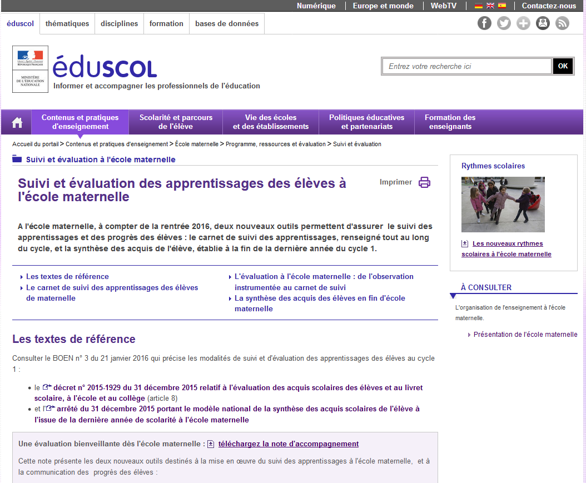

# Référence 

L'application e-carnet-de-maternelle s'appuye et met en oeuvre le référentiel décrit dans ce document Eduscol.

Référence éducation nationale : [Le carnet de suivi des apprentissages en maternelle](http://eduscol.education.fr/cid97131/suivi-et-evaluation-a-l-ecole-maternelle.html)

Nouveauté depuis la version 1.8 : il est maintenant possible de changer le référentiel par défaut. Les principales situations qui peuvent le nécessiter sont : 

- utiliser une langue régionale (occitan, catalan, ...),
- une langue étrangère (anglais, arabe, ...),
- adaptation scolaire et scolarisation des élèves handicapés (ASH),
- adaptation Montessori,
- adaptation autre programme national (Belgique),
- autre domaine d'apprentissage,
- déployer une même version de référentiel au sein d'un même établissement.

La mise en oeuvre de cette adatation est décrite dans le chapitre [Catalogue observables](#catalogue-observables).

NB : un usage récent du e-carnet maternelle a permis à une école internationale de produire plusieurs centaines de e-carnets personnalisés adaptés à un parcours trilingue : Français, Anglais, Arabe.

- Logo de l'école en entête
- Référentiel personnalisé réalisé avec l'outil Réferentiel builder (prestation sur mesure, [thierry@tr-esolutions.com](mailto://thierry@tr-esolutions.com))
- Utilisation des tags par langue pour faciliter l'usage par chaque enseignante (une tablette partagée par les 3 enseignantes)
- Zones réservées pour les appréciations dans chaque langue
- Simplification dans le contenu du e-carnet

Voir les tutos pour plus de précisions sur la façon de procéder.
