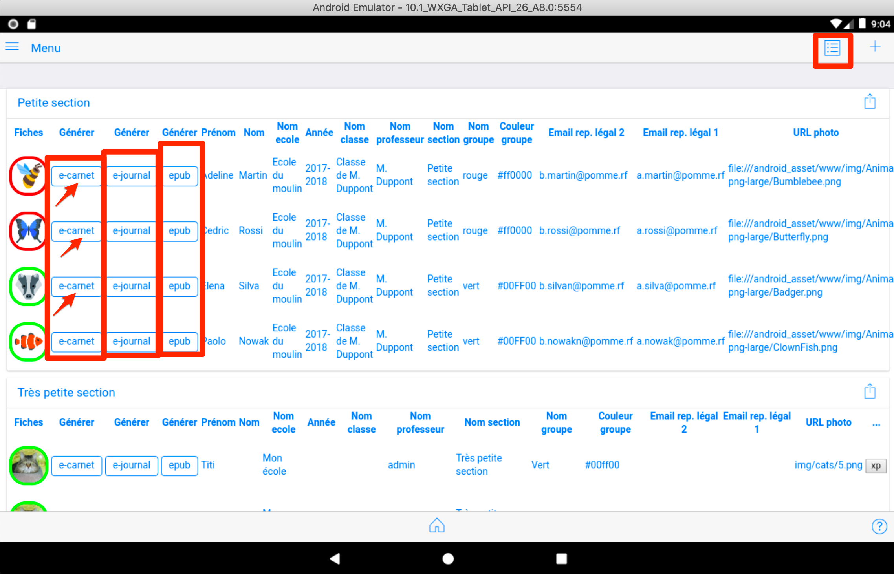
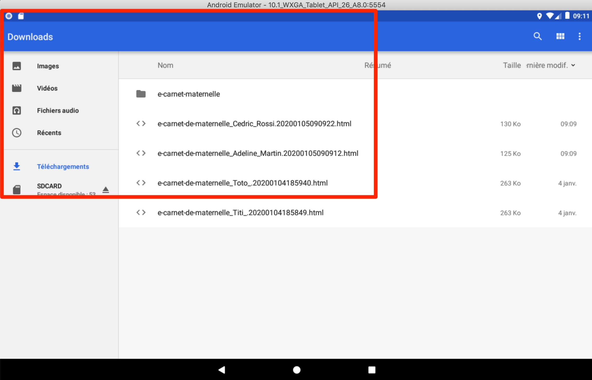
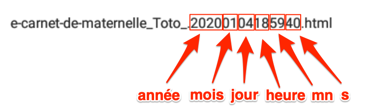
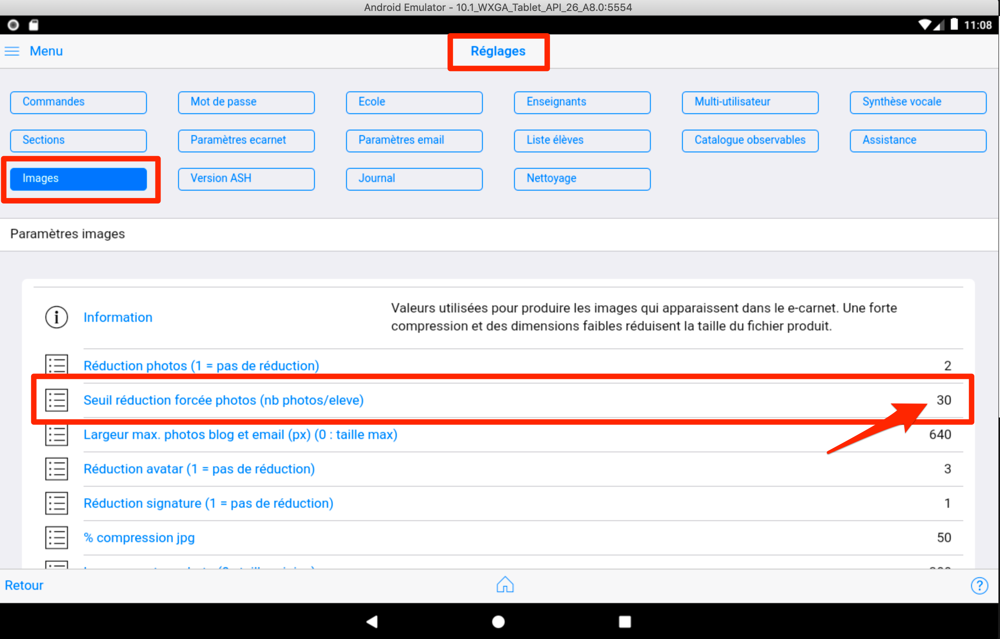
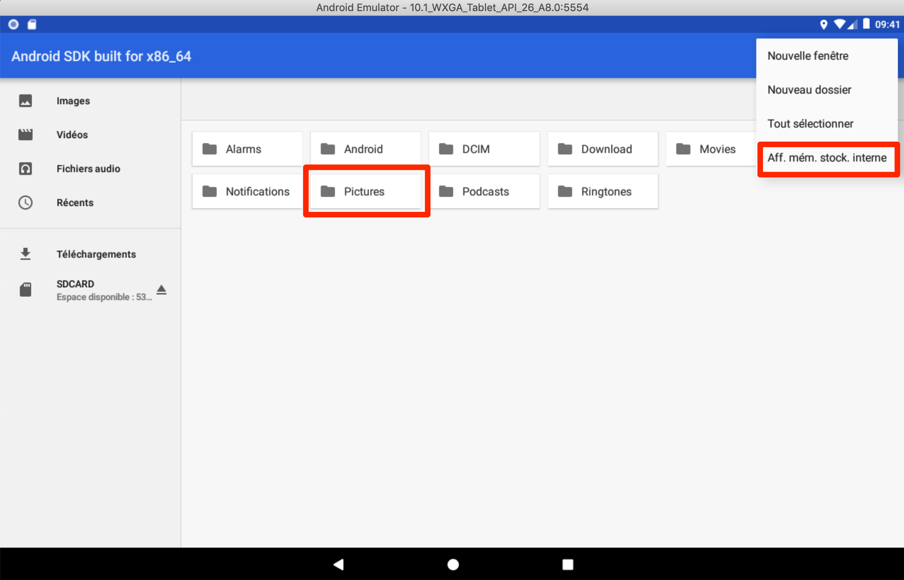
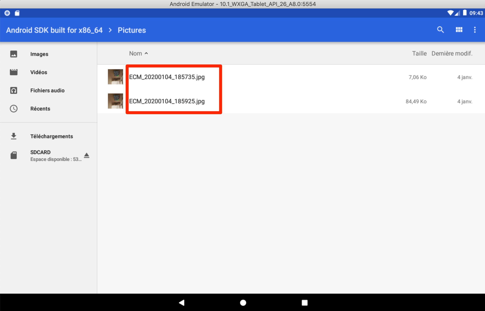

# Informations importantes

## Les différentes versions de l'application

Au démarrage, seule la version Android existait. (versions 1.x.x)

Ensuite, pour répondre à quelques demandes, les versions suivantes ont été publiées : 

- Windows
- MacOs
- Linux

Exceptée la prise de photo et de video, les fonctionnalités de ces versions de "bureau" sont rigoureusement identiques à la version Android.

Elles n'ont pas fait l'objet d'évolutions significatives depuis plusieurs mois. Par manque de temps ...

La version  Android actuellement publiée est la version du 23 octobre 2021 intitulée 1.11.6v128.

Depuis cette date, Google a fait significativement évoluer ses exigences de sécurité pour les applications. L'application e-carnet a été significativement impactée par ces changements de règles : l'utilisation du répertoire "Download" pour stocker les fichiers produits par l'application a été refusé par Google au développeur de l'application.

Cette situation a conduit a revoir tout le système de gestion de fichiers de l'application.

Elle a aussi complexifié l'usage des vidéos et des enregistrements audio, qui seront temporairement désactivés, dans les nouvelles versions. (L'import de fichiers video et audio restent disponibles, seules les captures via tablette et mobile sont concernées).

La réécriture partielle de l'application a pris plusieurs mois, a nécessité un grand nombre de modifications et a conduit à préparer la publication d'une nouvelle version e-carnet, la version 2.x.x.

***IMPORTANT*** : la version 1 ne peut pas etre mise à jour avec la version 2 qui doit être installée comme une nouvelle application. Les 2 versions peuvent donc exister simultanément. Les fichiers de sauvegardes et epub produites par la version 1 peuvent être importés dans la version 2.

A la date de mise à jour de cette documentation, la version 2 est en cours de test pour IOs. La version Android suivra et devrait être publié avant fin mars 2023.

Cette présente documentation a été créé initialement pour la version Android (1.x.x).

Sa mise à jour est en cours pour correspondre désormais à la version 2.x.x, qui sera compatible avec les systèmes suivants : 
- Android
- IOS
- MacOS
- Windows
- Linux

***NB :*** Pour mémoire, l'application a été conçue initialement pour fonctionner nativement sans connection internet et sans base de données hébergée dans le cloud. Pour être compatible avec un usage dans des classes ne disposant pas de Wifi ou de débit internet suffisant.

## Documentation 

Cette présente documentation est désormais hébergée par la solution [readthedocs](https://readthedocs.org) largement utilisée sur Internet pour documenter les logiciels.

Cette solution amène l'opportunité de rendre la rédaction de cette documentation collaborative et transparente. Le code source étant visible et téléchargeable via [github](https://github.com/Thierry28/e-carnetV2/blob/master/docs/index.md).

En contrepartie de la version gratuite de readthedocs utilisée ici, des publicités apparaissent en bas de page.

## Mettre à jour l'application régulièrement

Il faut éviter de "sauter des versions".

Par conséquent il est fortement recommander de mettre l'application à jour très régulièrement en la connectant à internet régulièrement et de vérifier si une nouvelle version est disponible.

***Android :*** Vous pouvez aussi activer la fonction Android "Mettre à jour automatiquement"

***iOS :*** Idem

## Sauvegarder vos données régulièrement

Comme il vaut toujours mieux prévenir que guérir, l'utilisation de l'une ou plusieurs des techniques ci-après est fortement recommandée.

### La solution recommandée par votre établissement

En priorité, si elle existe, mettez en oeuvre la recommandation de votre établissement ou de votre fournisseur de tablette concernant leur sauvegarde.

A défaut, vous pouvez utiliser une ou plusieurs des techniques suivantes.

### La solution native Google Android

Si vous en avez la possibilité, c'est une des techniques les plus simple et la plus complète.

Elle permet de sauvegarder la totalité de vos données y compris celles de vos applications.

Cet écran apparaît lorsque vous configurez un compte de messagerie Google : 

***NB:*** Le process complet de sauvegarde/restauration n'a pas encore été testé par le développeur. 

### La fonction sauvegarde de l'application e-carnet de maternelle

Vous pouvez à tout instant provoquer la production d'un fichier qui contient toutes les données et media utilisés par votre application.

Cette fonctionnalité est décrite dans le chapitre [Réglages, commandes](#commandes-diverses).

Cela reste à ce jour la façon la plus sûre de conserver toutes les données dans un fichier à stocker en dehors de votre terminal.

### La production de e-carnets ou e-journaux régulière

Conseil : n'attendez pas le dernier moment pour produire vos e-carnets !

Vous pouvez à tout instant provoquer la production de fichiers html ou epub qui contiennent le reflet des apprentissages de chaque élève en utilisant les boutons de raccourcis figurant dans la page contenant la liste des élèves :  

<!--  -->

<!-- NB : pour accéder à cette page, cf l'icône en haut à droite : 

<!--  -->

<!-- Retrouvez ensuite les fichiers générés avec votre explorateur de fichiers, dans votre répertoire "Téléchargement" et "e-carnet-maternelle".

 -->

<!--  -->
<!-- NB : cette copie d'écran peut être différente selon les versions Android.

 -->

<!-- NB : le nombre qui figure dans le nom de fichier est la date de production du fichier.
Cette date ne figureara pas dans le nom de fichier qui sera inséré dans l'email pour les parents.

  -->

## En cas de problème

Malgré tout le soin apporté au développment de cette application, il peut se produire des situations imprévues ... 

Lorsque cela arrive, pas de panique ... A ce jour la plupart des situations que vous nous avez remonté a été résolue dans un délai pouvant aller de 24 à 48h.

Mais pour cela quelques consignes qui permettront d'accélérer l'identification et la correction ou le contournement du problème : 

- ***Ne surtout pas dés-installer l'application*** vous perdriez une partie de vos données et vous compliquerez la résolution du problème.  
- Cherchez dans ce présent guide si une rubrique contient des informations associées. Voir en particulier le chapitre [FAQ](#manipulations-diverses-faq).
- Cherchez sur notre site web ou dans cette documentation si votre cas de figure est décrit. Si il ne l'est pas, poursuivez avec les étapes suivantes.
- Faire une copie d'écran qui illustre le problème pour l'envoyer au soutien.
- Lorsque cela est possible, immédiatement apres le problème, utiliser la fonction "Réglages/Assistance/Envoyer rapport d'erreur". NB : ce rapport d'erreur se remet à zéro à chaque lancement de l'application.

<!-- A savoir, vous pouvez aussi envoyer ce rapport d'erreur directement avec votre logiciel de messagerie. Le fichier à joindre est "journal.html" situé ici : 

 -->

Coordonnées du soutien : [support@tr-esolutions.com](mailto://support@tr-esolutions.com)

<!--  -->

## Volume mémoire des e-carnets

Cette application a la particularité de pouvoir fonctionner aujourd'hui sans connection internet. C'est une demande de certains(es) d'entre-vous qui ont des classes non desservies en wifi ou en acces internet.

Par conséquent, elle ne stocke aucune donnée liée aux enfants ou à la classe sur un serveur externe. 

Cela signifie que toutes les données sont stockées sur la tablette et que ce stockage est donc limité à sa capacité mémoire et à la place laissée par d'autres documents ou applications.

Un usage intensif pouvant aller de type 30 photos par élève pour une classe de 25 élèves, soit 750 photos est possible sur la plupart des tablettes.

Neanmoins certaines tablettes anciennes peuvent commencer à "planter" des lors que le nombre de photo par élève augmente.

Pour limiter ce risque de plantage à la génération des e-carnets, un mécanisme automatique de réduction de la qualité des images se déclenche au dela d'un certain nombre de photo par élève (réglable dans les réglages, )

## Stockage des medias sur la tablette

Pour limiter le volume de stockage lié au nombre de photo, il est possible de limiter leur taille et donc de ne pas conserver la taille initiale des photos prises par la tablette.

Ces réglages sont aussi possible depuis l'écran ci-dessus.

Des explications détaillées sont fournies dans le chapitre [Réglages](#réglages)

## Tablette vs smartphone

Bien que l'application e-carnet soit pleinement fonctionnelle sur un smarthphone, il est recommandé d'utiliser une tablette pour laquelle les écrans ont été initialement conçus.

L'adaptation aux smartphones est prévue, elle se fera progressivement.

<!-- 
## Lieux de stockage des fichiers

### Photos

Les photos prises par l'application sont stockées dans le répertoire "Pictures" : 

Ces photos ont un nom de fichier commençant par ECM_ : 

### Vidéos

### Audio

 -->

