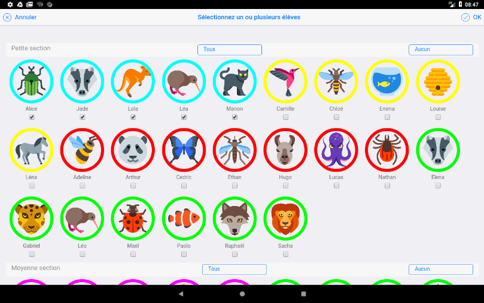
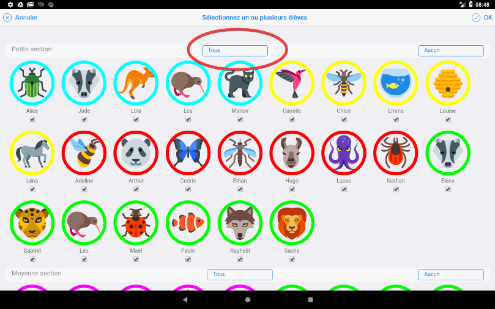
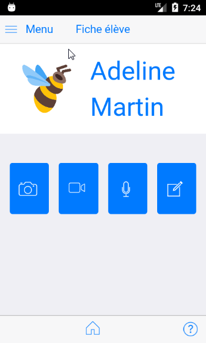

# Nouveautés

Sur Android Play store : https://play.google.com/store/apps/details?id=org.tre.eportfolio&gl=FR

## Version 1.9.16v117 du 14 mars 2021

- Amélioration conformité RGPD : suppression des permissions Android non nécessaires.

## Version 1.9.15v115 du 15 février 2021

- Simplification saisie commentaires et gestion conservation commentaires périodes précédentes (utiliser séparateur --- entre les différentes versions, seule les commentaires situés apres --- seront restitués dans les documents.)
- Les versions "imprimées" des e-carnets ont une mise en page optimisée. (Impression ou génération pdf depuis un navigateur ou versions pdf automatiques dans les versions PC)
- Suppression des permissions non utiles (voir ci-après les permissions qui subsistent)
- Correction ordre de tri des élèves dans la grille de suivi
- Ajout des chiffres clés
- Amélioration sauvegarde/restauration avec version PC.
- Icône de la note restituée après restauration
- Copie des avatars "animaux" dans le dossier Pictures (Android) et Avatars (Windows)

NB : Bugs identifiés restant à corriger : 

- les tags restent visibles dans le fichier epub
- anomalie au changement des remplacements.
- après certaines restauration de sauvegardes, la vignette des vidéos n'est pas restituée (mais les vidéos restent accessibles)

Liste des permissions nécessaires au fonctionnement de l'application Android : 

- prendre des photos et enregistrer des vidéos : fonctions de base de l’application
- enregistrer des fichiers audio : idem, fonctions de base de l’application
- lire contenu de stockage partagé et modifier/supprimer contenu mémoire stockage partagé : l’application a besoin de cet accès pour écrire les fichiers contenant les e-carnets et rendre ces fichiers accessibles à l’utilisateur. Nécessaire aussi pour enregistrer les sauvegardes et fichiers de réglages.
- afficher les connexions réseau et bénéficier d’un accès complet au réseau : nécessaire pour vérifier que la version installée est la dernière disponible. Permet d’alerter l’utilisateur et du besoin de déclencher une mise à jour.
- modifier vos paramètres audio : nécessaire pour utiliser les fonctions de reconnaissance et synthèse vocale.

## Version 1.9.14v113 du 6 décembre 2020

- Correction bug bouton envoyer e-carnet
- Correction du bug arrivant parfois au démarrage de l'application pour les tablettes lentes.
- Correction du bug pouvant empêcher la saisie de photos.
- Optimisation des fonctions sauvegarde/restauration
- La doc est ici : https://frama.link/ecmguide
- Voir les tutos dans l'onglet "Tutos par moments clés"

NB : Bugs identifiés restant à corriger : 

- les tags restent visibles dans le fichier epub
- l'import d'un dossier élève ayant comme avatar une icone standard "animal" ne restitue pas correctement cet avatar. Palliatif : remettre manuellement un avatar apres import
- l'icone de la note n'est pas restituée apres une restauration depuis une sauvegarde.
- anomalie au changement des remplacements.
- dans la grille, l'ordre des élève sur la première ligne n'est pas toujours bonne, ce qui compte est le prénom dans les cellules

Prochaine version : 

- saisie des commentaires simplifiée.
- versions Windows, Mac, Linux.
  

## Version 1.9.13v112 du 28 novembre 2020

Mise à jour de cette documentation : ajout de 47 "tutos" video. Perfectibles ... mais disponibles !

Corrections de bugs. 

Remise en service export format  epub pour sauvegarde ou échange dossier élève entre tablettes et versions Windows, Mac.

Compatible avec échanges bi-directionnels entre version Android, Windows, MacOS via transfert de fichier. 

NB : Bugs récemments identifiés qui seront pris en compte dans la prochaine version, courant décembre : 

- le bouton "envoyer" e-carnet est KO. Palliatif : passer directement par votre logiciel de messagerie et "joindre" le fichier html produit.
- l'import d'un dossier élève ayant comme avatar une icone standard "animal" ne restitue pas correctement cet avatar. Palliatif : remettre manuellement un avatar apres import

NB : les nouvelles versions Windows, MacOs et Linux seront disponibles mi-décembre 2020. Elles auront les particularités suivantes : 

- import de photos, vidéos
- production des e-carnets
- génération automatique des documents dans 3 formats : html, pdf, png
- import/export dossier élève depuis et vers tablette
- import/export sauvegarde complète depuis/vers tablette
- comme la version Android, fonctionnement sans serveur (connectivité internet permanente non nécessaire)

## Version 1.9.10v106 du 25 mai 2020

Ajout du bouton « importer photo » dans le volet de gauche

Prise en compte des avatars personnalisés dans la sauvegarde/restauration

Optimisation de la gestion du journal

Correction bug de la fonction « tableau de bord »

Mise à jour fichier des remplacements pour la personnalisation du e-carnet.

Ajout d'un bouton "mise à jour fichier remplacements"

## Version 1.9.9v105 du 19 avril 2020

Amélioration de la fonction de personnalisation des e-carnets. Exemples : suppression bloc signature direction, suppression mode 2 colonnes dans les appréciations, augmentation taille police, remplacement de libellés, ...

Amélioration de la fonction de gestion des ateliers : désactivation par défaut en mode enseignant.

Mise à jour parties Aide, A propos.

## Version 1.9.8v104 du 29 mars 2020

Correction d'un bug.

## Version 1.9.6v102 du 28 mars 2020

Spécial travail à distance : Ajout d'une fonction permettant d'envoyer une consigne à tous les parents.

Ajout possibilité de personnaliser la mise en forme et les contenus des e-carnets et e-journaux produits.

Diminution des causes de plantage.

Vous pouvez continuer d'utiliser e-carnet à distance en incorporant des photos que les parents pourraient vous envoyer.

## Version 1.8.9v101 du 1er mars 2020

Possibilité de pré sélectionner jusqu'à 8 observables par défaut, 1 par "atelier" pour une affectation automatique lors de la capture par les élèves.

Possibilité de modifier les libellés des observables.

Possibilité d'ajouter des "étiquettes" (tags) à chaque observable pour facilité leur sélection dans la grille.

Corrections de bugs et optimisations diverses.

## Version 1.8.7v100 du 18 février 2020

Em mode élève, affectation des photos à un observable par défaut. Evite d'avoir a affecter les photos à posteriori. Sélection à partir de la grille de suivi.
Le clic sur le bouton retour ne fait plus quitter prématurément.
Optimisations multiples pour diminuer le risque de plantage lorsque le nombre de photos devient important (> 500).

## Version 1.8.6v99 du 10 février 2020

Optimisation et correction bug d'affichage de la grille de suivi.

## Version 1.8.5v98 du 2 février 2020

Optimisation de la gestion mémoire pour diminuer les risques de plantage dans le cas de grand nombre de photos. D'autres optimisations sont en cours de préparation.
Correction de bugs.

## Version 1.8.3v96 du 7 janvier 2020

Mise à jour du lien vers la documentation dans la page Aide.

La lecture des vidéos est de nouveau opérationnelle (correction bug).

## Version 1.8.2v95 du 4 janvier 2020

La grille de suivi est maintenant affichée pour les élèves d'une même section.

Les fichiers e-carnet peuvent être produits directement depuis la page contenant la liste des élèves, affichée en mode liste (et pas mosaïque). Ils s'enregistrent directement sur la tablette.

Nouveau document possible : e-journal. Il reproduit le contenu qui apparaît dans le blog élève. Similaire  au e-carnet mais les observables sont présentés par ordre chronologique, quel que soit le référentiel utilisé. Permet d’avoir des observables décrits selon plusieurs référentiels (exemple : anglais/français). Email modifié en conséquence : e-journal au lieu de e-carnet. Personnalisation dans les réglages.

Ce document e-journal peut être multi lingue. Il peut rassembler des observables rédigés en plusieurs langues (cas des classes qui enseignent plusieurs langues).

Changement du sélecteur de photo pour l'avatar élève. Il est maintenant possible d'aller choisir une photo n'importe où sur la tablette.

Fonction de nettoyage des documents pour lesquels les medias ont été supprimés.

Fonction d'import du fichier de sauvegarde des élèves.

Sauvegarde automatique des réglages à chaque démarrage de l'application. 

Amélioration gestion sauvegarde/restauration des données de l'application.

Correction bug de la fonction exporter liste des élèves au format xlsx depuis la page liste des élèves.

Ajouter message d'alerte si le filtre de date dans le e-carnet conduit à 0 media.

 
## Version 1.8.0v93 du 1er janvier 2020

Le catalogue de référence est maintenant personnalisable grâce à une application windows et MacOs (voir notre site web). Le fichier résultant s'importe dans la tablette depuis "réglages/Gestion observables".

NB : le blog de l'élève est MULTI catalogue : quels que soient les catalogues successivement utilisés, les medias conservent la mémoire du catalogue ayant servi a affecter l'observable.
le e-carnet, lui est MONO catalogue : il ne liste QUE les medias du catalogue courant

Cette possibilité permet la prise en compte des référentiels francophones différents (ASH, Montessori, Belge, ...) et des versions en d'autres langues (Anglais, Arabe, Occitan, Catalan, ...).
Elle permet aussi de déployer une même version de référentiel au sein d'un même établissement.

Remise en service du contrôle de version et de l'inscription à la newsletter.
Les tutoriels sont redevenus accessibles depuis l'application.

Correction du bug Supprimer document.

## Version 1.7.5v92

Optimisation gestion taille des images, agrandissement dans le blog.

## Version 1.7.3v91

Grille de suivi : ajout sélecteur de media.

Bouton repositionnement par défaut de la fenêtre journal dans réglages/journal.

Correction bug lié à utilisation d'une période de sélection.

Correction bug grille de suivi qui ne s'affichait plus

## Version 1.7.2v90

Réactivation de la synthèse vocale.

Correction bug lié à la rotation des photos dans le e-carnet et les fichiers epub.

## Version 1.5.0v70

Cette nouvelle version a fait l'objet de nombreuses optimisations techniques visant à augmenter les performances en situation d'un grand nombre de medias (plusieurs centaines de photos par exemple).

Elle diminue aussi les cas de plantage.

Information importante pour les utilisateurs actuels : lors du prochain lancement, une opération technique va être réalisée.

Cette opération qui n'aura lieu qu'une seule fois peut prendre du temps (jusqu'à plusieurs dizaines de minutes selon le nombre de photos). Il est important d'attendre la fin du processus.

Nouvelles fonctionnalités : 

- Ajout nouveau pad pour signature des parents, directement depuis le e-carnet généré, dans la case prévue à cet effet. La signature des parents est uniquement visible dans le e-carnet qu'ils auront signé depuis la tablette de l'enseignant.

- Ajout sélection d'une période pour ne conserver dans le e-carnets que les observables d'une période. Menu "réglages", "Parametres e-carnet".

- Compatible avec un grand nombre de medias (testé 700, mais pourra dépasser)

- Export de la grille de suivi sous forme de fichier Excel.

- Export de tout le contenu (base de données et medias : photos, videos, audio) dans un dossier (fichier SAUVEGARDE_ECM.zip)

- Import du fichier de sauvegarde dans une autre tablette si besoin (transfert ou sauvegarde). Ne pas changer le nom du fichier : SAUVEGARDE_ECM.zip

- Affichage d'une fenetre de 'logs' (journal) qui montre ce qui se passe, 
affiche les éventuelles erreurs et produit un fichier journal
qui peut être facilement consultable et envoyé par email pour support.
L'affichage de ce popup journal est gérable dans Réglages/Journal.

<!--
## Version 1.2.0v23 du 6 mai 2018

Principale nouveauté : association d'un observable à plusieurs élèves : 

- Sélection d'un sous ensemble des élèves en cliquant sur chaque icône

- Sélection de toute la classe en cliquant sur "Tous"

Autres évolutions : 

- correction d'un problème pour certains utilisateurs des versions Androïd 7 et 8.

- un clic sur la flèche "Retour" de la barre de fonction Androïd provoque maintenant la fermeture de l'application.

- Un fichier excel modèle peut être utilisé avec la fonction "importer fichier élèves" de la page "Réglages", section "Liste élèves". Ce fichier est disponible sur le site web de l'application, dans la page "Tutoriels". [Lien direct.](https://drive.google.com/open?id=17hz6V-6MhR8hFGeqliqq0jWQ8fMDR--W)

 

- Un document sur la protection des données et la conformité RGPD est disponible sur demande (via l'email support@tr-esolutions.com).

NB : cette version est compatible avec les versions Android >= 6.0

Adaptations écran smartphone : 

NB : Penser à tourner votre smartphone pour adapter la largeur de l'écran.

## Version 1.1.14v21 du 2 avril 2018

### Suppression du bouton retour

Pour une navigation simplifiée, le bouton en bas à gauche a été supprimé.

Le principal bouton de navigation devient le bouton "home" en bas au centre.

### Nouvelle navigation dans la page réglages

Une barre de boutons permet de naviguer plus efficacement dans les différents modules de l'espace "réglages".

### Enregistrement de sélections personnalisées 

Dans la page "Observables", vous pouvez activer/désactiver chacun des observables pour simplifier l'affectation des observables aux médias.

La commande `Sauvegarder`permet maintenant de choisir une référence pour mémoriser ses sélections et les rappeler ensuite, depuis la page "Réglages"

## Version 1.1.13v20 du 28 mars 2018

### Nouvelle version du catalogue des observables

Ajout de la partie "Apprendre ensemble et vivre ensemble" : 

### Ajout module de choix de sélection personnalisée d'observables 

## Version 1.1.12v19 du 18 mars 2018

### Adaptation de l'éditeur de saisie des réussites régulières et bilan

Le texte exemple par défaut est supprimé, la saisie est simplifiée, elle est directe en cliquant sur l'icone `Tx` qui a été déplacé en première position.

### Modification du contenu du e-carnet 

3 blocs sont maintenant disponibles : 

- Bilan périodique
- Réussites régulières
- Les prochains apprentissages

Ces blocs n'apparaissent que si un contenu a été préalablement saisi dans la fiche de l'élève.

### Affectation d'une photo comme avatar dans la fiche élève

Le selecteur de photo permet maitenant de choisir une photo qui vient d'être prise en remplacement d'une icône "animaux".

### Processus permettant d'importer un fichier excel contenant une classe entière

LA documentation a été mise à jour : cf section 4.5.10.

NB : Ce process est actuellement réalisable mais reste un peu "technique". La récupération du fichier excel modèle et sa mise en place pour import seront améliorées ultérieurement.

Un fichier excel modèle ayant servi aux copies d'écran de cette version de la documentation est fourni sur le site web en complément. Espace téléchargement.

### Processus permettant de modifier le nom de l'enseignant

Ce process est décrit dans la documentation, cf 4.5.4.

### Mise à jour de la rubrique Evolutions à venir

## Version 1.1.11v18 du 4 mars 2018
### Mise en oeuvre de la synthèse vocale

  + Message de bienvenue au démarrage de l'application, pour témoigner de la présence de cette fonctionnalité de sysnthèse vocale ! Ce message est activable/désactivable dans le menu "réglages".
  + En mode élève, un "Bonjour (prénom)" accueille l'élève qui vient de cliquer sur son icône. Ce message est aussi activable/désactivable dans le menu "réglages".
  + Un bouton "Ecouter" permet à l'élève d'écouter le contenu du champ "notes" associé à chaque media.
  + A chaque fois que l'élève saisi un commentaire, la synthèse vocale prononce de commentaire des que l'élève clique en dehors de la zone de texte.
  + La vitesse de prononciation est réglable dans le menu "réglages".

NB : La synthèse vocale est une fonctionnalité native des tablettes Android. Cette fonctionalité se paramètre dans la partie "paramètres" de la tablette.

### Tableau d'avancement des apprentissage par élève

A partir du menu "Observables" puis bouton "Tableau d'avancement". Des lors que le tableau d'avance des apprentissage de la classe est affiché, une nouvelle barre contenant les icones des élèves apparait. Un clic sur l'une des icônes fait apparaitre le tableau d'avance des apprentissage de cet élève.

### Saisie des réussites et bilan de l'élève

Dans la fiche élève, en mode édition, la saisie des réussites et du bilan de la période est maintenant facilitée par la mise en oeuvre d'un éditeur de texte enrichi.

Deux espaces de saisie sont réservés à cet effet.
NB : un appui long dans la zone d'édition déclenchera l'apparition du clavier.

### Ecran "Réglages"

Trois nouveaux réglages apparaissent désormais dans la partie "Synthèse vocale".

-->

