# Parcours éleve 

<!-- N2  -->

## Ecran d'accueil, mode élève

Au lancement de l'application, un écran permet de sélectionner la fiche élève depuis laquelle l'enregistrement des preuves : 

- photo
- vidéo
- commentaire écrit
- commentaire audio
<!--  dessin (en cours) -->

4 icones de capture ont été spécialement agrandies pour être adaptées aux capacités motrices des élèves de maternelle.

L'élève va pouvoir réaliser les actions suivantes :

- Prendre une photo de son travail
- Prendre une vidéo de son travail
- Enregistrer sa voix
- Enregistrer une note
- Visualiser ses documents capturés au fil du temps

<!--  -->

## Vidéo : saisie d'une trace par un élève

[!embed](https://www.youtube.com/watch?v=k2J_pTScOA8)

## Ecran d'accueil, sélection de l'atelier

La sélection de l'atelier s'effectue en touchant la ligne d'entête.

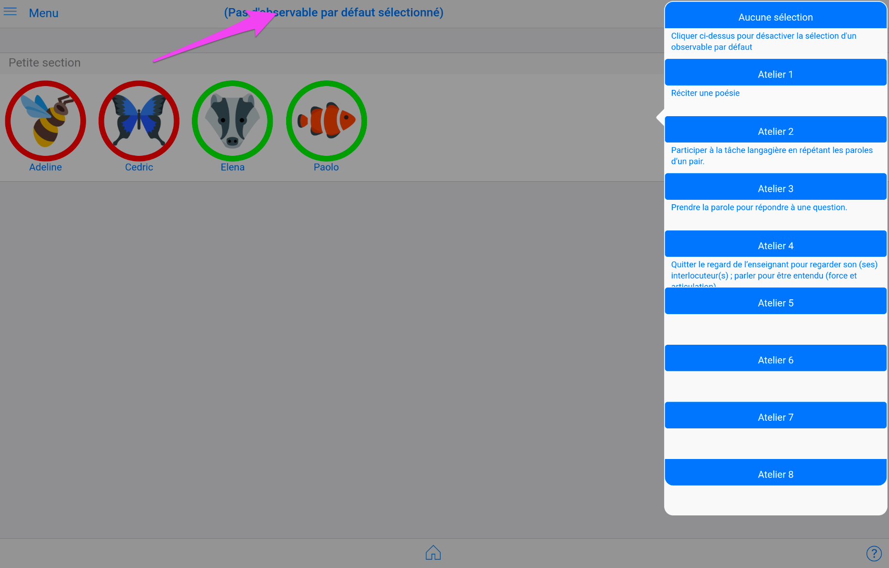

Pour sélectionner l'atelier sur lesquels le groupe d'élèves munis de la tablette travaille, touche la zone bleue contenant l'atelier correspondant : 

Le numéro de l'atelier et l'observable associé s'affichent maintenant dans la ligne d'entête.

A partir de cet instant, toutes les traces capturées par le groupe d'élève vont être affectées automatique à cet observable rappelé dans l'entête.

Des lors que l'élève a commencé par choisir son avatar avant de caputurer une photo, sa trace est automatiquement renseignée et vous n'aurez plus rien à faire, excepté revoir ou affecter un commentaire.

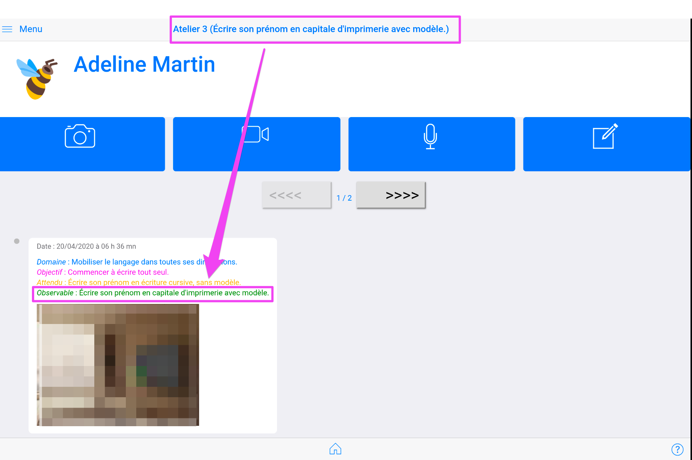

NB : au retour en mode enseignant, l'atelier courant est désélectionné. Aucun atelier par défaut n'est alors actif. Ceci pour éviter l'affectation automatique d'un observable à toute nouvelle capture de trace réalisée en mode enseignant. Il est néanmoins possible de re-sélectionner un atelier par défaut. Il sera ajouté à tout observable que vous pourriez choisir en complément.

## Prendre une photo

<!-- //todo : reactualiser illustrations -->

Une fenêtre de prise de vue s'affiche et l'élève n'a plus qu'à appuyer sur le déclencheur.

<!--  -->

Saisie d'un commentaire associé à la photo : 2 possibilités.

Avec le clavier,
Avec une reconnaissance vocale :

L'écran suivant s'affiche après avoir `Sauvegarder`

Le message indique que tout s'est bien déroulé !

***Point important :*** 

Lorsqu'aucun élève n'a été préalablement sélectionné, la photo n'est pas associée à aucun élève.
L'association devra être réalisée par le professeur dans un second temps, grâce au `mode professeur` et au menu `Mes documents`.

Ce mode de capture permet d'utiliser rapidement la tablette sans aucun choix préalable (mode `Saisie rapide`).

## Prendre une video

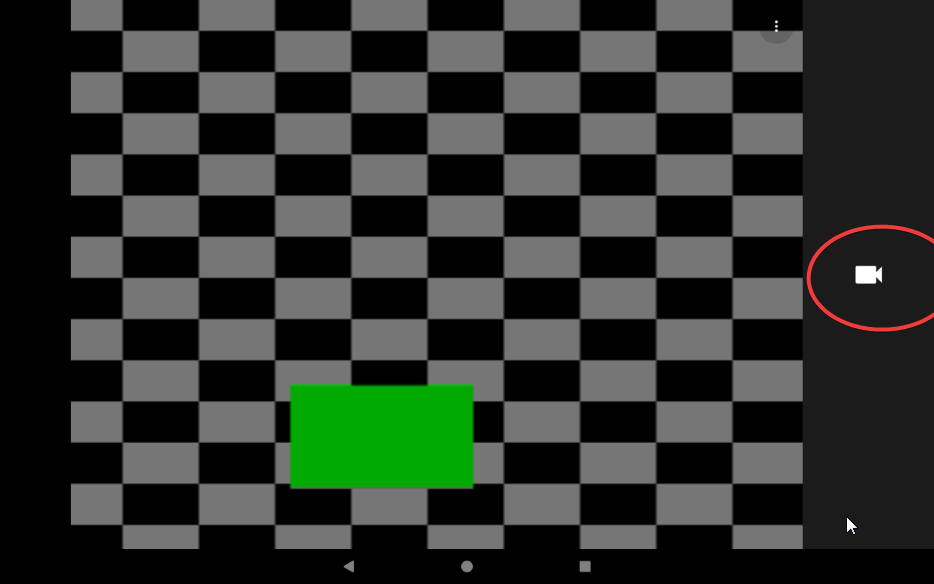

Fonctions identiques que pour la photo : 

## Enregistrer un son

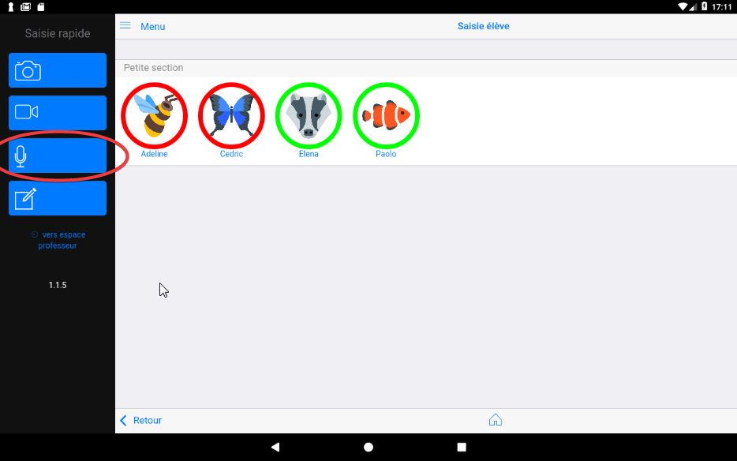

Appuyer sur `Démarrer` pour commencer l'enregistrement audio.

Lors du premier usage du logiciel sur la tablette, il faut `Autoriser`l'enregistrement.
Il est préférable que le professeur effectue ce premier réglage.

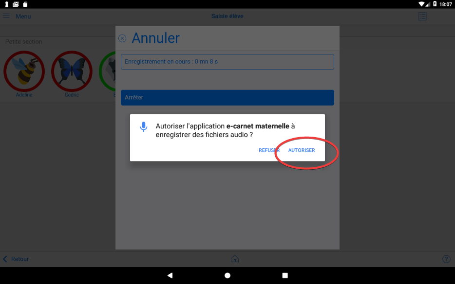

Pendant l'enregistrement, un compteur précise la durée.
Il faut appuyer sur `Arrêter` pour mettre fin à l'enregistrement.

A la fin de l'enregistrement un message de confirmation indique si tout s'est bien passé.

NB : ce message précise par ailleurs le nombre total de documents déjà enregistrés par la tablette avec le logiciel ***e-carnet de maternelle***.

<!-- // TODO : voir pourquoi il n'y a pas l'écran permettant d'ajouter un commentaire. -->

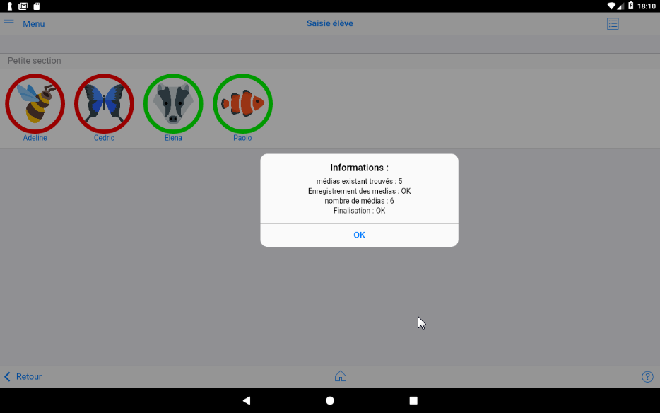

## Saisir une note

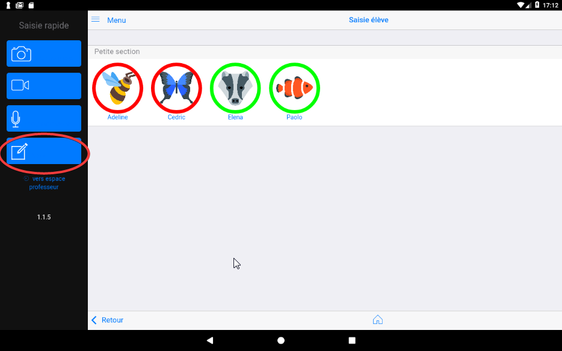

Comme précédemment, 
2 possibilités : 

Un nouveau bouton ***Ecouter*** permet à l'élève de déclencher une synthèse vocale.

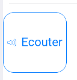

## Selection élève

## Fiche élève

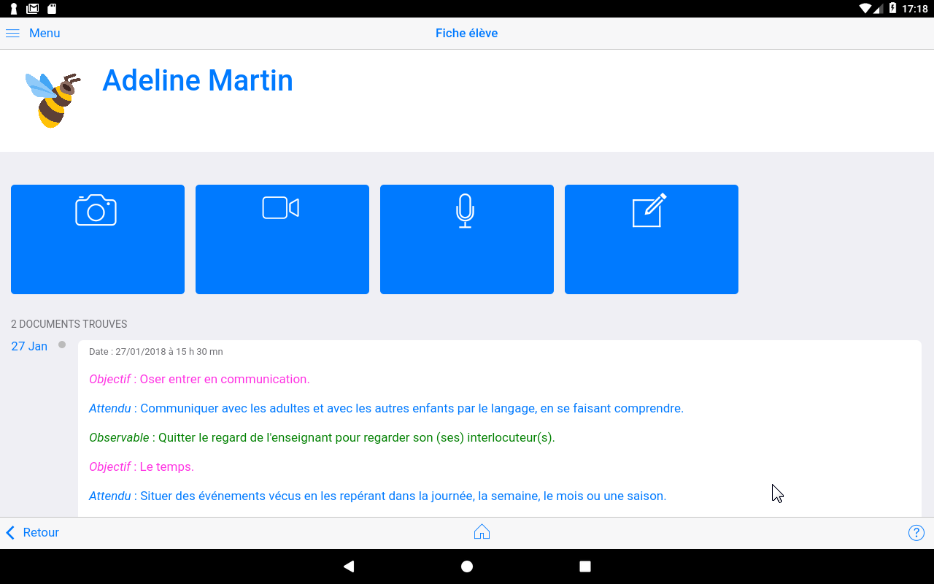

Le bouton `retour` permet de revenir à la liste des élèves.

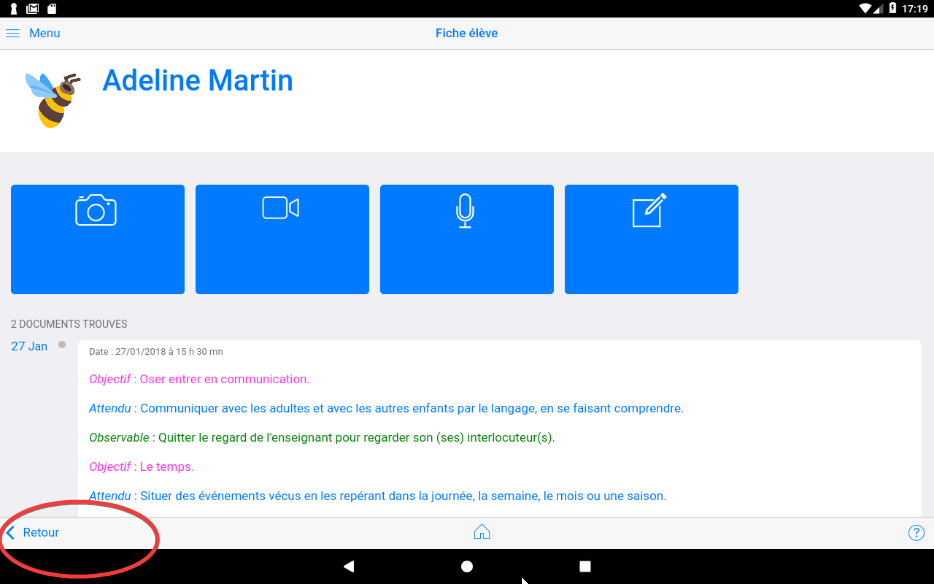

Le bouton `menu`permet de revenir aussi à la liste des élèves.

## Basculer en mode professeur.

Le passage en mode professeur permet d'accéder à des fonctionnalités complémentaires de gestion et de paramétrage.

Regardez le changement du contenu des menu et l'adaptation de la taille des icônes.

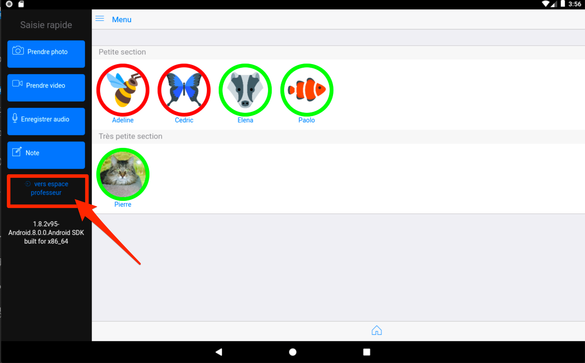

## Numéro de version

Ce numéro correspond à la référence de la version de l'application ***e-carnet de maternelle*** installée sur la tablette. Elle est utile à rappeler dans toute correspondance avec le soutien.

