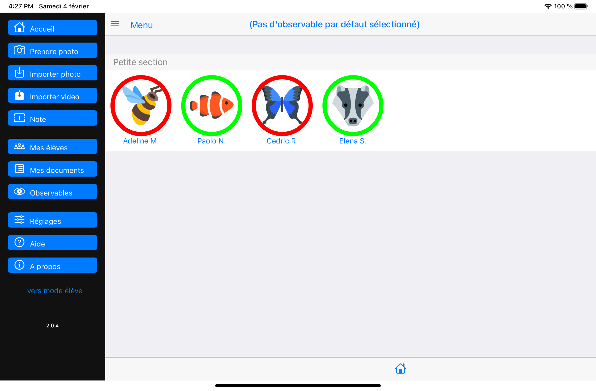

# Parcours professeur

Afin d'éviter toute mauvaise manipulation des données par les élèves, un mot de passe protège l'accès au `mode professeur`. Le code par défaut est ***1234***. Ce code pourra être modifié dans les `Réglages`.

De nouveaux boutons apparaissent à gauche.

Version courante : sans les boutons video et audio

Pour mémoire uniquement, la version 1 avec tous les boutons, en attendant leur remise en place.

Le bouton `Accueil` permet de refaire afficher cet écran dans toute circonstance.
Il permet aussi de 'rafraichir' le contenu de certains écrans.

