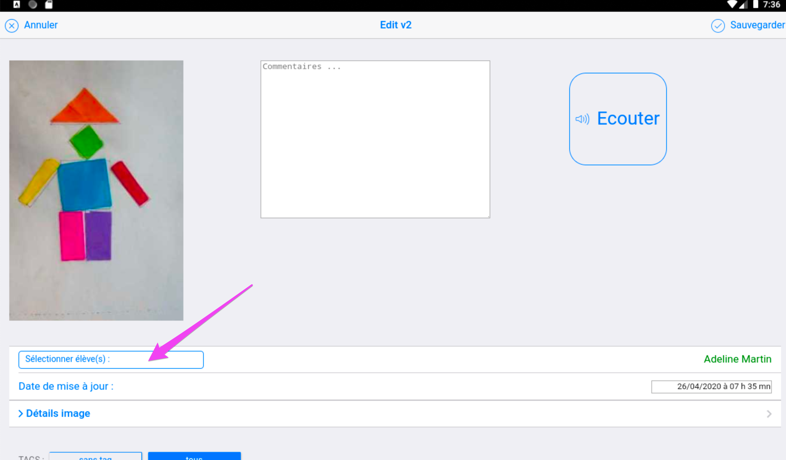

## Boutons médias

Les 4 boutons : 

- `Prendre photo`
- `Prendre vidéo`
- `Enregistre audio`
- `Note`

Ont des fonctions similaires à ceux du `mode élève` aux différences pres suivantes : 

Il est possible de choisir l'élève à associer : 

<!--  -->

Vous avez 3 possibilités pour associer des élèves à un média : 

- Affecter un média à TOUS les élèves
- Affecter un media à AUCUN élève
- Affecter individuellement le media

Il est possible de changer la date de prise de vue ou de saisie du document. C'est cette date qui est restituée dans le carnet de réussite produit pour les parents.

<!--  -->

[!embed](https://www.youtube.com/watch?v=N4qnMq5nE2A)

Il est possible d'associer une référence d'observable au document capturé.

<!--  -->

Si vous avez paramétré des tags (étiquettes), cliquer sur le tag 'P4' permettant de filtrer le référentiel pour ne visualiser que les observables de la période 4 par exemple.

Puis activer le sélecteur pour associer le bon observable à la trace que vous venez de capturer.

Terminer en sauvegardant :

Avec un commentaire associé et en utilisant les dernieres fonctionnalité de personnalisation du e-carnet, voila à quoi peut ressembler cette trace dans le e-carnet généré : 

