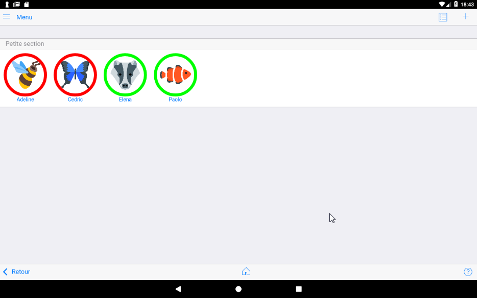
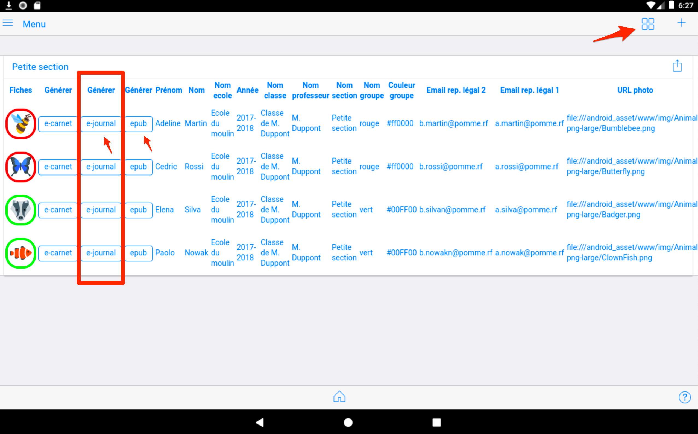
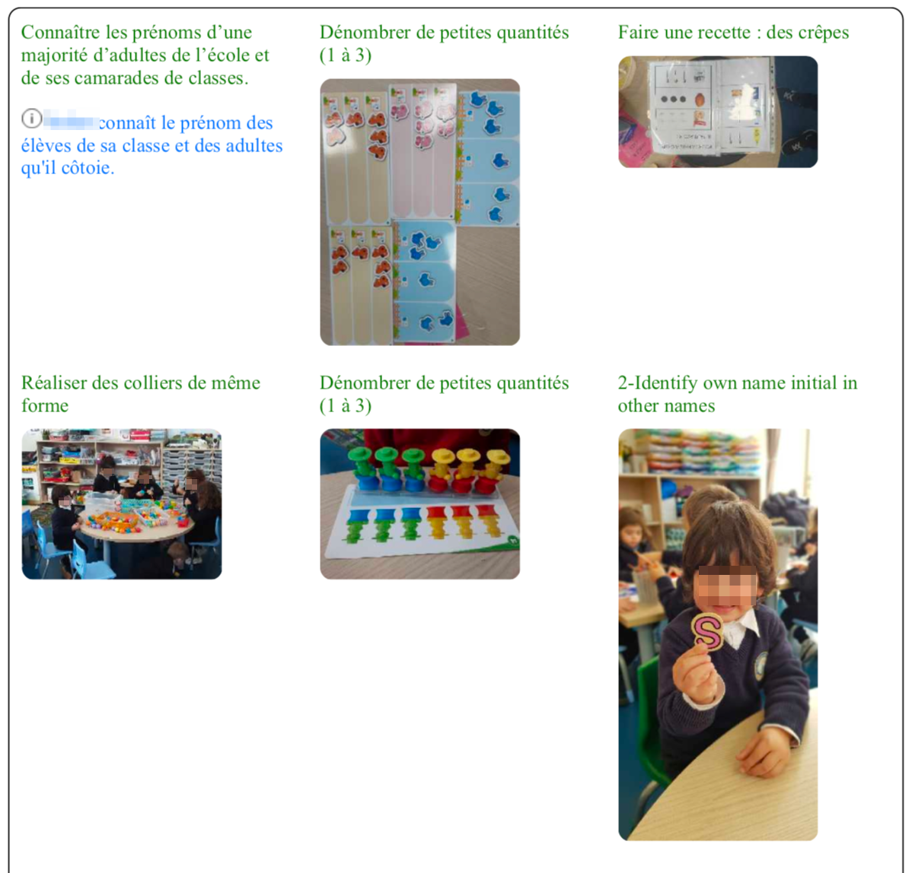

## Mes élèves 

### Mode mosaique

Ce bouton permet d'afficher la liste complète des élèves de la classe.
C'est la liste associée à l'enseignant désigné dans la page "réglages". 

<!-- //TODO : ajouter copie écran-->

### Mode liste

Ce mode d'affichage apporte des raccourcis sur les commandes de production 

### Générer un e-carnet

Voir le chapitre correspondant : [Générer un e-carnet](30-GenererECarnet/index.html)

### Générer un e-journal

Cette fonctionnalité nouvelle depuis la version 1.8.2 est une "version spéciale" du e-carnet qui permet : 

- de produire une variante du e-carnet basée sur la restitution chronologique des traces et non plus par observable.
- de générer une variante du e-carnet "multilingue".

En effet, il est maintenant possible de changer de référentiel d'un jour ou d'un cours sur l'autre...

Le cas d'usage est celui des classes multilingue.

L'enseignant de la langue étrangère change de référentiel avant son intervention en classe. Des lors toutes les traces qu'il va capturer poourront être associées à son référentiel, dans sa langue.

Le retour à la langue principale s'effectue par le chargement du référentiel correspondant.

Le e-journal restituera toutes les traces avec observables, quelle que soit la langue et donc le référrentiel utilisé.

Le e-carnet, lui, ne restituera que les traces associées au référentiel courant, lors de la production du e-carnet.

La différence est que le e-carnet pourra mettre en évidence (avec une suite de photos consécutives) un progres pour un observable donné, alors que le e-journal contiendra toutes les traces triées par ordre chronologique (sans regroupement par observable). 

Extrait d'un e-journal produit à partir d'un référentiel personnalisé avec l'outil referentiel builder. Ici Français/Anglais : 

<!-- //todo : ajouter illustration -->

### Générer un fichier epub

(Partie à compléter)

