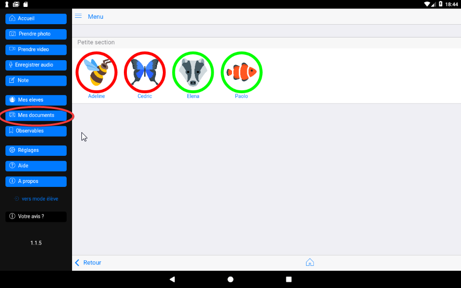
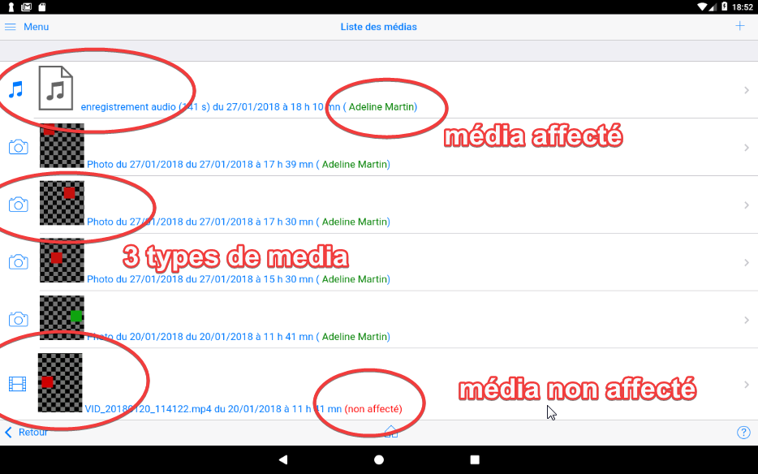
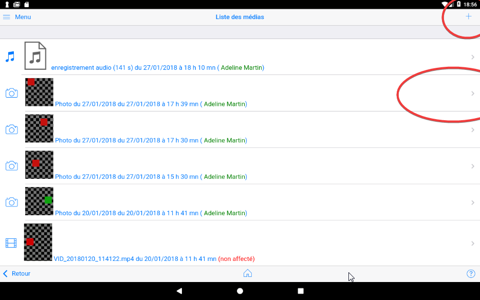
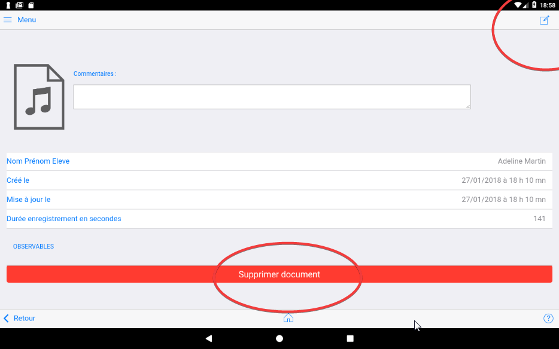

## Mes documents

Cet écran liste la totalité des documents ou médias enregistré par l'application ***e-carnet de maternelle***.

Une icône est spécifique à chaque nature (audio, photo, vidéo, note).

Chaque média précise l'heure de son enregistrement ainsi que l'élève qui lui est associé lorsque c'est le cas.

Le bouton `+ ` permet d'ajouter un nouveau document.
C'est équivalent au choix de l'un des 4 boutons média de la barre de gauche.

Un clic sur l'un des document provoque l'affichage de sa fiche : 

Cela permettra de la modifier ou de la supprimer.
Voir le chapitre correspondant.

