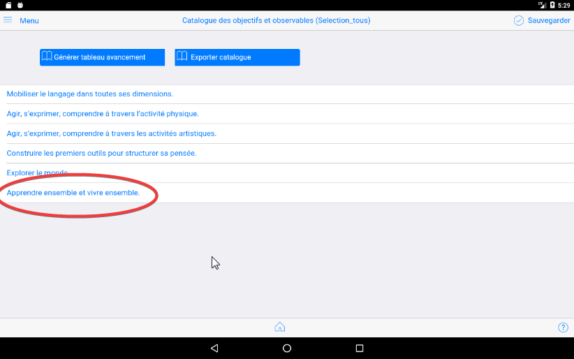
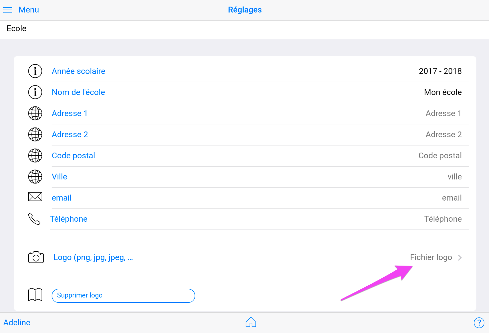
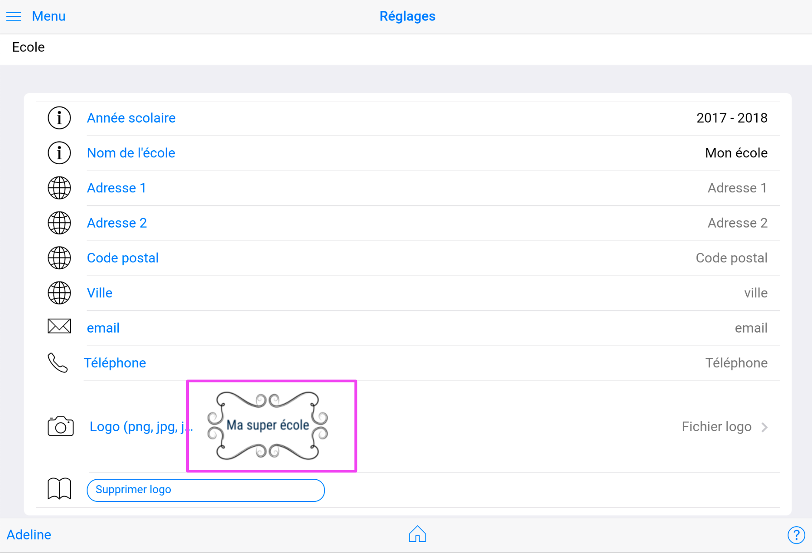
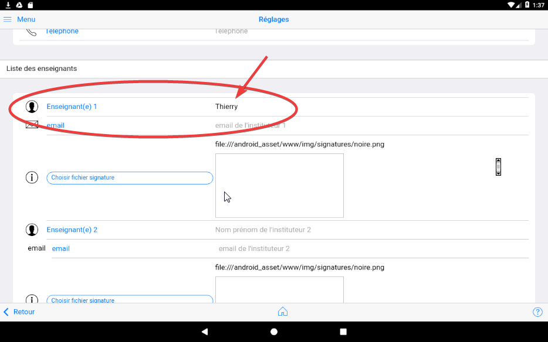
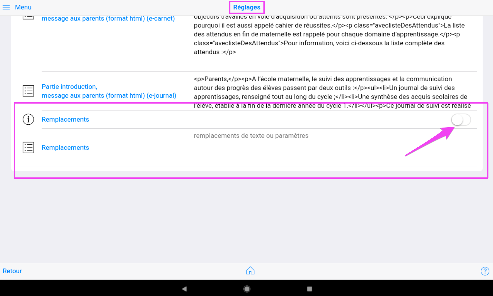
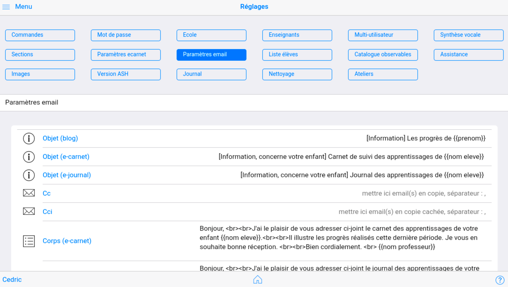
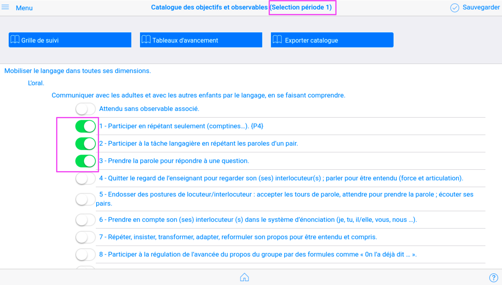

## Réglages


NB : Toutes les modifications effectuées dans la page `Réglages` sont instantannément enregistrées. Il n'est pas nécessaire de chercher un bouton "sauvegarder mes réglages" !

<!--  -->


### Commandes diverses

<!--  -->


`Sauvegarder base de données` permet de produire une archive (fichier zip) contenant tous les fichiers qui constituent le référentiel de données de l'application.

Cette fonction peut être utilisée avant de faire des modifications substancielles sur la liste des élèves par exemple ou dans les différents documents.

Cette fonction de sauvegarde ne gère pas les photos, vidéos et fichiers audio. Ces documents multimédias se sauvegardent grâce aux mécanismes natifs de la tablette et mis en oeuvre, ou pas, par son utilisateur.

`Restaurer base de données`  permet de recharger un fichier de sauvegarde produit par la commande précédente.
Cette fonction ne permet pas de retrouver des photos ou des vidéos qui auraient été supprimés ou déplacés.

`Recharger catalogue observables` est une nouvelle commande depuis la version 1.1.14v21.

Elle permet de prendre en compte le nouveau référentiel des observables introduit dans la version 1.1.13v20 par certains utilisateurs. Cette fonction n'est pas utile aux nouveaux utilisateurs qui ont commencé leur expérience e-carnet de maternelle à partir de la version 1.1.13v20. 
Attention, l'utilisation de cette commande réinitialise aussi les sélections personnalisées.

A l'issue de ce rechargement, l'affichage du menu `Observables` doit faire apparaitre la nouvelle partie du catalogue des observables : "Apprendre et vicre ensemble".



`Importer fichier epub` 

Cette commande permet d'importer dans la tablette un élève avec tous ces observables et documents (photos, videos, audios) associés.

Elle permet en particulier de passer un élève d'une tablette à une autre.

Elle est comparable à la technique de sauvegarde/restauration qui permet, elle, de trasnmettre ou de récupérer toutes les données de tous les élèves.

`Générer tous les fichier EPUB` 

Cette commande produit en une seule fois un fichier EPUB par élève. C'est une façon de : 

- faire une sauvegarde individualisée
- préparer un depôt dans un ENT, un drive ou tout espace partagé.

`Mettre à jour fichier remplacements` 

Cette commande permet de remplacer votre version courante du fichier qui gère la personnalisation du e-carnet et du e-journal avec la version la plus à jour.

Ce fichier est stocké dans le répertoire réglages et s'appelle "remplacements.json".

A partir de cette mise à jour, toute activation de la commande "Remplacements" dans les paramètres du e-carnet va remplacer vos précédents réglages dans ces personnalisations.


### Changement du mode de passe


### Paramétrage de la description de l'école


#### Ajouter un logo

<!-- Aller dans Réglages puis Ecole.  -->

Aller dans le bas de la page : 


Toucher "fichier logo"



Choisir une fichier que vous aurez préalablement téléchargé sur votre tablette. 


L'image du logo est insérée : 



Pour voir le résultat, aller sur une fiche élève puis générer un e-carnet. Résultat : 


### Paramétrage des utilisateurs de la tablette

L'application peut être utilisée par plusieurs professeurs.

Pour cela, il faut renseigner les noms des différents enseignants et indiquer celui qui est l'utilisateur courant.

Pour changer le nom de l'enseignant par défaut (changer 'admin') par exemple, il faut procéder en 2 étapes :

1 - Changer le nom admin par votre nom



2 - Aller dans la rubrique `Qui suis-je` et cliquer sur le nom (admin par défaut). Choisisez alors votre nom dans le sélecteur qui s'affiche.


Seule, sa classe sera visible, avec tous ses élèves. (NB : chaque élève est associé à un et un seul instituteur. La liste des élèves qui apparait est celle qui est associée à l'enseignant du "qui suis-je").

Dans cette version, la tablette peut être ainsi partagée par 3 professseurs, chacun pouvant avoir sa propre liste d'élèves.

Un fichier image représentant le scan de la signature de chaque enseignant permet de "signer" automatique le carnet transmis par email aux parents.
Ce fichier est modifiable.
Le fichier doit être déposé préalablement dans le répertoire de la tablette "Download/e-carnet-maternelle" pour être sélectionnable.


#### Paramétrage du directeur/de la directrice de l'école

Ce paramétrage est utilisé pour signer le carnet transmis par email aux parents.


### Multi-utilisateur : Qui suis-je ?

Ce paramètre est important.

Il impacte directement la sélection des élèves affichés dans la page `Mes élèves`.

C'est le nom du professeur utilisateur courant de la tablette. Touts les élèves créés lui sont alors affectés.

Lorsque la tablette change de professeur, il est important de changer cette valeur.


### Synthèse vocale


La vitesse (entre 0 et 1, exemple 0.75) influence la vitesse de locution de la synthèse vocale.$

Les 2 sélecteurs permettent respectivement de lancer automatiquement ou de désactiver les messages standard prononcés par la synthèse vocale : 

- au démarrage : "Bienvenue sur l'application e-carnet de maternelle"
- à chaque changement d'élève : "Bonjour (prénom de l'élève)"

Cette fonctionnalité est à la fois démonstrative de ce qui peut être fait mais permet aussi un retour d'information à l'élève qui vient de cliquer sur son avatar.

Cette fonction peut aider à générer une motivation supplémentaire à l'usage par les élèves en mode autonome.

NB : il faut avoir préalablement activé la fonctionnalité de reconnaissance vocale de la tablette.

Voir [Activer la reconnaissance vocale de la tablette](#activer-la-reconnaissance-vocale-hors-connexion-android-version-6.x)


### Nom des sections

Chaque éléve peut être regroupé dans une section, associée à un nom et  à une couleur.

<!--  -->


C'est ici que le nom de vos classes peuvent être paramétrées

Elles apparaitrons ensuite : 

- dans le popup accessible dans la fiche élève


- dans la page "Mes élèves" comme intitulé et clé de tri des élèves


### Paramètres e-carnet


#### Gestion des dates


La date figurant sur le e-carnet est modifiable ici. 

Vous la retrouverez pres des cartouches signatures : 


Les dates de DEBUT et FIN de période servent à filtre le contenu du e-carnet : seuls les observables qui auront des medias dont la date d'enregistrement est comprise entre ces 2 dates seront restitués dans le e-carnet.

Cela permet par exmple de produire soit : 

- un e-carnet ne contenant que les observables d'une période donnée
- un e-carnet contenant les observables de toute l'année scolaire.

La date utilisée pour ce filtrage est celle qui apparaît ici : 


NB : la partie de date significative est la partie JJ/MM/AAAA, le reste est ignoré.

#### Gestion des textes

Cette partie permet de personnaliser du texte qui aparaît dans le carnet diffsué par email aux parents.


Ces textes sont modifiables.

Pour cela cliquer sur l'un d'entre eux. Cela fait apparaître un éditeur de texte.

Pour commencer à saisir et rentrer en édition commencer par cliquer sur le premier symbole : 


Dans cette version, le texte est compatible avec une syntaxe html.

```html
<p></p> encadre un paragraphe 
<ul></ul> un début et une fin de liste
<li></li> un item de liste.
```

#### Activation de la fonction de personnalisation

Pour activer la fonction de personnalisation, cliquer sur le sélecteur : 



Ce qui donne : 


Cette activation a pour conséquence de charger en mémoire le contenu du fichier "remplacements.json" qui se trouve dans le répertoire "downloads/e-carnet maternelle/réglages" de votre tablette.

Son contenu apparaît dans l'écran et devient **modifiable**.

Une autre façon de procéder consiste à modifier avec un éditeur de texte le fichier "remplacements.json" soit depuis un éditeur compatible depuis la tablette ou depuis un PC/Mac sur lequel ce fichier aura été récupéré.

Pour l'activer, il suffira de le remettre à sa place dans le répertoire "Réglages" et de désactiver/ré activer le commutateur "remplacements" : 


**IMPORTANT** : la personnalisation n'est pas visible directement depuis l'écran de l'application au moment de l'affichage du e-carnet. C'est en ouvrant les fichiers html sur la tablette avec un navigateur ou un visualisateur html que la personnalisation est visible.

Et c'est bien le fichier personnalisé qui sera inséré comme pièce jointe aux emails pour les parents.

<!---
Toute modification réalisée par cet écran sera "écrasée" par toute prochaine désactivation/réactivation ultérieure (c'est le contenu du fichier remplacements.json)
-->

#### Paramétrage de la personnalisation

Les documents (e-carnet ou e-journal) produits par l'application sont des fichiers au format html.

Contrairement aux fichiers pdf, ils sont modifiables.

Une nouvelle fonction accessible depuis le menu "réglages", puis "Paramètres e-carnet" permet de paramétrer une succession de modifications dans chaque fichier produit.

Cette fonction utilise un mécanisme claissique de "chercher/remplacer".

Elle consiste donc à transformer une chaine de caractères par une autre ou à changer un paramètre de style par un autre.

Le "chercher" utilise la syntaxe "expression régulière" ou "regular expression, regex" en anglais.

Cette syntaxe est expliquée ici : 

[Wikipedia : expressions régulières](https://fr.wikipedia.org/wiki/Expression_r%C3%A9guli%C3%A8re)

De nombreux tutos ou exemples sont disponibles en recherchant avec Google.

#### Exemples

Exemple 1 : remplacer le texte "Bilan périodique des progrès" en "Bilan en langue Anglaise"
est transcrit de la façon suivante dans un fichier spécifique : 

```json
  {
    "actif":"non",
    "commentaire":"changement libellé bloc",
    "actuel": ">Bilan périodique des progrès<",
    "nouveau": ">Bilan en langue Anglaise<"
  }
```

Exemple 2 : masquage du titre "Ce que Adeline va apprendre"

```json
  {
    "actif":"non",
    "commentaire":"masquage",
    "actuel": "<h2> Ce que",
    "nouveau": "<h2 style='display: none;'> Ce que"
  }
```

Exemple 3 : Augmentation de la taille de la police de caractère 

```json
  {
    "actif":"oui",
    "commentaire":"augmentation taille police",
    "actuel": "font-size: 14px;",
    "nouveau": "font-size: 16px;"
  }
```

Exemple 4 : Suppression des dates 

```json
  {
    "actif":"oui",
    "commentaire":"suppression date",
    "actuel": "<p class=\"date\"> .*<\/p>",
    "nouveau": ""
  }
```

Tous ces "blocs" constituent autant de "chercher/remplacer" qui vont être appliqués sur chaque document produit avant de les enregistrer sur la tablette.

Le "chercher" est la valeur de "actuel".

Le "remplacer" est dans "nouveau".

Il y a 2 façons de modifier ou d'ajouter ces "blocs" : 

- via l'écran "Réglages/paramètres e-carnet" et la zone de texte "Remplacements" en changeant les "non" par "oui" et inversement, ou en rajoutant des blocs. Mais pas pratique à ce stade...

- via le fichier comme indiqué précédemment.


#### Quelques personnalisations

Extraits du fichier "remplacements.json : 

(inclus dans la version 1.9.9v105)

```json
  [
  {
    "actif":"oui",
    "commentaire":"Preuves : suppression colonnes et affichage horizontal 1/3",
    "actuel": "bloc-preuve {\n *(.*\n *.*)", 
    "nouveau": "bloc-preuve {\n"
  },

  {
    "actif":"oui",
    "commentaire":"Preuves : suppression colonnes et affichage horizontal 2/3",
    "actuel": "vignette-portfolio{}", 
    "nouveau": "vignette-portfolio{width: 30%; display:inline-grid;}"
  },

  {
    "actif":"non",
    "commentaire":"changement libellé bloc",
    "actuel": ">Bilan périodique des progrès<",
    "nouveau": ">Bilan en langue Anglaise<"
  },
  {
    "actif":"non",
    "commentaire":"changement libellé bloc",
    "actuel": ">Réussites régulières<",
    "nouveau": ">Bilan en langue Française<"
  },
  {
    "actif":"non",
    "commentaire":"changement libellé bloc",
    "actuel": ">Prochains apprentissages<",
    "nouveau": ">Bilan en langue Arabe<"
  },
  {
    "actif":"non",
    "commentaire":"masquage",
    "actuel": "<h2> Ce que",
    "nouveau": "<h2 style='display: none!important;'> Ce que"
  },
  {
    "actif":"oui",
    "commentaire":"augmentation taille police",
    "actuel": "font-size: 14px;",
    "nouveau": "font-size: 16px;"
  },
  {
    "actif":"oui",
    "commentaire":"suppression date",
    "actuel": "<p class=\"date\"> .*<\/p>",
    "nouveau": ""
  },
  {
    "actif":"oui",
    "commentaire":"suppression toutes les bordures cadre signature",
    "actuel": "<div class=\"bloc-cartouche-signatures bordure (.*)\">",
    "nouveau": "<div class=\"bloc-cartouche-signatures $1\">"
  },
  {
    "actif":"non",
    "commentaire":"",
    "actuel": "Enseignant :",
    "nouveau": "Enseignantes :"
  },
  {
    "actif":"non",
    "commentaire":"",
    "actuel": "Email :",
    "nouveau": "Site web :"
  },
  {
    "actif":"oui",
    "commentaire":"Suppression bouton",
    "actuel": "<button type=\"button\" class=\"button\" data-action=\"clearParent\">Effacer</button>",
    "nouveau": ""
  },
  {
    "actif":"oui",
    "commentaire":"Suppression bouton",
    "actuel": "<button type=\"button\" class=\"button\" data-action=\"undoParent\">Defaire</button>",
    "nouveau": ""
  },
  {
    "actif":"oui",
    "commentaire":"Suppression bouton",
    "actuel": "<button type=\"button\" class=\"button\" data-action=\"save-pngParent\">Utiliser</button>",
    "nouveau": ""
  },
  {
    "actif":"oui",
    "commentaire":"Masquage par défaut des titres observables",
    "actuel": "domaine flagMasquerTitresCompetences",
    "nouveau": "domaine flagMasquerTitresCompetences\" style=\"display: none!important;"
  },
  {
    "actif":"oui",
    "commentaire":"Masquage par défaut des titres observables",
    "actuel": "objectif flagMasquerTitresCompetences",
    "nouveau": "objectif flagMasquerTitresCompetences\" style=\"display: none!important;"
  },
  {
    "actif":"oui",
    "commentaire":"Masquage par défaut des titres observables",
    "actuel": "attendu flagMasquerTitresCompetences",
    "nouveau": "attendu flagMasquerTitresCompetences\" style=\"display: none!important;"
  },
  {
    "actif":"oui",
    "commentaire":"Suppression mode 2 colonnes",
    "actuel": "bloc container2col blocBilan",
    "nouveau": "bloc blocBilan"
  },
  {
    "actif":"oui",
    "commentaire":"Suppression mode 2 colonnes",
    "actuel": "bloc container2col blocReussitesRegulieres",
    "nouveau": "bloc blocReussitesRegulieres"
  },
  {
    "actif":"oui",
    "commentaire":"Suppression mode 2 colonnes",
    "actuel": "bloc container2col blocVaApprendre",
    "nouveau": "bloc blocVaApprendre"
  },
  {
    "actif":"oui",
    "commentaire":"Suppression mode 2 colonnes",
    "actuel": "bloc container2col blocBilanPeriodiqueProgres",
    "nouveau": "bloc blocBilanPeriodiqueProgres"
  },
  {
    "actif":"oui",
    "commentaire":"remplacement tag {...}, ne doit contenir que caractères A-Z a-z 0-9 _",
    "actuel": "{[A-Za-z0-9_]+}",
    "nouveau": ""
  },
  {
    "actif":"non",
    "commentaire":"remplacement tag {ar}",
    "actuel": "{ar}",
    "nouveau": " (Arabe)"
  },
  {
    "actif":"non",
    "commentaire":"suppression tag {en}",
    "actuel": "{en}",
    "nouveau": ""
  },
  {
    "actif":"oui",
    "commentaire":"suppression complète cadre signature directeur",
    "actuel": "signatureDirecteur{}", 
    "nouveau": "signatureDirecteur{display:none!important;}"
  },

  {
    "actif":"non",
    "commentaire":"inactif, suppression heure mn dans la date, pour mémoire uniquement",
    "actuel": "/> Le (.*) à (.*) mn",
    "nouveau": "/> Le $1 "
  },
  {
    "actif":"non",
    "commentaire":"inactif, pour mémoire uniquement",
    "actuel": "<p>Visa de l’enseignante / de l’enseignant de la classe :</p>",
    "nouveau": ""
  },
  {
    "actif":"non",
    "commentaire":"inactif, pour mémoire uniquement",
    "actuel": "<p>Visa de la directrice / du directeur de l’école :</p>",
    "nouveau": ""
  },
  {
    "actif":"non",
    "commentaire":"inactif, pour mémoire uniquement",
    "actuel": "<p>Visa des parents ou du représentant légal de l’élève :</p>",
    "nouveau": ""
  },
  {
    "actif":"oui",
    "commentaire":"masquage icone audio",
    "actuel": "audioType",
    "nouveau": "inactif"
  },
  {
    "actif":"oui",
    "commentaire":"suppression",
    "actuel": "(Libellé non trouvé)",
    "nouveau": ""
  }

]

```


#### Attention

Comme le contenu des fichiers e-carnet et e-journal sont susceptibles d'évoluer, il n'est pas impossible que certains des chercher/remplacer ne fonctionnent plus. Il conviendra alors de les mettre à jour.


### Paramètres email

Ces paramètres permettent de pré-remplir l'email généré à destination des parents.

<!--  -->


Ces informations sont utilisées par le générateur d'email à destination des parents lorsque vous cliquez sur l'icône "partager" apres avoir générer un e-carnet.

Vous pouvez ajouter ici des destinataires systématiques en Copie Conforme (CC) u en Copie Cachée Invisible (Cci).

Les parties "Corps" sont modifiables avec un éditeur intégré.

Pour cela cliquer sur l'un d'entre eux. Cela fait apparaître un éditeur de texte.

Pour commencer à saisir et rentrer en édition commencer par cliquer sur le premier symbole : 


Dans cette version, le texte est compatible avec une syntaxe html.

```html
<p></p> encadre un paragraphe 
<ul></ul> un début et une fin de liste
<li></li> un item de liste.
```


### Gestion de la liste des élèves


#### Importer depuis fichier

`Importer fichier élèves` permet, sur la base d'un fichier de type excel modèle d'initialiser sa tablette avec tous ses élèves ainsi que les informations qui leur sont associées.
Cette fonction évite une saisie qui peut être fastidieuse au démarrage si le fichier excel existe par ailleurs.

Exemple d'import d'un fichier de 20 élèves : 


Après import : 


Le fichier modèle est obtenu par l'export de la base élève. Voici la démarche : 

1 - Afficher la liste des élèves en mode liste en cliquant sur l'icône liste : 


2 - Cliquer sur export


Le fichier est enregistré dans le répertoire de la tablette "Download/e-carnet-maternelle".

Voir [ici](#trouver-le-catalogue-des-observables\indexobservables-ou-le-fichier-excel-des-élèves-\indexfichier-xls-élèves) pour les manipulations à faire pour trouver ce fichier.


3 - D'une façon comme d'une autre, modifier ce fichier XLS et le remettre dans le dossier Download pour le ré-importer : 


Puis cliquer sur OK


NB : les fichiers importés s'ajoutent aux élèves existants.

Un message confirme le nombre d'élèves importés : 


Vous pouvez voir le résultats en revenant dans le menu puis "mes élèves"


#### Récupérer liste élèves en cas de problème

***ATTENTION*** : à utiliser avec précaution.

A n'utiliser que sur recommandation du support.

`Récupérer élèves depuis sauvegarde automatique` est une fonction à n'utiliser qu'en cas de situation extreme et sur recommandation du support. Elle permet de recharger la base de données des élèves à partir d'un fichier de sauvegarde qui est automatiquement généré par l'application à chaque démarrage.

Elle écrase par conséquent la version courante. 


#### Supprimer tous les élèves

***ATTENTION*** : à utiliser avec précaution.

La fonction `Supprimer tous les élèves` supprime irrémédiablement tous les élèves décrits dans l'application.

Cette fonction est utile à plusieurs occasions : 

- suppression des essais et des élèves initialisés par défaut,
- au commencement d'une nouvelle année.

#### (A-B) Supprimer tous les medias

***ATTENTION*** : à utiliser avec précaution.

La fonction `Supprimer tous les medias` supprime irrémédiablement tous les medias catalogués dans la base de données interne de l'application e-carnet.

Cette fonction est surtout utile à l'occasion du commencement d'une nouvelle année, pour nettoyer l'application et repartir sur une base vide.

A la différence d'une suppression/ré-installation de l'application, tous les réglages sont conservés. Cette fonction ne supprime pas les élèves.

Cette fonction enchaine les 2 fonctions unitaires ci-après : 

- A - Nettoyer base médias
- B - Supprimer les medias orphelins

#### A - Nettoyer base médias

***ATTENTION*** : à utiliser avec précaution.

Cette fonction efface le contenu de la base de données des documents.

#### B - Supprimer les medias orphelins

***ATTENTION*** : à utiliser avec précaution.

Cette fonctionne supprime les fichiers associés à des traces utilisés par l'application e-carnet (photos, videos, audios) qui ne figurent plus dans la base de données.

Elle ne supprime que les fichiers produits par l'application : les fichiers photo, videos, autios dont le nom commence par ECM_.

Elle ne supprime aucun autre document de la tablette.


### Gestion du catalogue des observables


#### Changement de référentiel (1)

Cette fonction permet de sélectionner un fichier .ecm qui contient un nouveau référentiel.

Ce fichier est produit à partir de l'application compagnon "Referentiel builder" qui fonctionne sur PC.

***Attention*** : chaque changement de référentiel "laisse des traces"... En effet, chaque référentiel apporte un jeu de nouveaux identifiants techniques et de libellés qui sont enregitrés dans une base de données interne pour faire un sorte de conserver en mémoire le référentiel en vigueur à chaque capture de trace, pour le restituer correctement dans le e-journal.

NB : 

- un e-journal est MULTI-référentiel : il contient, par ordre chronologique, tous les observables et traces capturés, quel que soit le référentiel utilisé.

- un e-carnet est MONO-référentiel : il ne peut contenir que des observables et des traces associés au référentiel courant.

#### Selectionner des sous ensembles du référentiel (2)

Cette fonction permet d'effectuer des sélection d'observables parmi le référentiel.

Cela permet par exemple de se fixer des objectifs précis dans une période donnée.

Cf ci-après l'exemple de choix d'une version simplifiée du catalogue : 

Les libellés sont modifiables.

Pour activer une sélection par défaut, cliquer en dehors du libellé.

<!--  -->


Ce qui va donner, dans la page "Observables" : 

<!--  -->


Vous pouvez librement changer le contenu de chaque sélection.


### Assistance


Ces fonctions ont vocation à aider à dépanner en cas de besoin...

`Envoyer rapport d'erreur` : si vous avez un logiciel de messagerie configuré sur votre tablette, cette fonction génère un email à destination du support dans lequel est joint le fichier journal.html.

Ce fichier, situé dans le répertoire Downloads/e-carnet maternelle, contient les derniers messages techniques générés par l'application.

`Tester écriture répertoire Pictures` : vérifie que l'un des dossiers nécessaire au bon fonctionnement de l'application est bien accessible.

`Nettoyer documents avec media supprimé` : dans le cas où un fichier media serait supprimé manuellement, cette fonction permet de supprimer aussi sa référence dans la base de données.

`Vérifier liens photos` : vérifie que tous les medias référencés sont associés à des fichiers accessibles.

`Exporter fichier media` : génère un fichier utile pour le support.

`Exporter liste medias disque` : idem

Envoyer le fichier qui commence par Disque.Medias, cf ci-dessous : 


Transmettre ce fichier au développeur : [thierry@tr-esolutions.com](mailto://thierry@tr-esolutions.com)

`Importer fichier medias` : ne fait rien ! A revoir ...

`Génére classe demo` : censé génèrer une classe de 20 élèves. A revoir.


### Images

Contrairement à la plupart des logiciels de sa catégorie (gestion d'images, fonctions de communication avec les parents, ...), le logiciel e-carnet maternelle fonctionne sans serveur connecté à Internet.

Le logiciel doit donc gérer toutes les photos, videos, audios enregistrés : 

- stockage sur la tablette, 
- optimisation de la mémoire
- gestion de certaines limites techniques

En particulier, afin de pouvoir générer un fichier e-carnet dont la taille et le contenu sont compatibles avec ue transmission par email, certains réglages et compromis sont nécessaires.

Ils sont d'autant plus nécessaires que le nombre de photos par élève augmente. 

Lorsque les e-carnets d'une classe de 25 élèves, avec chacun plus de 30 photos sont à produire, certaines optimisations doivent être consenties... 

Des configurations à plus de 600 photos sont courantes pour les plus grand(e)s utilisatrices/utilisateurs de l'application !

Cette page contribue à ces optimisations.

NB : ces paramètres influencent : 

- la taille des fichiers e-carnet générés
- le risque de plantage
- le volume de stockage disponible sur la tablette


- réduction photo (1) : facteur de réduction. Exemple : 2 réduit de moitié la largeur des photos enregistrées par le logiciel. 
  
- Seuil de réduction forcée photo (2) : c'est le nombre de photos associées à un élève au-delà duquel une réduction forcée est réalisée. Sinon, la taille du fichier du e-carnet risque d'être trop volumineux pour être envoyé par email.
  
- Largeur max photo blog et email en pixel (3) : conditionne la taille de la photo qui va être incluse dans la fiche élève et dans l'email "individuel" qui peut être transmis aux parents.
  
- Réduction avatar (4) : facteur de réduction qui opère uniquement sur la taille de la photo de l'avatar élève qui est inséré dans le e-carnet.
  
- Réduction signature (5) : facteur de réduction qui opère uniquement sur la taille de les signatures qui sont insérées dans le e-carnet.

- % compression jpg (6) : influence la netteté des photos conservées par le e-carnet.
  
- Largeur capture photo (7) : largeur en pixel des photos conservées par le e-carnet.

Recette : pour agrandir les photos avec la meilleure qualité, utiliser les valeurs suivantes : 

- Largeur capture photo : 0
- Largeur max. photos blog et email (px): 600, 900, ...
Plus cette valeur est grande, plus les photos vont prendre de la place sur la tablette et plus gros sera l'email issu du blog.
La netteté dans le e-carnet en dépend aussi

(Partie à illustrer)


### Version ASH


ASH : Adaptation scolaire et Scolarisation des élèves Handicapés. 

A la demande d'un collègue spécialisé, cette fonction permet d'envisager l'utilisation du logiciel e-carnet maternelle dans un contexte autre que celui du cycle 1 (maternelle).

Ce commutateur permet de supprimer toutes référence à "maternelle" dans les différents documents produits aux parents.

Cette fonctionnalité reste à expérimenter. Elle doit être mise en oeuvre avec les fonctions de personnalisation du référentiel.


### Journal


Le commutateur permet de réafficher la petite fenêtre transparente qui apparait en sur-impression. 

Elle permet de visualiser des messages de services.

Ces messages donnent des indications sur la progression de certaines opérations ainsi que d'éventuels messages d'erreurs.

(Partie à illustrer)


### Nettoyage


Ces fonctions sont identiques à celles décrites dans la section [Gestion de la liste d'élèves](#gestion-de-la-liste-des-élèves).


### Ateliers


Cette page permet de donner des noms à chacun de vos ateliers.

Le cas d'usage est expliqué dans le chapitre [Gérer des ateliers](#Gérer-des-ateliers), du chapitre Manipulations diverses.


