## Aide

L'aide est accessible depuis le bouton du menu principal : 

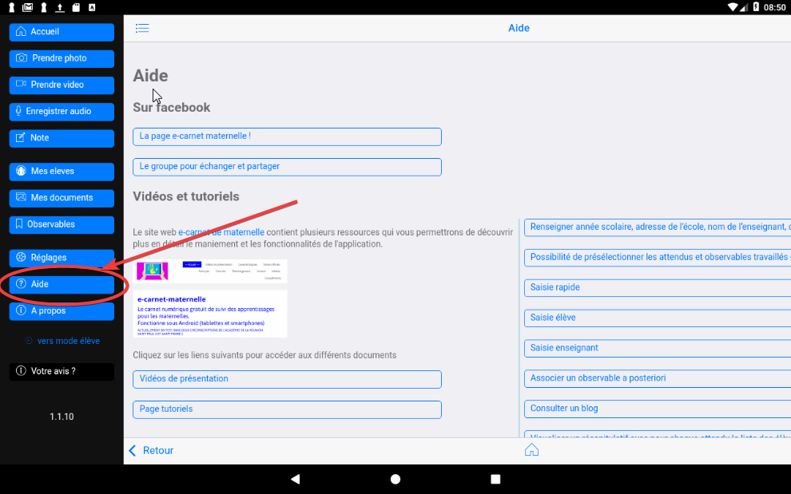

### Le tableau de bord

`Tableau de bord` 

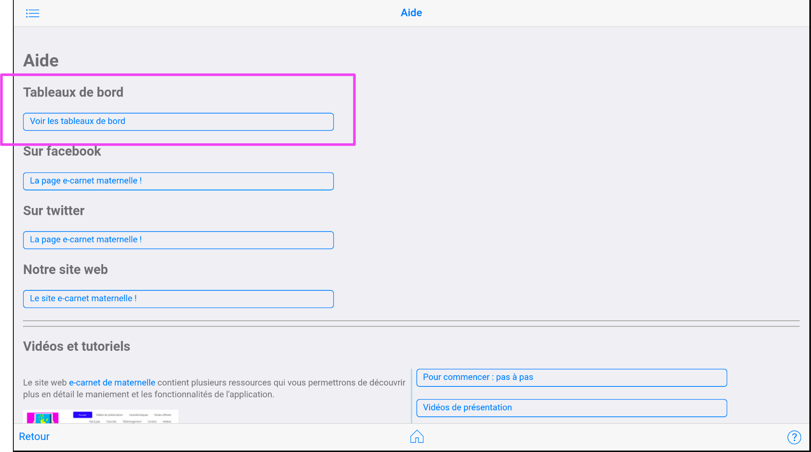

Coup d'oeil sur votre espace disque total et restant : 

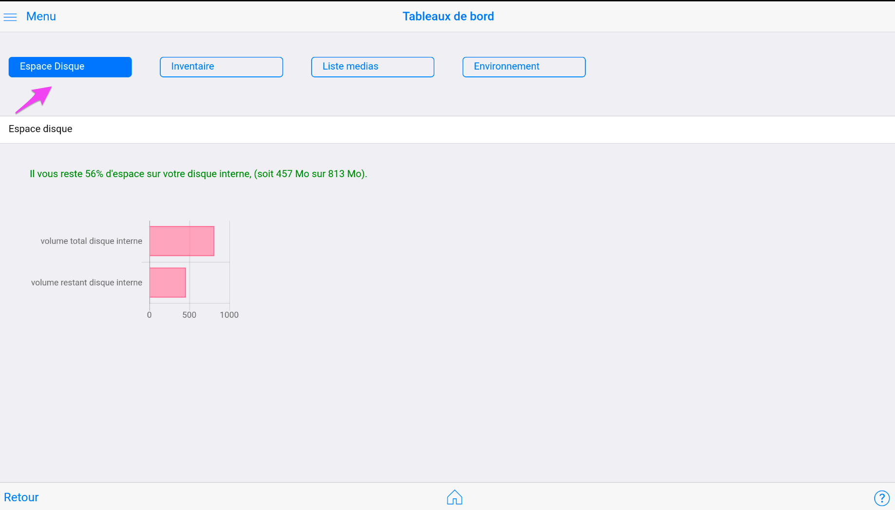

Volume des différents objets de votre application.

Vous permet d'avoir une idée du nombre des : 

- élèves
- photos
- videos
- audios
- notes

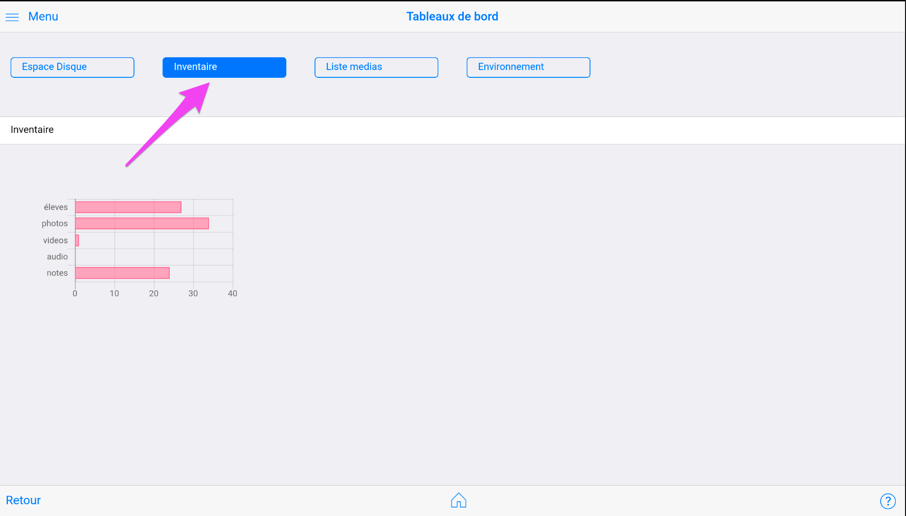

Liste des medias et des élèves associés

Vous permet d'avoir une vision exhaustive des documents et de leur association avec les élèves concernés.

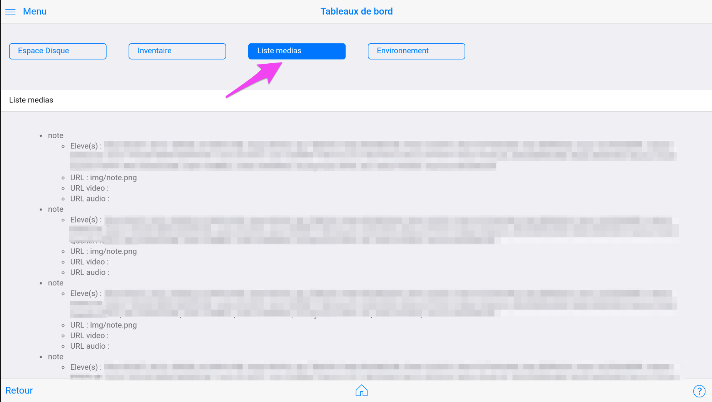

Environnement

C'est la copie de paramètres techniques qui sont insérés dans le fichier journal.html, utile en cas de besoin d'assistance.

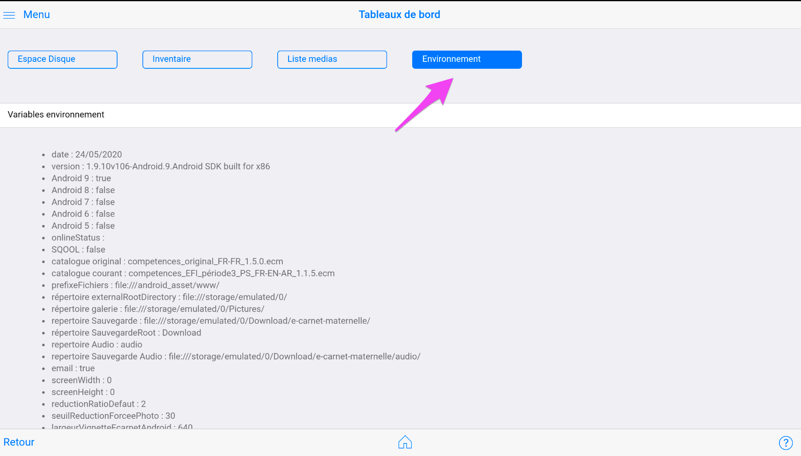

### Les liens vers les réseaux sociaux

Plusieurs ressources sont disponibles : 

- la page Facebook
- le groupe Facebook

<!-- 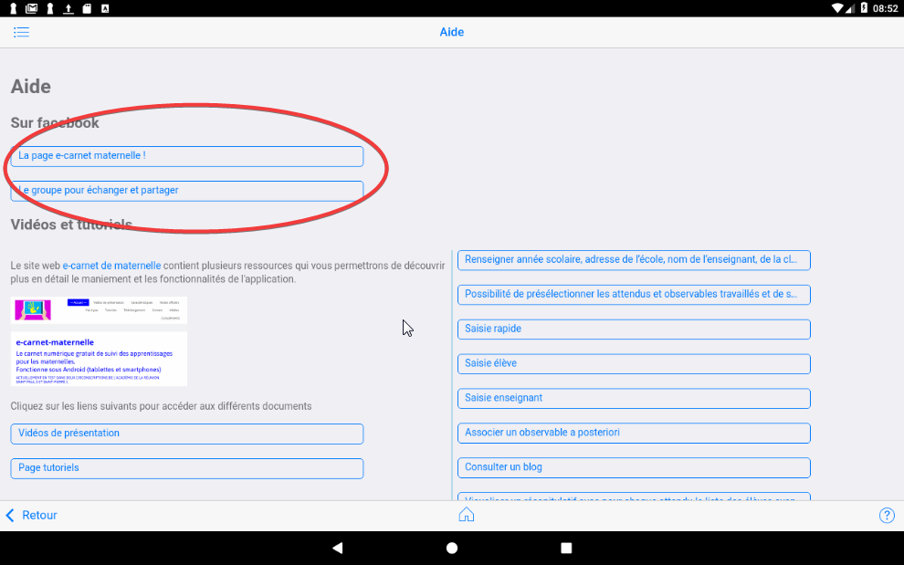 -->

### Autres ressources et tutoriels

Des vidéos et des tutoriels : 

<!-- 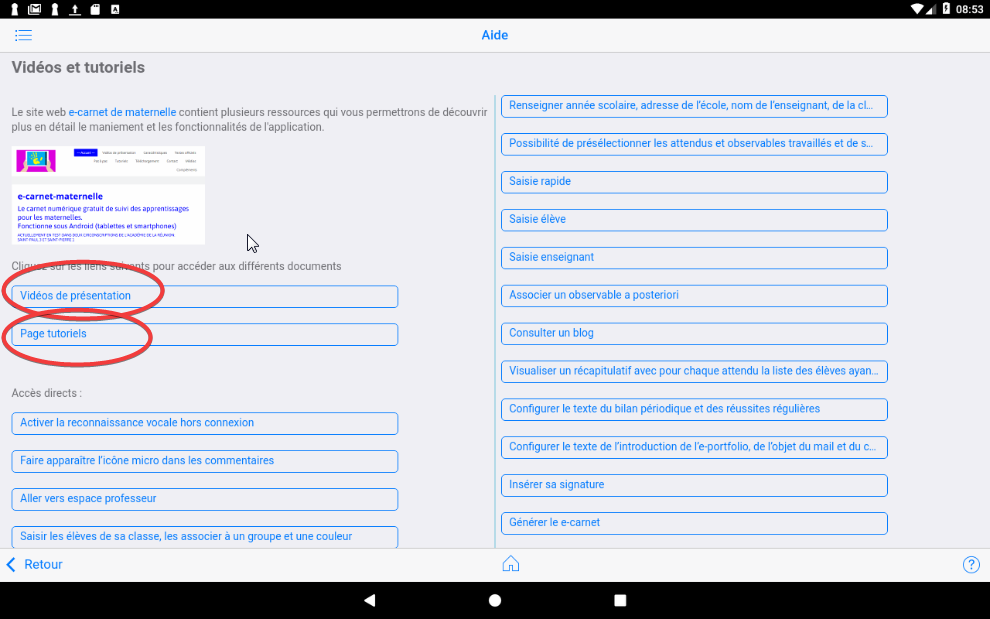 -->
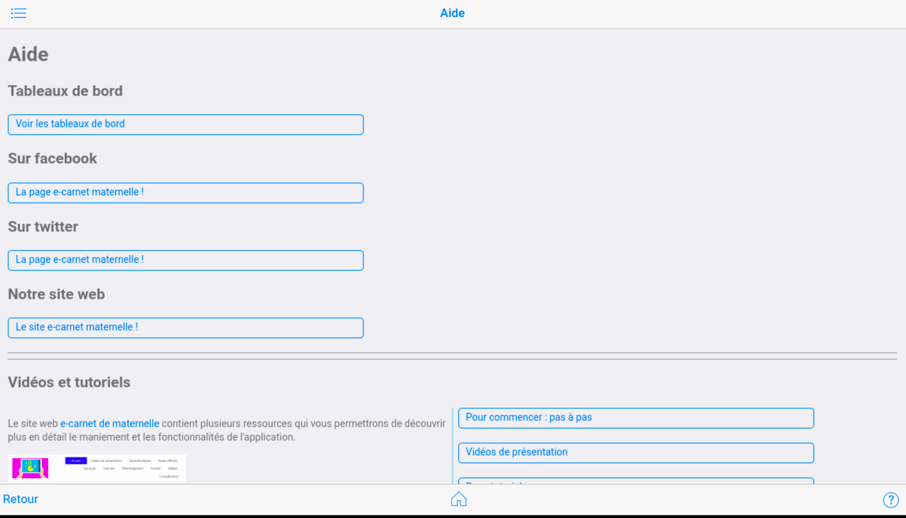

Vous trouverz aussi le lien vers le guide de référence : ce présent document !

<!-- 
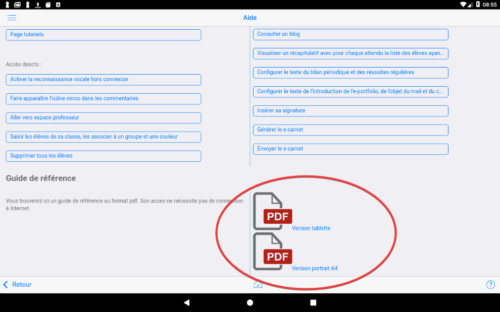

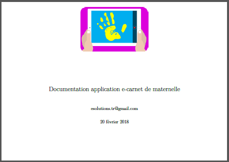

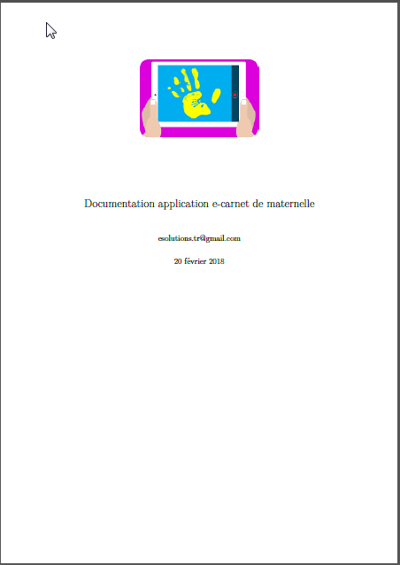 -->

