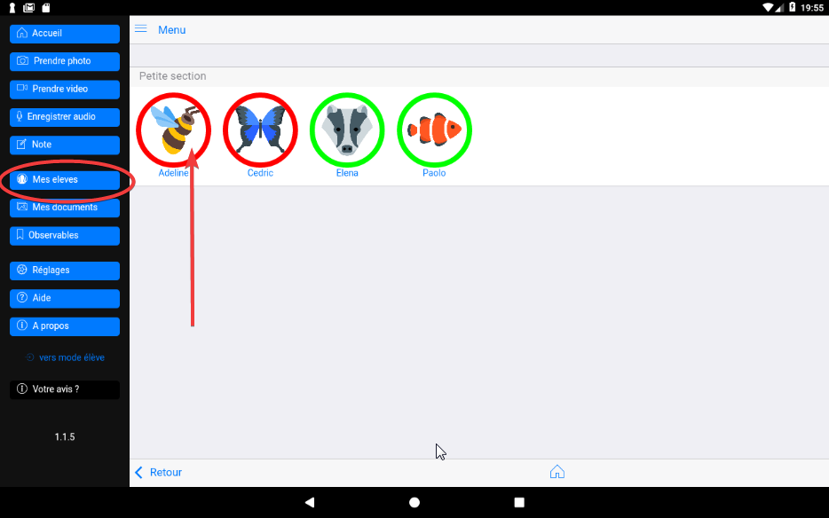

## La  fiche élève

(NB : cette partie n'est pas à jour) 

Le clic sur l'une des icônes associée à un élève permet d'afficher sa fiche : 

Cette fiche est composée de plusieurs parties, pour les découvrir il faut scroller de bas en haut.

### Entête 

(Partie à compléter)

### Barre de commandes

(Partie à compléter)

### Personnalisation du bilan

Cette partie permet de personnaliser le paragraphe "bilan de l'élève" dans le e-carnet.

### Personnalisation de la liste des reussites

Cette partie permet de personnaliser le paragraphe "Liste des réussites" dans le e-carnet.

### Le 'blog' ou timeline 

Cette partie liste de façon chronologique inverse (les documents les plus récents en premier), tous les documents associés à l'élève avec, lorqu'un observable a été affecté : 

- L'objectif de référence à atteindre. Exemple : OSer entrer en communication.
- L'attendu. Exemple : Communiquer avec les adultes et les autres enfants.
- L'observable de référence qui correspond à la photo, à la vidéo ou à l'enregistrement sonore. Exemple : Participer en répétant seulement.

Suivi immédiatement par le document ou une icône le symbolisant.

Au clic sur l'un des ces documents faire afficher sa "fiche"

Si la trace est une photo, elle peut être immédiatement transmise aux parents en cliquant sur l'icône envoyer à droite de la trace.

