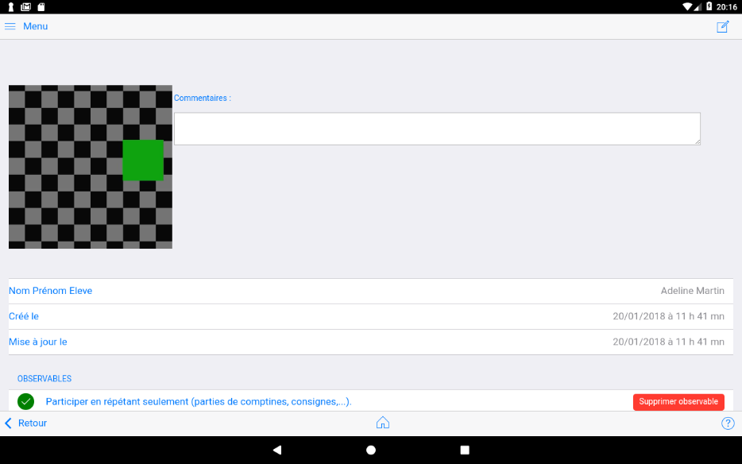
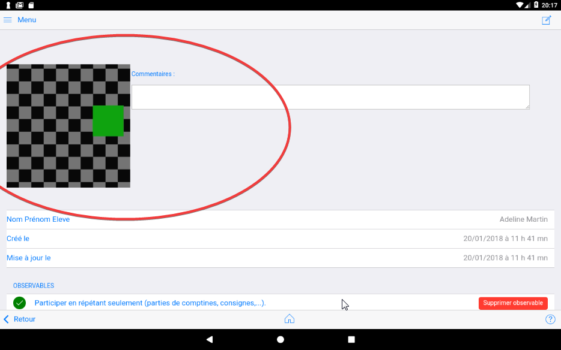
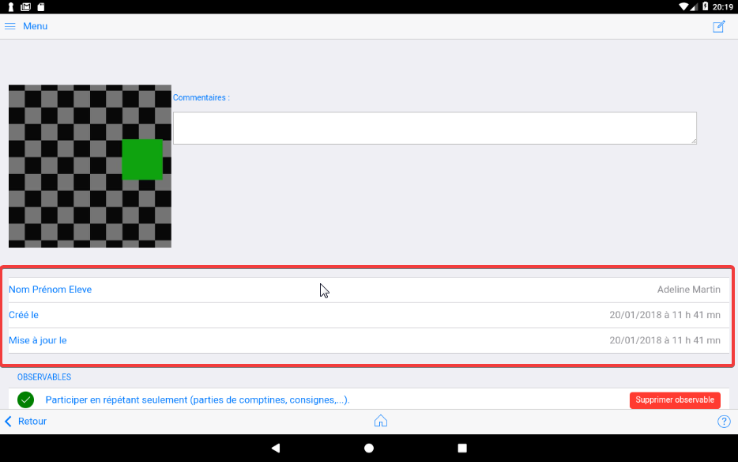
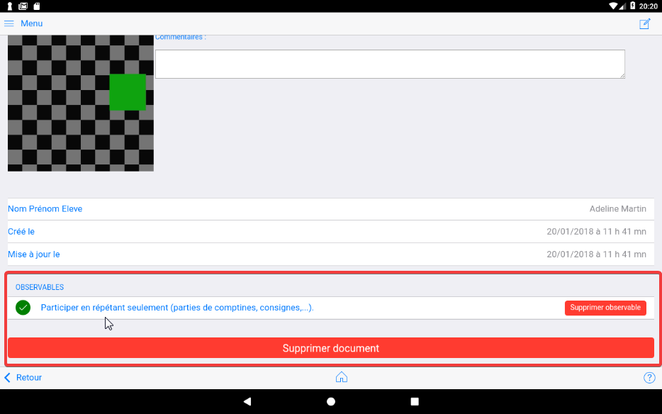

## La fiche "document"

(NB : cette partie n'est pas à jour) 

### La miniature document et commentaire

A chaque photo et video sont associés une version réduite pour affichage dans cet encart.
Lorsqu'un commentaire avait été saisi lors de la sauvegarde du document, il apparaît ici.

### Elève associé et dates

### Observables associés au média

Cette zone liste l'observable de référence associé au média.

Il peut y en avoir plusieurs.

Le bouton `Supprimer observable` permet de supprimer l'observable.

Le bouton `Supprimer document` supprimer le document associé à l'élève.

Les média : photo ou vidéo ne sont pas supprimés de la tablette.

### Affecter une photo existante

(Partie à compléter)

### Affecter une vidéo existante

(Partie à compléter)

