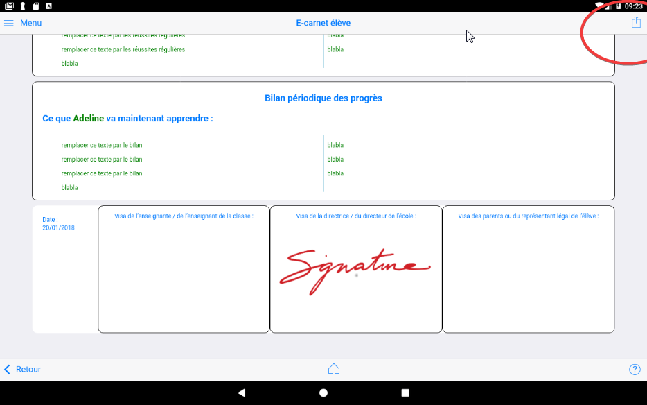
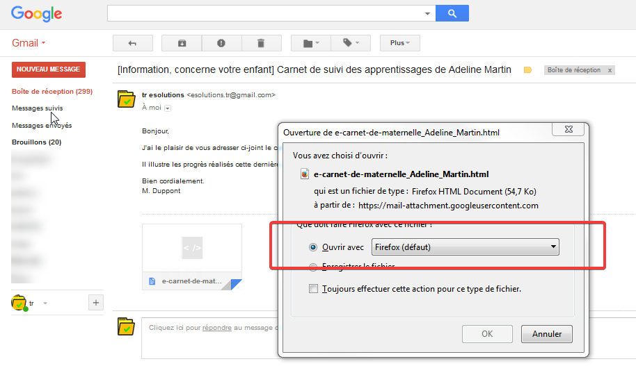

### Générer le e-carnet

<!-- [!embed](https://www.youtube.com/watch?v=xIJW-rbMuns) -->

Ce bouton en haut à droite permet de produire le carnet de suivi des apprentissage, ou e-carnet, de l'élève en cours.

Il faut scroller sur la page pour découvrir tout son contenu?

La partie qui rappelle aux parents les objectifs et attendus qui sont à la base des apprentissages.

Le contenu de cette partie dépends de : 

- la sélection effectuée dans la partie `Observables`,
- du sélecteur de droite, qui permet de masquer la totalité du paragraphe.

Ensuite, vient la partie qui restitue les "traces" ou "documents" ou "média" qui illustrent des observables.
Pour chacun d'entre eux, 

Sont rappelés : 

- Le domaine d'apprentissage, exemple : Mobiliser le langage,
- Le sous domaine, exemple : l'oral,
- L'objectif, exemple : communiquer avec les adultes et avec les autres enfants,
- L'observable identifié correspondant au média, exemple : quitter le regard de l'enseignant pour regarder son interlocuteur.
- une vignette ou une icône selon la nature du média, 
- la date et heure du document. Cet horodatage pouvant être modifié das la fiche associée au document.

Le sélecteur `Masquer les titres des objectifs` permet de masquer le rappel des domaines, des sous domaines et objectifs, laissant uniquement apparaître les observables. 

NB : les 2 sélecteurs de masquage existent aussi dans la version transmise par email aux parents.

Les parties "Réussites régulières" sont des parties personnalisables par le professeur dans la fiche Elève  t "Bilan périodique des progrès" sont des parties personnalisables par le professeur dans la fiche Elève.

Cette personnalisation doit par conséquent être réalisée AVANT la génération du e-carnet.

Le pied de page du e-carnet est personnalisable : 

- la date est modifiable dans la partie `Réglages`
- les signatures sont aussi personnalisables. Cf partie `Réglages`.
- Seule la partie "Visa des parents" reste vierge à ce stade. NB : Dans cette version, il n'y a pas encore de mécanisme permettant au parents destinataire de ce document de le remplir.

La diffusion du document commence par le bouton "export" en haut à droite : 

Choisir votre logiciel de messagerie, ici GMAIL : 

Un email prérempli est proposé.

Rien n'est diffusé aux parents sans action de la part du professeur.

Cet email pourra être : 
- modifié, 
- enregistré dans les brouillons, 
- être adressé à soi-même
- ou diffusé tel que

En jaune les parties qui ont été automatiquement préremplies : 

- les adresses email des 2 parents qui figurent dans la fiche de l'élève,
- le nom et prénom de l'élève tels qu'apparaissant dans sa fiche,
- le nom du professeur tel qu'il existe dans la partie `Réglages`
- le fichier, au format html, qui contient la copie rigoureusement conforme de ce qui apparaissait sur la page `E-carnet élève`.

A partir de cet instant,  plusieurs actions sont possibles : 

1 - ajouter un fichier depuis la tablette ou autres drives configurés sur la tablette (OneDrive par exemple).

2 - envoyer le message aux destinataires. L'émission est alors instantannée si la
 tablette est connectée à internet.

3 - ajouter des destinataires, enregistrer en brouillon, supprimer, ...

La suppression du message n'a aucun impact dans l'application "e-carnet de maternelle". L'email pourra être regénéré autant de fois que nécessaire.

### Enregistrer et consulter le fichier contenant le e-carnet

A partir du bouton "export" en haut à droite, vous pouvez enregistrer le fichier au lieu de le diffuser.

Pour cela choisir une destination parmi celles qui apparaissent dans le menu proposé : 

Aller ensuite dans la destination que vous avez choisi. Ici Google Drive. Vous pourrez ici utiliser votre disque OneDrive Microsoft associé à votre compte académique.

Localiser le fichier parmi  les derniers enregistrés :

NB :  en fonction des paramètres de votre drive ou de votre tablette, il est possible que le document ne s'affiche pas correctement. Dans ce cas, le document reste visualisable correctement sur tout PC, mac ou Linux. Evolutions prévues.

### Message reçu dans le logiciel de messagerie

Important : pour un affichage correct du document, il faut l'OUVRIR AVEC un navigateur internet, ici FIREFOX.

### Modes de transmission du e-carnet

(Partie à compléter)

