# Manipulations diverses, FAQ

## SPECIAL CONFINEMENT : Envoyer un email à tous les parents

### Principe

Afin de vous faciliter la diffusion de travaux et consignes aux parents, une fonction a été spécialement ajoutée.

Elle consiste à générer un email dont les destinataires sont les emails des parents enregistrés pour chaque élève.

Le contenu de l'email est alimenté depuis : 

- le texte inséré dans une note
- une photo que vous pouvez avoir pris depuis le logiciel ou depuis votre galerie

A cet email vous pourrez joindre tout fichier. Exemple : autres photos, fichier pdf, ...

### Pré requis

Pour que cette fonctionnalité soit pleinement opérationnelle, vous devez préalablement avoir renseigné les informations suivantes dans les différentes parties concernées : 

- votre adresse email (réglages/enseignants)
- les adresses email des représentants légaux/parents
  
### Mode opératoire

Voici comment procéder : 

En mode enseignant, cliquer sur photo ou note : 

Saisir un commentaire : 

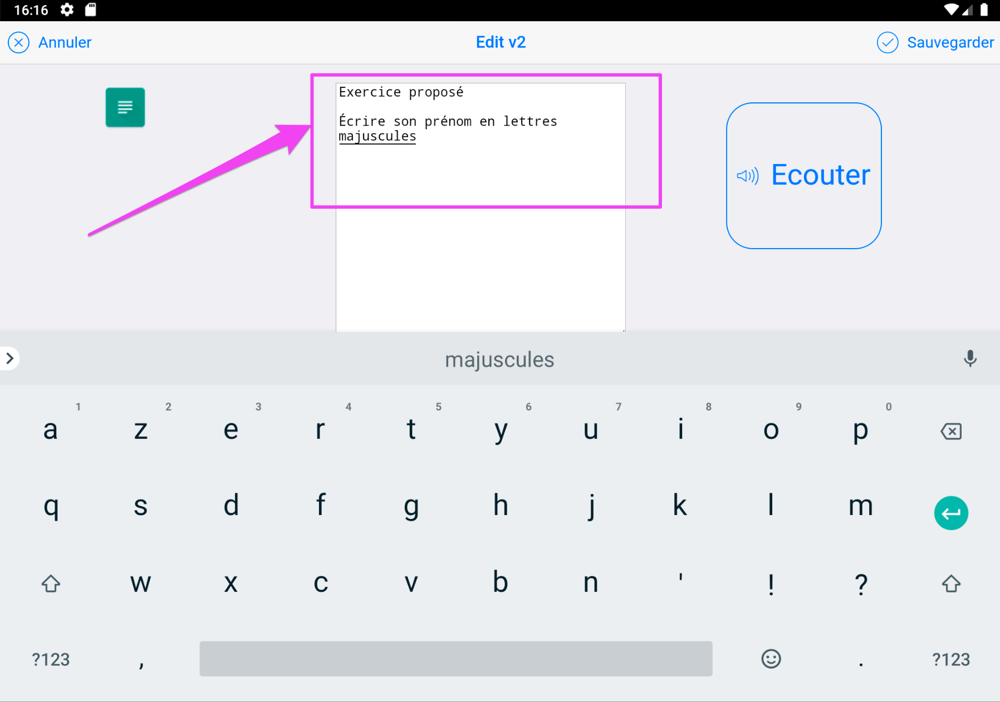

Sauvegarder, puis ré-ouvrir la note en cliquant sur la ligne

Faire défiler l'écran pour faire afficher le bas de l'écran : 

Si vous avez un logiciel de messagerie configuré sur votre tablette, celui va se lancer et un brouillon de message pré rempli va apparaitre.

A noter : 

- l'émetteur : c'est votre email
- le destinataire : c'est votre email aussi
- En CCI : copie cachée invisible : tous les emails des parents.

La raison de ces choix : lorsque vous faites une diffusion d'un email à de multiples destinataires, il est risqué et incorrect de laisser voir toutes les adresses emails à tous les destinataires. 

Pour cette raison, en mettant tous les emails des parents en copie cachée, ils vont tous recevoir l'email mais ne verront que votre adresse email apparaitre dans les destinataires. C'est la pratique en vigueur pour les diffusions multiples.

Le brouillon de cet email est ainsi pré rempli.

Normalement les opérations qu'il vous reste à faire sont de :

- vérifier, 
- retirer éventuellement les emails superflus (laisser 1 seul parent et pas les 2), 
- ajouter autant de pièces jointes que nécessaire
- envoyer

Pour consulter la pièce jointe générée automatiquement : 

Aller dans votre gestionnaire de fichiers, et sélectionner le répertoire Téléchargement. La pièce jointe est : 

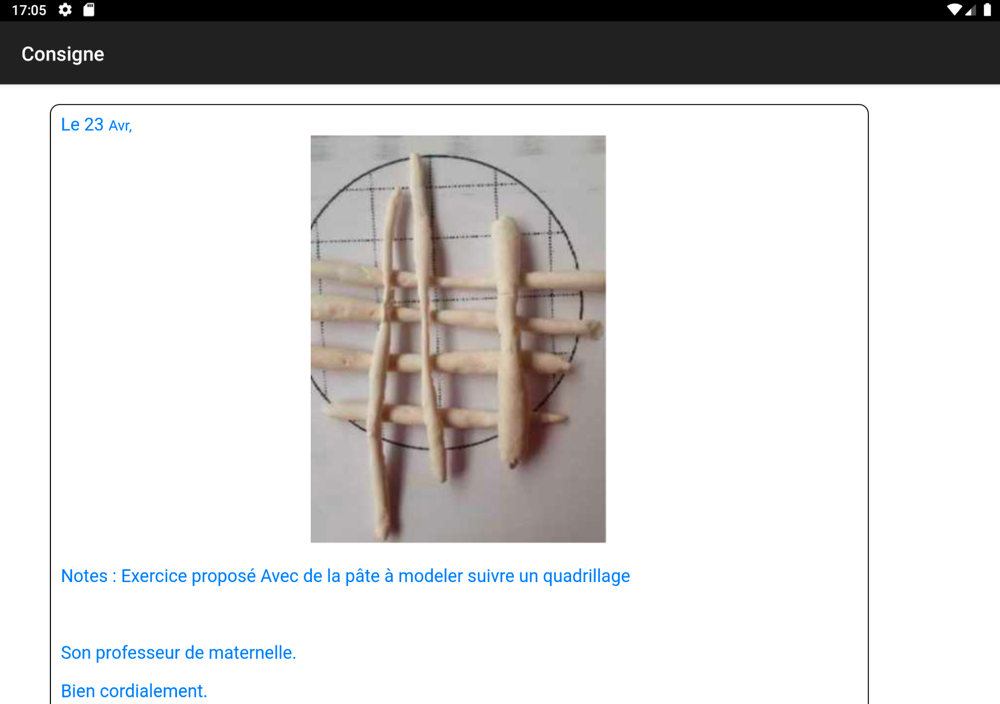

## Ajouter un logo en entête du e-carnet

### Principe

Pour avoir ça (fichier html transmis aux parents) : 

Suivre ce qui suit ! 

### Pré requis

Un fichier logo (jpg, png, bmp) doit être accessible depuis le gestionnaire de fichiers de la tablette.

### Mode opératoire

Aller dans Réglages puis Ecole. 

Voir [Ajouter un logo](#ajouter-un-logo)

## Personnaliser la mise en page du e-carnet

### Avertissement

Cette personnalisation, bien qu'étant pleinement fonctionnelle et paramétrable par l'utilisateur, nécessite des compétences html, css et expressions régulières (regex) pour effectuer des personnalisations non standard.

Néanmoins, de multiples personnalisations sont facilement accessibles en changeant un "non" par un "oui" dans les réglages.

En résumé : actuellement faisable, mais ... pas pratique et réservé aux bricoleuses et bricoleurs...

L'ergonomie pourra évoluer ultérieurement. 

Aller dans "Réglages" puis "Paramètres e-carnet" : 

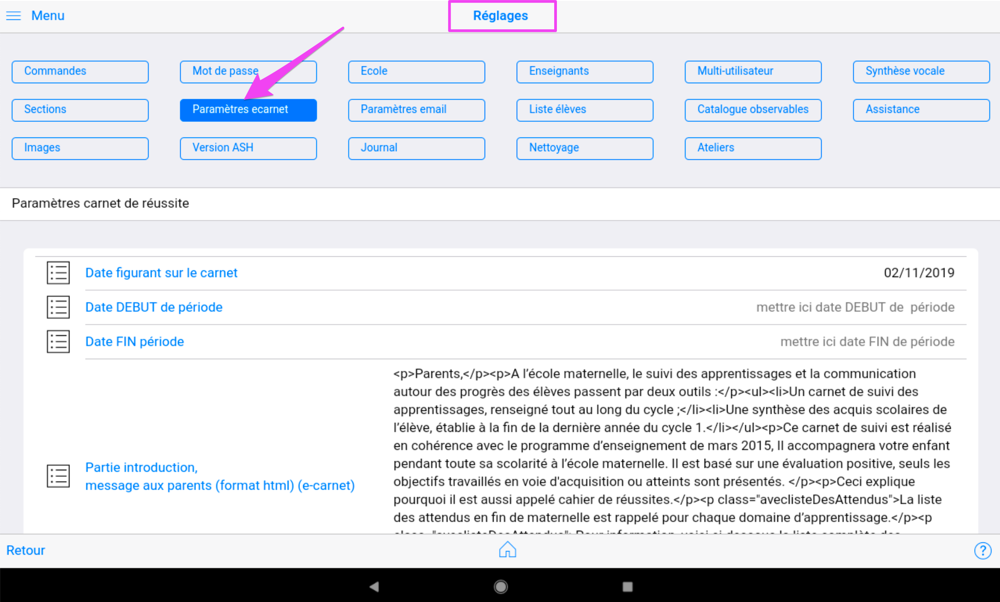

Pour activer la fonction de personnalisation, cliquer sur le sélecteur : 

Ce qui donne : 

Pour le détail, voir [Activation de la fonction de personnalisation](activation-de-la-fonction-de-personnalisation)

## Personnaliser les libellés d'observables

Chaque libellé d'observable est modifiable. Le nouveau remplace l'ancien partout où il avait été utilisé : ce n'est pas un "nouvel observable", seul le libellé change.

Voir chapitre [Observables](#personnaliser-les-libellés-dobservables)

## Gérer des ateliers

La notion d'atelier consiste à pré-identifier jusqu'à 8 observables qui vont devenir facilement accessible depuis le mode élève.

Leur mise en oeuvre s'effectue en 2 étapes : 

1 - En mode enseignant, affecter un observable à un atelier

2 - En mode élève, choisir l'atelier

### Affection d'un observable à un atelier

Afficher la grille de suivi (Observables puis Grille de suivi).

Toucher la ligne qui contient l'observable que vous souhaitez affecter à un atelier. Cela va faire apparaitre le popup d'affectation des ateliers : 

Toucher une zone en bleu pour affecter l'observable à l'un des ateliers :

Reproduire autant de fois que nécessaire

Pour **effacer le contenu d'un atelier**, il suffit de toucher à nouveau la zone en bleu.

Pour **faire disparaitre le popup**, toucher n'importe où en dehors de la zone du popup.

### Choisir un atelier

En mode élève, la sélection de l'atelier s'effectue en touchant la ligne d'entête.

Pour sélectionner l'atelier sur lesquels le groupe d'élèves munis de la tablette travaille, touche la zone bleue contenant l'atelier correspondant : 

Le numéro de l'atelier et l'observable associé s'affichent maintenant dans la ligne d'entête.

A partir de cet instant, toutes les traces capturées par le groupe d'élève vont être affectées automatique à cet observable rappelé dans l'entête.

Des lors que l'élève a commencé par choisir son avatar avant de caputurer une photo, sa trace est automatiquement renseignée et vous n'aurez plus rien à faire, excepté revoir ou affecter un commentaire.

NB : au retour en mode enseignant, l'atelier courant est désélectionné. Aucun atelier par défaut n'est alors actif. Ceci pour éviter l'affectation automatique d'un observable à toute nouvelle capture de trace réalisée en mode enseignant. Il est néanmoins possible de re-sélectionner un atelier par défaut. Il sera ajouté à tout observable que vous pourriez choisir en complément.

## Activer la reconnaissance vocale hors connexion (Android version 6.x)

Aller dans Paramètres

Choisir Langue et saisie

Saisie vocale Google

Cliquer sur Langues

<!--
Reconnaissance vocale hors connexion

Tout

Français

Télécharger le pack 
-->

## Activer la reconnaissance vocale hors connexion (Android version 7.x)

NB : pas necessaire avec Android 7.1

Aller dans Paramètres

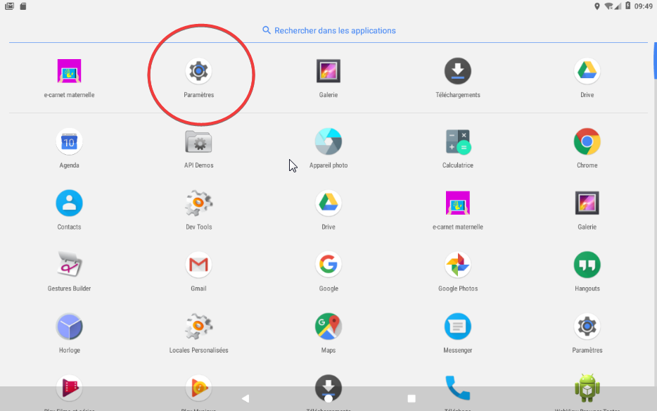

Choisir Langue et saisie

Saisie vocale Google

Cliquer sur Voix

## Modifier les réglages sonores pour entendre la synthèse vocale

Il peut arriver que la tablette n'émette aucun son alors que la synthèse vocale est correctement activée dans les réglages de l'application e-carnet. Pour corriger cette situation, il faut vérifier que le volume sonore soit suffisant.

Aller dans "paramètres" : 

Puis "Sons et notifications" : 

Et ajuster "Volume des contenus multimédias" : 

## Trouver les photos sur la tablette

Les photos sont enregistrées dans le répertoire "Pictures".
Il est possible de les retrouver via l'explorateur de fichiers, soit depuis la tablette, soit depuis un PC sur lequel la tablette serait connectée.

Avec la tablette,

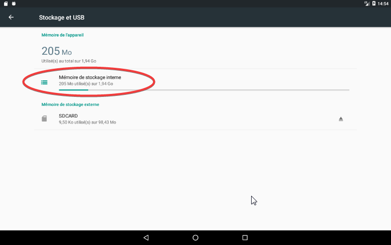

Attention : Les photos créées par l'application sont préfixées par ECM. Il ne faut en aucun cas les supprimer, les renommer ou les déplacer sinon le lien entre ces photos et les élèves sera perdu.

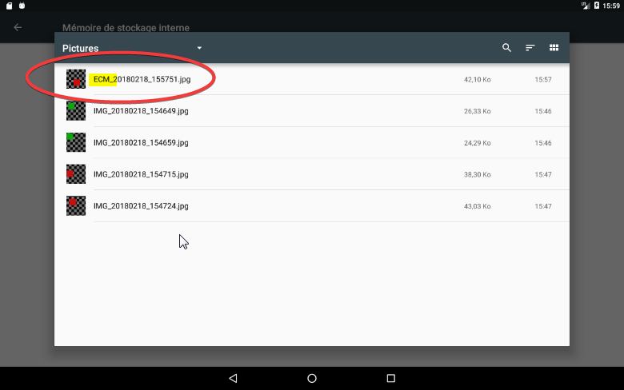

## Trouver le catalogue des observables

Lorsqu'on exporte le catalogue des observables, depuis le menu "Observables",

Il est indiqué que le fichier est enregistré dans le répertoire Download/e-carnet-maternelle.

Pour le trouver, plusieurs façons possibles. La plus simple étant depuis le PC connecté à la tablette.

Sinon, avec cette technique : 

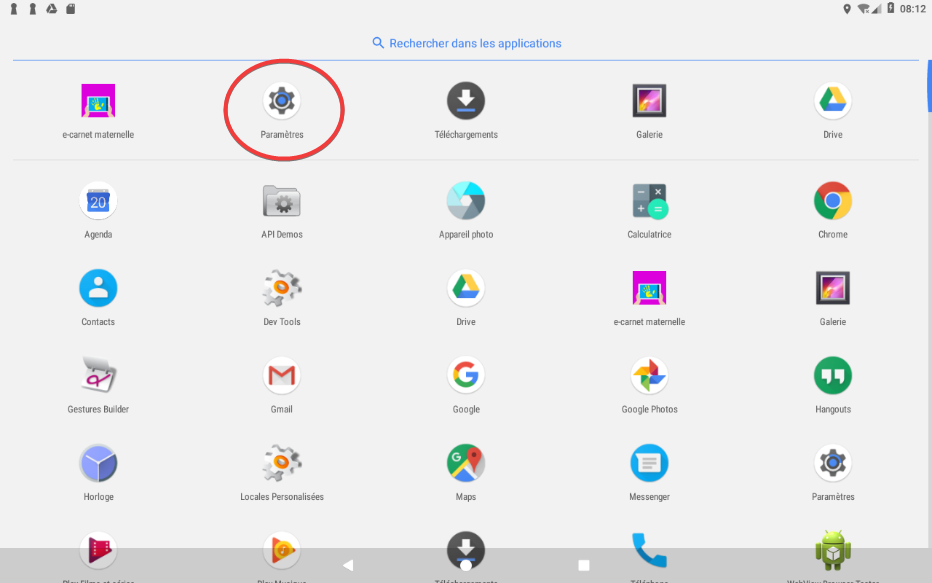

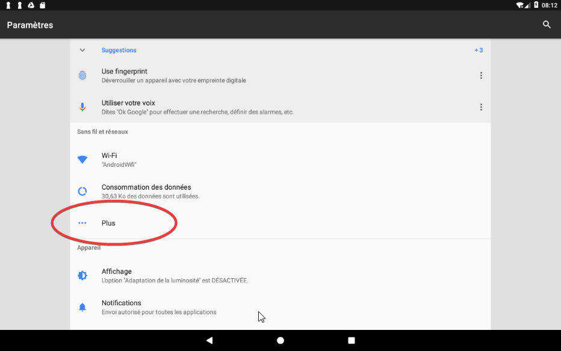

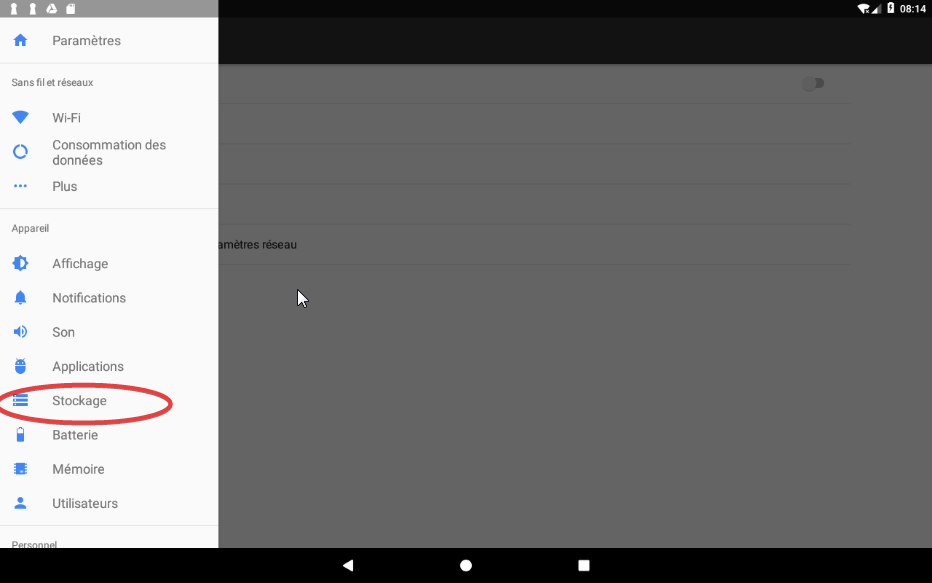

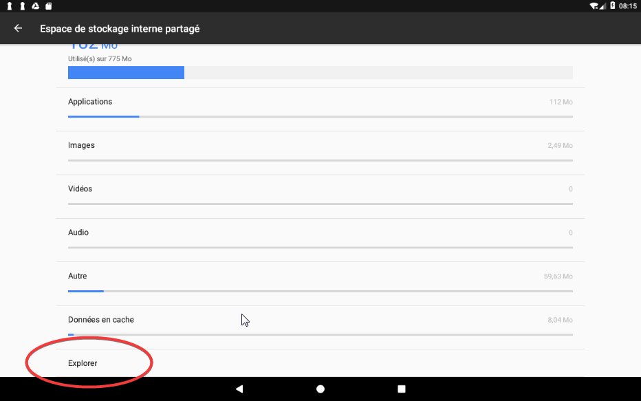

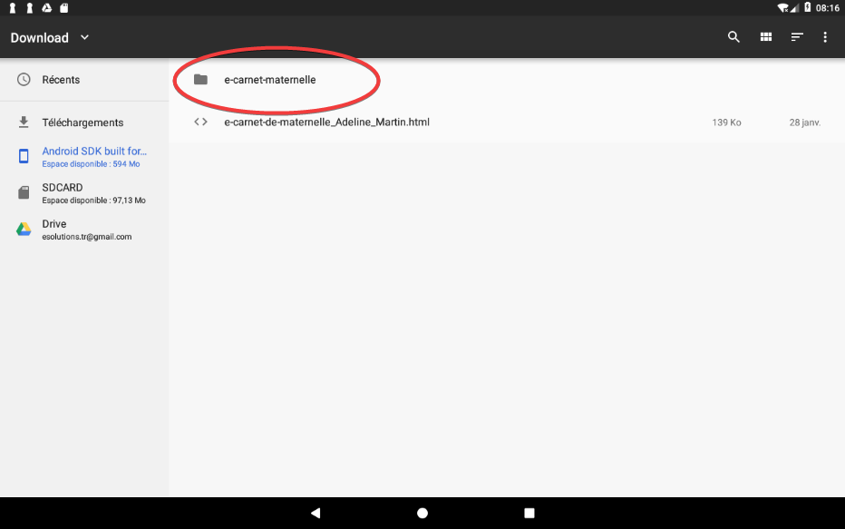

Vous identifierez le bon fichier en regardant la date ou ici l'heure correspondant à l'export.

Pous pouvez aussi vous aider du nom de fichier : le nombre ici 201802200809 se lit : 2018 02 20 08 09, soit le 20 février 2018 à 08h09 mn.

## Transférer des fichiers depuis la tablette ver un Mac (ou un PC)

Une façon simple consiste à passer par Internet !

2 techniques depuis la tablette : 

- Transférer le fichier sur un drive (OneDrive, GoogleDrive, OwnCloud, ...)
- S'envoyer un email avec comme pièce jointe le fichier à récupérer si celui n'est pas trop volumineux.

Depuis le Mac ou le PC, respectivement, selon la méthode utilisée : 

- Se connecter sur son drive et télécharger le fichier
- Se connecter sur sa messagerie et récupérer l'email avec la pièce jointe.

## Gérer une sitation de plantages répétés

Si le plantage apparait à l'affichage d'une fiche élève ou d'un e-carnet et que le nombre de photo est "important" (10, 20, 30 ou plus selon les tablettes), il faut intervenir sur la taille des photos.

Explications à venir.

Si le plantage apparaît à un autre moment, envoyer le dernier fichier journal=.html présent sur la tablette, répertoire Téléchargement/e-carnet-maternelle.

## Transférer le e-carnet directement sur le smartphone des parents en bluetooth

- Vérifier que le Bluetooth est activé sur la tablette enseignant et sur le smartphone parent. (Paramètres/Bluetooth ou faire glisser écran vers le bas, maintien du doigt sur la touche Bluetooth)
- Appairer les deux appareils. Ils se détectent comme appareil à proximité.
- Ouvrir sur la tablette le gestionnaire de fichiers. Dans stockage interne/Download repérer le ecarnet à partager.
- Maintenir le doigt dessus pour le sélectionner.
- Cliquer sur Partager et choisir l’appareil à proximité correspondant.
- Accepter de part et d’autre le transfert.
- Sur le smartphone, le fichier se trouve dans Stockage interne/Bluetooth. Il s’ouvre avec un navigateur Internet.

## Personnaliser le référentiel

Il y a 2 façons de procéder en fonction des objectifs souhaités : 

- Soit simplifier l'affichage, diminuer la liste des observables possibles tout en respectant le contenu officiel (mode fortement recommandé)
- Soit introduire de nouveaux observables, en changer leur expression ou utiliser une autre langue.

Dans le premier cas : utiliser les sélections personnalisées.

Dans le second cas, utiliser sur un PC ou un Mac l'application compagnon : E-carnet référentiel builder.

Exemple de résultat, cas d'un référentiel d'une école internationale, Français, Anglais : 

<!-- 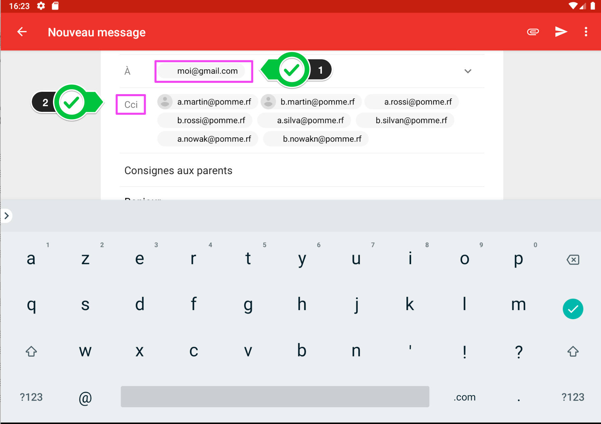 -->

## Obtenir un référentiel dans une autre langue

Utiliser sur un PC ou un Mac l'application compagnon : E-carnet référentiel builder.

(partie à compléter)

## Utiliser un référentiel identique entre toutes les classes d'une même école

Utiliser sur un PC ou un Mac l'application compagnon : E-carnet référentiel builder.

Produire un référentiel et utiliser ce référentiel sur chaque tablette.

(partie à compléter)

## Changer de tablette

Vous souhaitez passer à une nouvelle tablette !

### Principe

Utiliser la fonction "Sauvegarde" de la tablette actuelle puis "Restaurer" cette sauvegarde depuis la nouvelle.

### Pré requis

Sur la nouvelle tablette ... commencer par faire une photo !

En effet, dans les tablettes neuves, il manque un répertoire qui se crée uniquement à partir de la première photo.

L’application utilise ce répertoire.

Afin de transférer la sauvegarde d'une tablette à l'autre, il va vous falloir aussi un espace de stockage commun entre l'ancienne et la nouvelle tablette.

La solution la plus simple est d'utiliser un espace de type drive distant (OneDrive, Google Drive ou autre).

Vos 2 tablettes doivent avoir accès au même espace.

Vos 2 tablettes doivent avoir LA MÊME VERSION du logiciel e-carnet. Si ce n'est pas le cas ... ça peut fonctionner quand même mais à éviter !

### Mode opératoire

Voici la procédure pour transférer votre classe, vos élèves et vos medias associés.

Réglages/Commande 

La sauvegarde produit un fichier qui est ici et qu'il faudra copier au même endroit dans la nouvelle tablette : 

Une fois en place sur la nouvelle tablette, faire "Restaurer" et choisir ce fichier : 

NB : ne pas tenir compte de l'extension "epub" (anomalie sans gravité)

Redémarrer votre logiciel e-carnet.

Vous devriez retrouver vos informations !

## Changer de référentiel

## Transmettre les vidéos aux parents

Le principe consiste à transmettre le fichier epub aux parents.

Dans sa version actuelle, les vidéos ne sont pas directement consultables. Elles sont néanmoins accessibles en "bricolant un peu" le fichier epub.

Changer le suffixe ***epub*** en ***zip***.
Utiliser un décompacteur (7z, winzip, ...) et décompresser le fichier zip.
Les vidéos sont dans le dossier VIDEOS.

## Transférer tout le contenu sur une autre tablette

Le principe consiste à :

Prérequis : 

- les 2 tablettes doivent utiliser la même version du logiciel e-carnet-maternelle.
- la nouvelle tablette doit disposer d'un espace de stockage "suffisant". L'espace nécessaire étant indiqué par la taille du fichier de sauvegarde qui va être généré dans la première étape suivante.

Mode opératoire : 

- générer un fichier de sauvegarde avec la fonction Réglages/Commandes/Sauvegarder base de données.
- Transmettre ce fichier à l'autre tablette. Un moyen simple de transfert étant d'utiliser un drive de type Google Drive ou Microsoft OneDrive, ou tout autre espace de stockage partagé.
- Sur la nouvelle tablette, utiliser "Réglages/commandes/restaurer la base de données. Attention ceci efface toutes les données e-carnet de la nouvelle tablette.

NB : attention, ce fichier de sauvegarde peut être tres volumineux, il contient en effet toutes les photos, toutes les videos, tous les fichiers audio. Ces documents seront copiés sur la nouvelle tablette a

