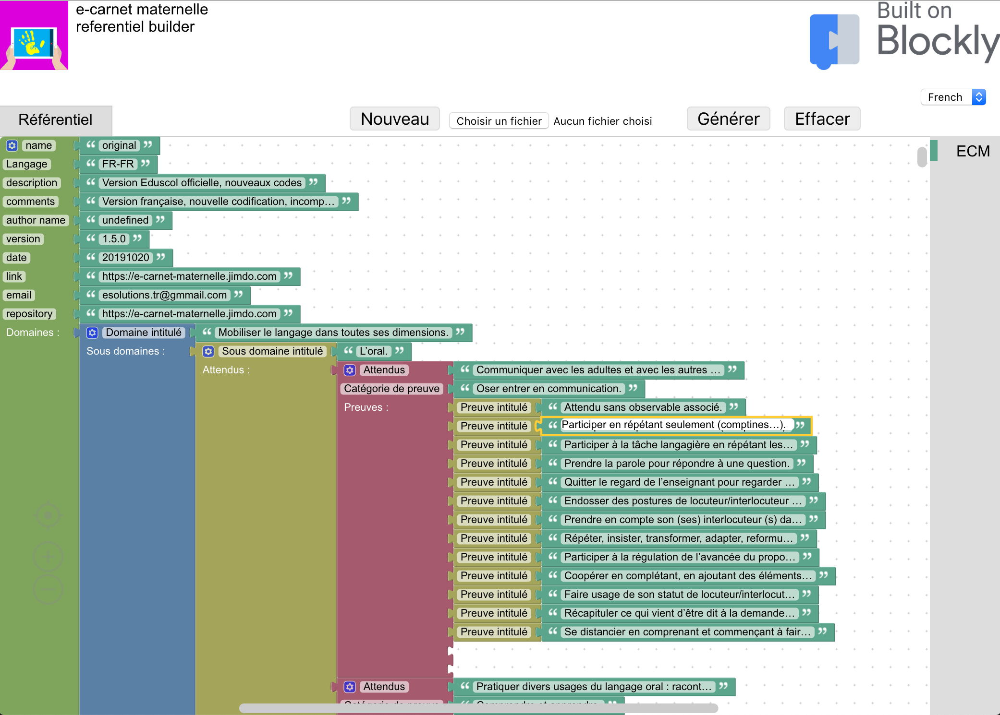
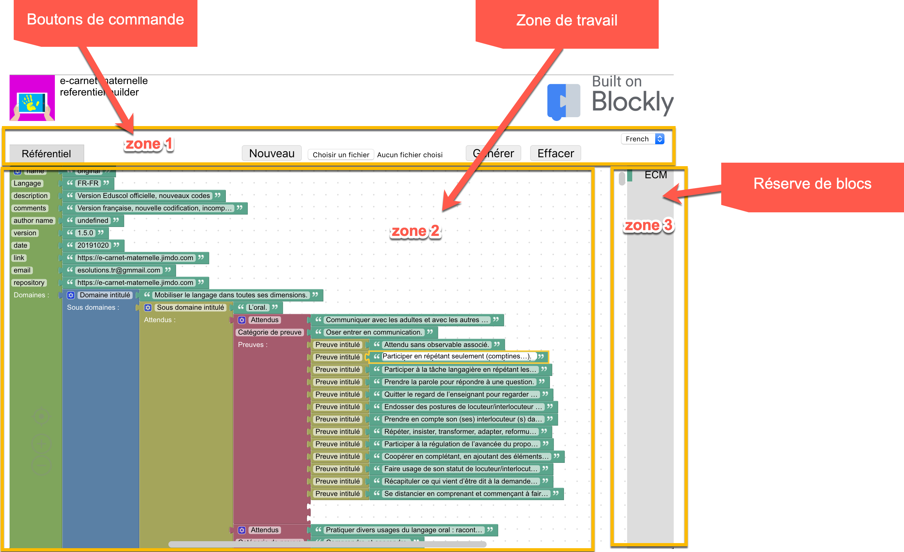
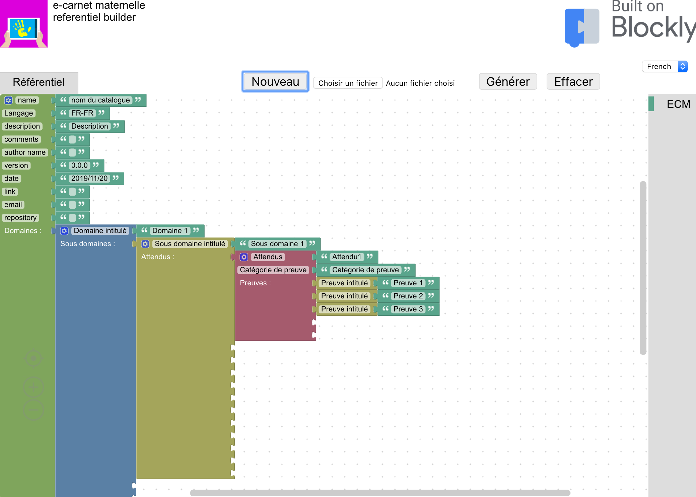
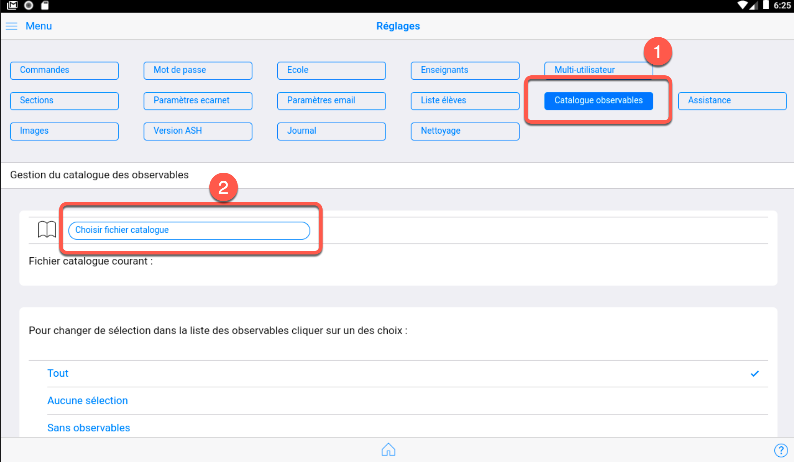
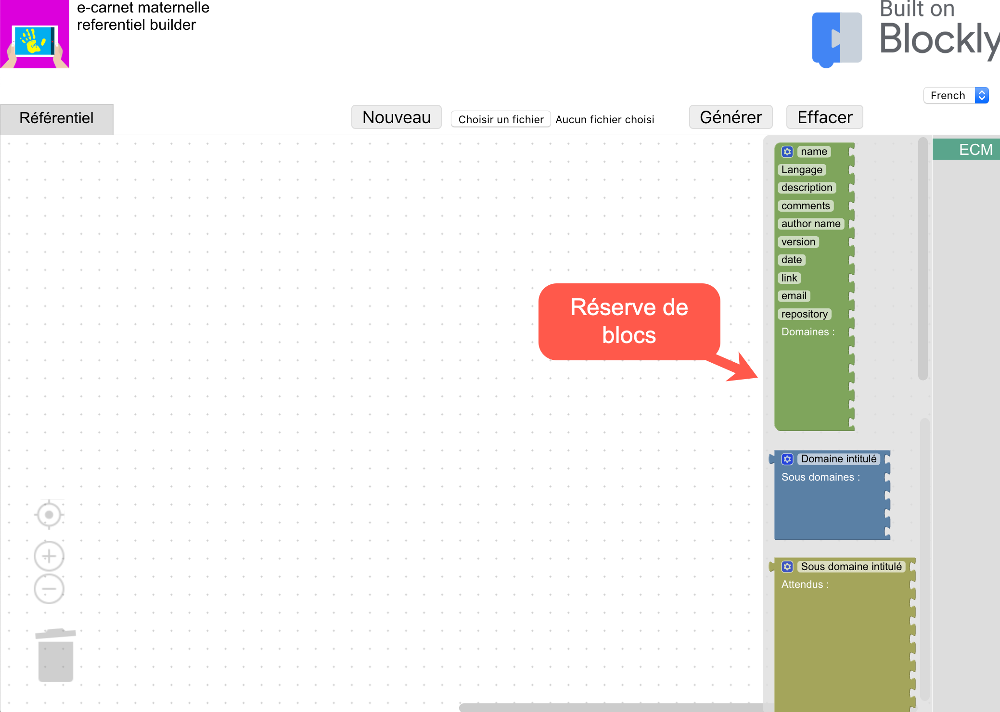
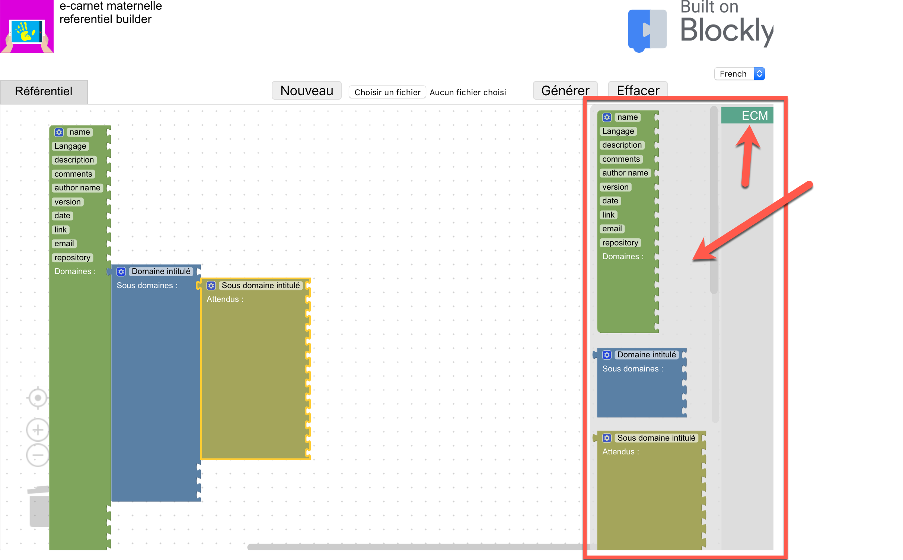

# Mode d'emploi

## Vue d'ensemble

### Zone 1 : boutons de commande

#### Le bouton `Nouveau`

Il provoque 2 opérations : 

- le nettoyage de la zone de travail (effacement de tous les blocs)
- L'initialisation de la zone de travail d'un nouveau référentiel composé d'un premier domaine, contenant un sous-domaine, un attendu et 3 observables. Se reporter dans la suite de ce document pour découvrir comment procéder à partir de cette étape.

#### Le bouton `Choisir un fichier` 

Il permet de charger dans la zone de travail un référentiel existant.

#### Le bouton `Générer` 

Il déclenche la transformation des blocs en unn fichier au format .ecm qui est destiné à être enregistré sur la tablette dans laquelle le logiciel e-carnet maternelles est installée pour y être installé via la commande `Réglages` puis `Gestion observables` puis `Choisir fichier catalogue` : 

#### Le bouton `Effacer` 

Il permet de nettoyer la zone de travail et de partir d'un référentiel vierge. Cela nécessite ensuite de placer les blocs accessibles depuis la réserve de blocs (zone 3).

#### Le bouton `French` 

Dans cette version seul le choix "Arabe" est utile : ce choix permet de passer à une lecture de droite à gauche.

### Zone 2 : Espace de travail

#### Les bases du fonctionnement de l'interface "en blocs"

Avant de rentrer dans le fonctionnement de cette zone de travail, quelques mots sur les principes de l'interface graphique utilisée.

Cette interface graphique proposée est une interface open source proposée par Google. Elle s'appelle Blockly. Elle est comparable à Scratch utilisée dans de nombreux projets éducatifs.

Pour plus de renseignements voir le site officiel de Google : [https://developers.google.com/blockly](https://developers.google.com/blockly).

Sur le plan de travail proposé (l'espace quadrillé) les blocs peuvent être : 

- Ajoutés
  - soit depuis la réserve (volet de droite qui apparait en cliquant sur `ECM` 
  - soit par duplication d'un bloc existant
    - sélectionner le bloc par un clic
    - clic avec bouton droit
    - choisir `dupliquer` 
- Modifiés
  - En changeant le texte qui apparait dans les cellules des blocs verts
  - En changeant le nombre de "
- Supprimés

### Zone 3 : Réserve de blocs

La réserve de blocs contient tous les blocs nécessaires à la construction du référentiel.

