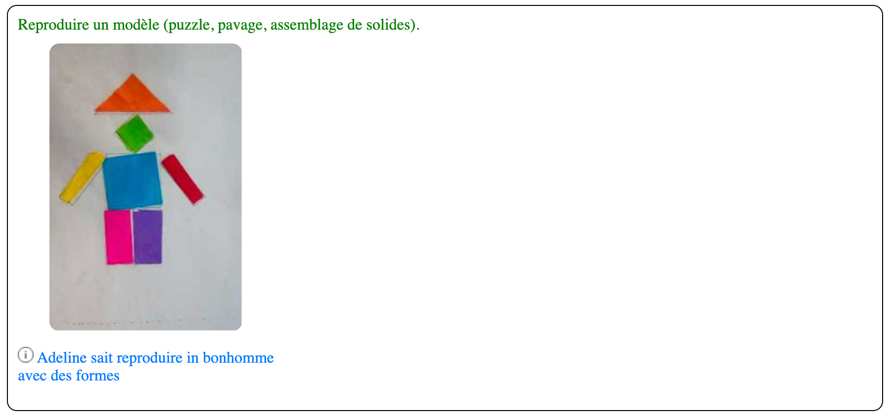

# Présentation de l'application
<!-- N2  -->

Le e-carnet maternelle est une application gratuite pour les enseignants et les élèves de cycle 1. 

Elle permet de simplifier et automatiser la production des carnets de suivi des apprentissages destinés aux parents.

Elle permet de saisir et stocker instantanément tous types de documents (image, audio, vidéo, texte)  pour chaque élève de la classe.

<!-- [!embed](https://www.youtube.com/watch?v=aILpjdo-0t0) -->

Ces traces (témoignages des apprentissages) sont associés aux attendus et observables établis par le Ministère de l’Éducation Nationale.

Un commentaire de l'élève ainsi qu'un commentaire de l'enseignant peuvent être ajoutés.

Les carnets de suivi sont générés automatiquement à la demande et peuvent être envoyés par mail aux parents. Ils peuvent être transmis par d'autres moyens. Voir [Mode de transmission du e-carnet](30-GenererECarnet/index.html#modes-de-transmission-du-e-carnet).

Ce n'est pas un carnet de compétences, on prend l'élève au niveau qui est le sien, il est la référence, et on constate avec lui ses progrès au cours du temps. Conformément aux textes officiels, il n'y a pas de code de "notation".

Le logiciel est le votre, il évolue au gré de vos remontées et suggestions. N'hésitez pas à nous en faire part. En moyenne, une nouvelle version est publiée tous les mois.

Pour plus d'informations, voir le site web [e-carnet-maternelle](https://e-carnet-maternelle.jimdofree.com).

Quelques exemples de contenus produit par le logiciel : 

<!--  -->

## Exemple de e-carnet (version simplifiée)

Le logiciel génère un fichier au format html adapté à sa transmission par email aux parents.

Ce fichier a l'avantage d'être "dynamique". Le clic sur des boutons permet de masquer ou d'afficher des parties entières. Ci-après la version avec les parties explicatives masquées.

## Exemple de e-carnet (version avec les détails)

Le même document, mais pour lequel les parties explicatives à vocation pédagogique n'ont pas été masquées :

## Exemple e-carnet avec logo

<!-- 
## Exemple pdf produits depuis le navigateur

 -->

<!--  -->

## Exemple multilingue

## A propos de la gratuité de l'application

Un peu d'histoire pour comprendre...

Le logiciel e-carnet maternelle est le résultat de la rencontre d'un enseignant de La Réunion et d'un ingénieur travaillant dans la région parisienne.

Professeur des écoles Maître Formateur (PEMF) en maternelle au moment de l'apparition du carnet de suivi des apprentissages, Rémi a été confronté à la difficulté de le concrétiser en version papier. 

Passé dans la foulée conseiller pédagogique, en circonscription, pour le numérique, Rémi a réfléchi à une solution et fait appel à un ami ingénieur passionné d'informatique travaillant par ailleurs pour une entreprise multinationale dans le domaine des Télécom (Thierry). 

Ensemble, à distance, sur notre temps libre, nous avons donc conçu le e-carnet-maternelle qui évolue continuellement en fonction des retours de terrain et de nos idées.

C'est une fabuleuse expérience qui nous passionne.

Contrairement à d'autres éditeurs, nous ne vivons pas de cela.

L'application fonctionne sans ressources externes : pas de serveurs sur Internet et pas d'usage de logiciels payants (que de l'open source). Nous n'avons donc pas de frais fixes.

Nous ne comptons pas nos heures !!!

C'est pour cela que, dès le départ, nous avions prévu que cette version serait et resterait gratuite.

Le logiciel e-carnet-maternelle tel que nous le connaissons restera gratuit, sans publicité et sans revente de données quelles qu'elles soient.

Vos multiples retours positifs et encouragements sont notre carburant !

## Autres versions de cette documentation

- [Format html 1 seule page](Ecm_guide.html)
- [Format pdf orientation paysage (A4 vertical)](files/Ecm_guide_portrait.pdf)
- [Format pdf orientation portrait (A4 horizontal)](files/Ecm_guide_paysage.pdf)
- [Format epub](files/Ecm_guide.epub)

<!-- 
E:\VS\Projects\templateFM7Cordova-CDR1\_notesTGA\screenshots\2018-01-27-18-00-46.png
-->

