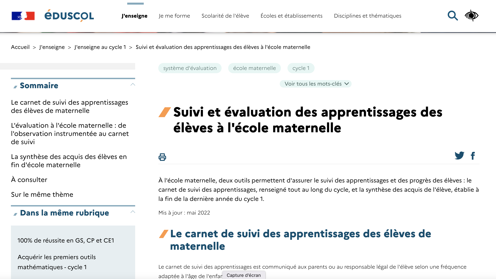

# Référence 

L'application e-carnet-de-maternelle s'appuye et met en oeuvre le référentiel décrit dans ce document Eduscol.

Référence éducation nationale : [Le carnet de suivi des apprentissages en maternelle](http://eduscol.education.fr/cid97131/suivi-et-evaluation-a-l-ecole-maternelle.html)

