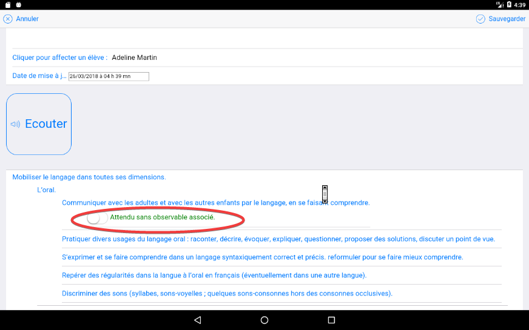
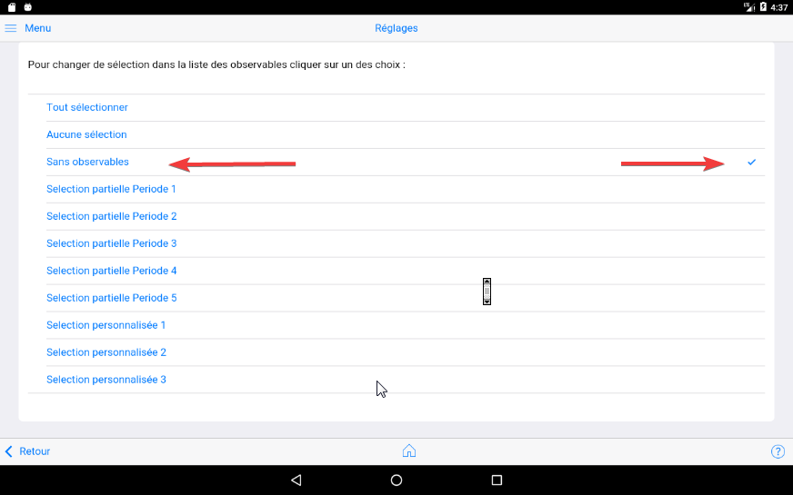
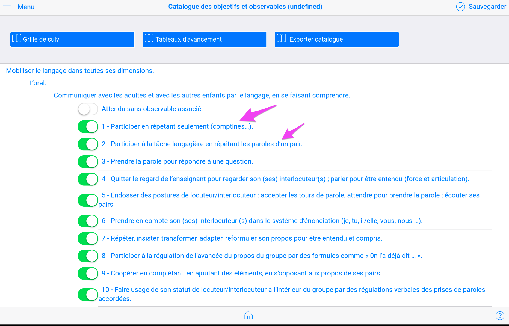
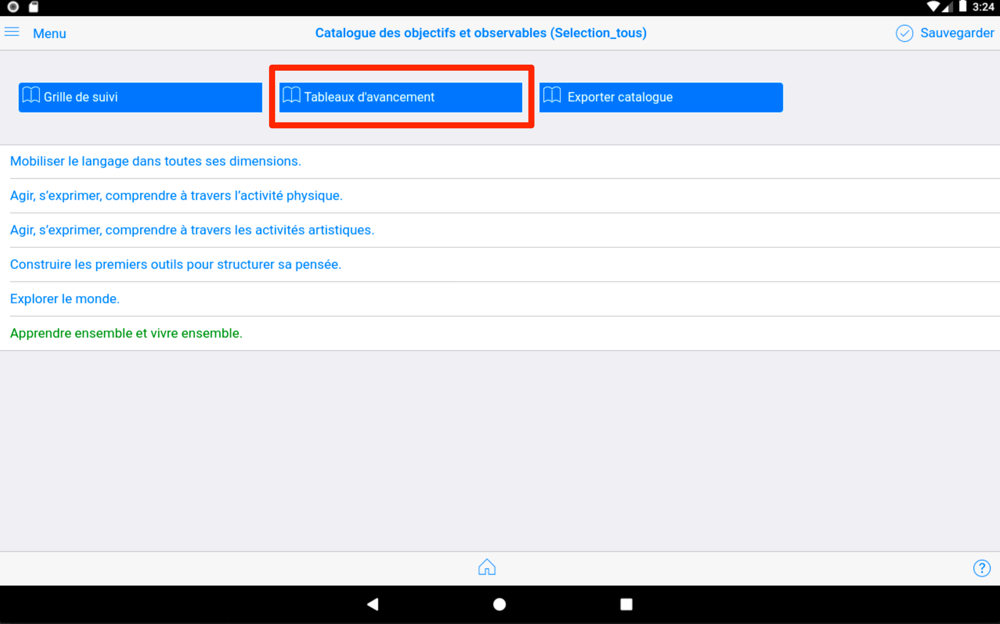
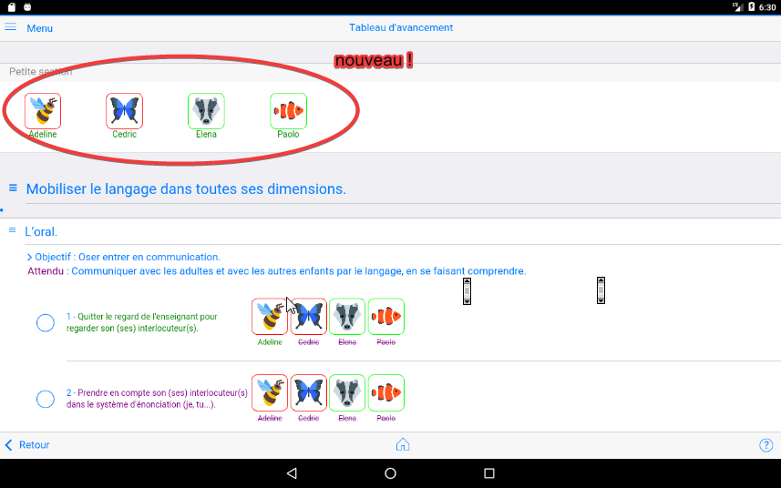
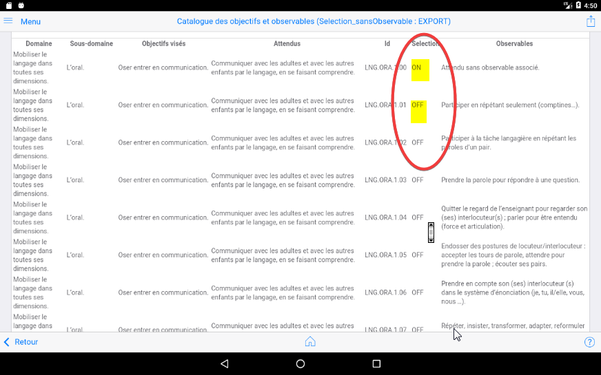

# Objectifs pédagogiques

!!! note "Évolution terminologique 2025"
    Depuis la version 2.3.3 (1er septembre 2025), la terminologie a évolué : les "Observables" sont désormais appelés "Objectifs" pour mieux refléter l'approche pédagogique par compétences et s'aligner sur la terminologie officielle de l'Éducation Nationale.

## Accès aux objectifs

## Page des objectifs

Dans sa version initiale, c'est à dire à la première installation, le réglage par défaut permet à l'enseignant de sélectionner un objectif parmi tous ceux existants dans le référentiel. Le catalogue 2025 comprend une structure enrichie et modernisée.

Cette sélection par défaut permettra d'affecter l'un de ces objectifs à l'un ou l'autre des médias associés à un élève :

Cette liste peut être modifiée ce qui permet de restreindre ensuite la liste affichée aux seules valeurs qui sont travaillées par l'enseignant dans une période de temps.

Exemple : Seuls 3 objectifs sont ici retenus, les autres sont désactivés. Pour mémoriser cette sélection personnalisée, faire "Sauvegarder" en haut à droite.

La commande `Sauvegarder`permet de choisir une référence pour mémoriser ses sélections et les rappeler ensuite, depuis la page "Réglages"

Un message de confirmation témoigne de la prise en compte de cette nouvelle sélection. Elle est sauvegardée dans une colonne désignée par le nom de la sélection choisie si vous exportez le catalogue.

Le résultat au moment de l'attribution dans un média affichera alors une liste restreinte d'objectifs :

Il est possible de personnaliser cette liste à partir de sélections pré définies ou de sélections personnalisées.

Exemple de sélection pré-définie : version simplifiée masquant tous les objectifs :

Obtenue à partir de la page "Réglages" :

### Personnaliser les libellés d'objectifs

Chaque libellé d'objectif est modifiable. Le nouveau remplace l'ancien partout où il avait été utilisé : ce n'est pas un "nouvel objectif", seul le libellé change.

Pour cela il suffit de pointer le libellé depuis la page "Objectifs" puis en dépliant le catalogue : 

Le résultat dans la grille de saisie :

Résultat final :

NB : Attention, toute modification ultérieure de ce libellé se répercutera dans toutes les traces de tous les élèves associés à cet objectif.
(le code interne ne change pas).

<!-- NB : Pour créer ou ajouter de nouveaux observables et modifier plus profondément le référentiel, il faut utiliser le logiciel Referentiel Builder décrit par ailleurs.
 -->

NB : Il est possible de changer le référentiel par défaut. Les principales situations qui peuvent le nécessiter sont : 

- utiliser une langue régionale (occitan, catalan, ...),
- une langue étrangère (anglais, arabe, ...),
- adaptation scolaire et scolarisation des élèves handicapés (ASH),
- adaptation Montessori,
- adaptation autre programme national (Belgique),
- autre domaine d'apprentissage,
- déployer une même version de référentiel au sein d'un même établissement.

<!-- La mise en oeuvre de cette adatation est décrite dans le chapitre [Catalogue observables](#catalogue-observables). -->

Ce changement de référentiel est aujourd'hui une prestation sur mesure car elle nécessite plusieurs heures d'intervention pour aider à mettre au point le fichier excel à la base du  nouveau référentiel, faire une demande à [support@tr-esolutions.com](mailto://support@tr-esolutions.com))

NB : un usage récent du e-carnet maternelle a permis à une école internationale de produire plusieurs centaines de e-carnets personnalisés adaptés à un parcours trilingue : Français, Anglais, Arabe.

- Logo de l'école en entête
<!-- - Référentiel personnalisé réalisé avec l'outil Réferentiel builder (prestation sur mesure, [thierry@tr-esolutions.com](mailto://thierry@tr-esolutions.com)) -->
- Référentiel personnalisé 
- Utilisation des tags par langue pour faciliter l'usage par chaque enseignante (une tablette partagée par les 3 enseignantes)
- Zones réservées pour les appréciations dans chaque langue
- Simplification dans le contenu du e-carnet

Voir les tutos pour plus de précisions sur la façon de procéder.

### Ajouter des étiquettes (ou 'tags') aux objectifs pour faciliter leur affectation

Exemple : Vous souhaitez préparer votre travail de la Période 4 de l'année en sélectionnant les objectifs que vous allez travailler avec vos élèves.

Utilisons l'étiquette "Periode4" :

Exemple d'affectation de cette étiquette sur plusieurs objectifs :

Cette étiquette "Periode4" apparait désormais entre accolades à la suite du libellé.

NB : Il pourra être "effacé" du e-carnet pour éviter son affichage dans le document transmis aux parents. Cf les fonctions de personnalisation ci-avant.

Dans la grille de suivi, nous retrouvons cette étiquette, qui apparait aussi sous forme d'un bouton :

Si vous activez le bouton "Periode4" vous filtrez et simplifiez l'affichage pour ne conserver que les objectifs sur lesquels vous allez travailler.

Pour revenir à l'affichage complet, touchez "Tous".

### La grille de suivi

Cet écran permet une saisie rapide de traces : 

(Partie à compléter)

### Générer tableau avancement

Lorsque vous cliquez sur le bouton "Générer tableau d'avancement", vous obtenez, par objectif, l'indication si tel ou tel élève détient ou non une trace associée à l'objectif.

Dans ce cas, le prénom de l'élève apparaît en vert.

Lorsqu'au moins un élève détient une trace pour cet objectif, le nom de l'objectif apparaît en vert.

Par conséquent, en un seul coup d'œil, vous repérez en rouge tous les objectifs à travailler avec les élèves.
 

Depuis la version 1.1.11, un nouveau sélecteur d'élève est apparu. Il permet de faire afficher le ***tableau d'avancement par élève***

Une fois cliqué sur un élève, un nouveau rapport s'affiche.

Chaque apprentissage acquis aparaît en vert.

Le nom de l'élève est rappelé en entête.

### Exporter le catalogue

Cette vue permet de récupérer la vision de la sélection active : 

Pour récupérer le fichier, cf le chapitre "Trouver le catalogue des objectifs ou le fichier Excel des élèves" plus loin dans ce document.

## Catalogue 2025

### Nouvelle structure

Le catalogue 2025 introduit une approche modernisée avec :

- **Nouvelle terminologie** : "Objectifs" au lieu d'"Observables"
- **Organisation thématique** : Remplacement des "sous-domaines" par des "thématiques"
- **Fichiers de données enrichis** : Structure mise à jour pour l'année académique 2025
- **Compatibilité** : Migration automatique depuis l'ancien catalogue

### Avantages de la nouvelle approche

- **Clarté pédagogique** : Terminologie plus explicite pour les familles
- **Alignement institutionnel** : Cohérence avec les programmes officiels
- **Flexibilité** : Organisation modulaire des thématiques
- **Évolutivité** : Adaptation aux nouvelles pratiques

!!! tip "Migration automatique"
    La migration vers le nouveau catalogue 2025 s'effectue automatiquement lors de la mise à jour. Vos données existantes sont préservées et adaptées à la nouvelle terminologie.

## Voir aussi

- [Catalogue 2025](46-Catalogue2025.md)
- [Terminologie 2025](45-Terminologie2025.md)
- [Nouveautés](06-Nouveautes.md)

