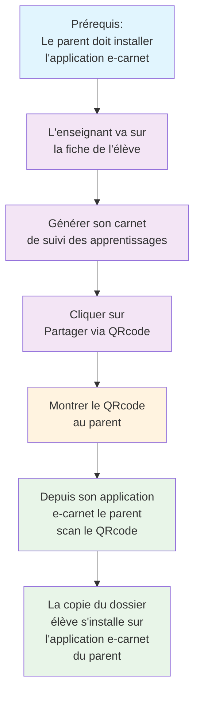
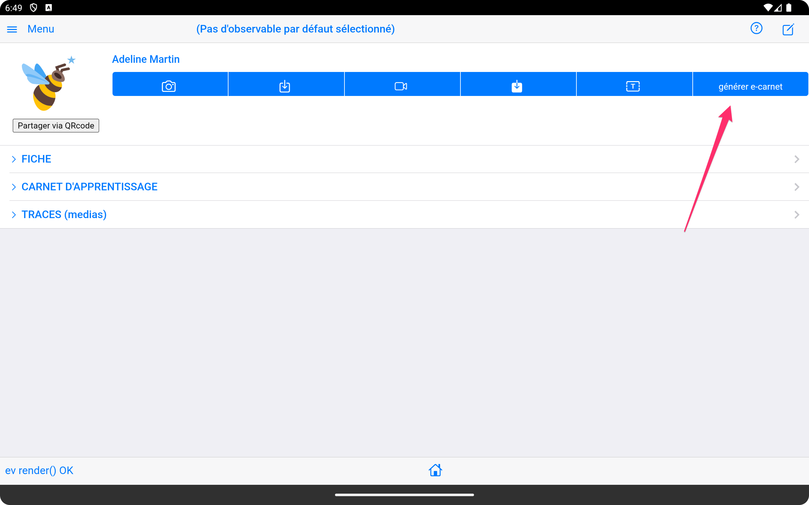
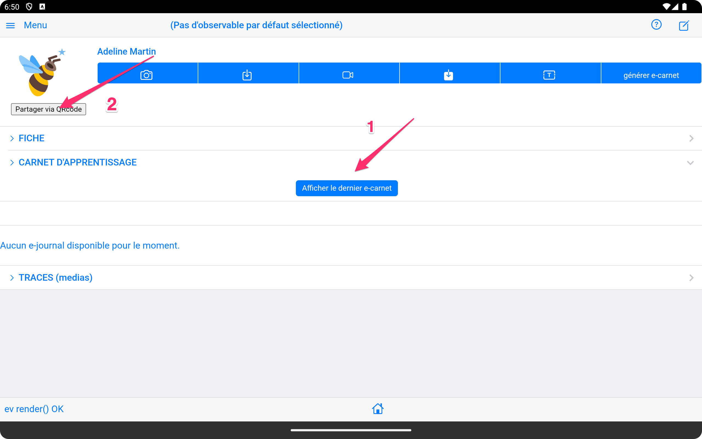
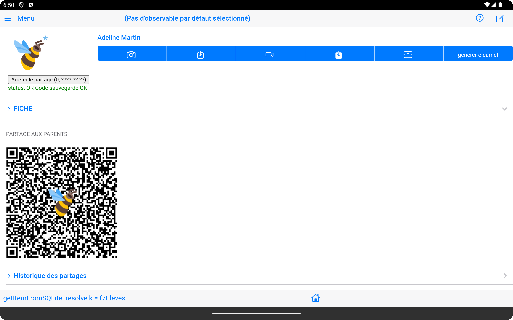
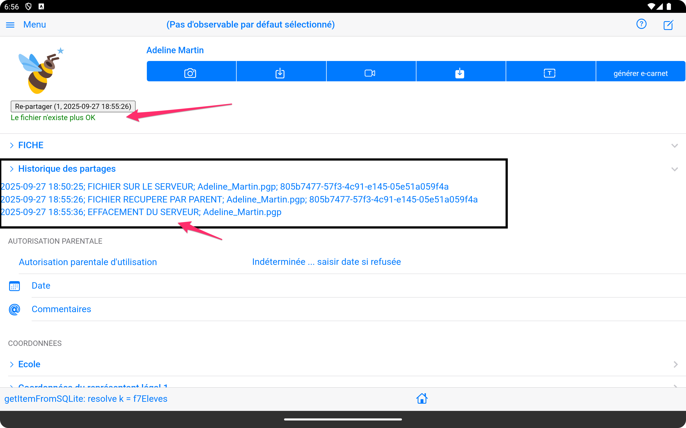

# Partage du carnet de suivi des apprentissages par QRcode

La fonctionnalité de partage du carnet de suivi des apprentissage par code QR facilite la communication entre enseignants et parents, ainsi que les échanges entre collègues.

## Vue d'ensemble du partage

### Principe de base

Le partage par code QR permet de :

- **Transmettre rapidement** le dossier complet de l'élève sous la forme d'un fichier unique (format epub) 
- **Sécuriser** les échanges de données sensibles. Le fichier est chiffré par la tablette de l'enseignant et déchiffré par l'application e-carnet du parent. Ce fichier est détruit du serveur ayant servi à l'échange et le QRcode n'est utilisable qu'une seule fois.
- **Simplifier** l'accès aux carnets de suivi des apprentissages numériques, via le scan d'un simple QR code à usage unique.

### Types de partage disponibles

#### Partage vers les parents

- Le carnet de suivi des apprentissages de l'élève.
- L'ensemble des médias qui illustrent ces apprentissages

#### Partage entre enseignants

- Le carnet de suivi des apprentissages de l'élève
- L'ensemble des médias qui illustrent ces apprentissages
- Le référentiel de compétences utilisé

## Processus de partage

!!! tip "Prérequis important"
    Avant de pouvoir recevoir un carnet partagé via QR code, le parent doit obligatoirement installer l'application e-carnet sur son appareil mobile. Cette installation est nécessaire pour décoder et recevoir les données du carnet de l'élève.

!!! info "Android Store"
    L'application e-carnet est disponible sur le Google Play Store pour les appareils Android.

### Étape 1 : Production du dossier de l'élève

1. **Depuis la page élèves** :
   - Choisir l'élève concerné
   - Produire le e-carnet
   - Partager via QRcode

Le bouton (1) suivant doit apparaitre, témoignant de l'existence du carnet dans le dossier

Finalement, déclencher (2) la production du dossier complet et le QRcode pour le partage : 

Le résultat ressemble à :

La présence du QRcode et le message en vert témoignent de la mise à disposition du dossier.

### Étape 2 : Utilisation par les destinataires

### Pour les parents

#### Installer l'application e-carnet

1. Installer l'app "e-carnet".

2. Au premier démarrage choisir "Parents".
      

3. Scanner le code QR reçu.
   
   

4. Attendre la fin du processus de chargement.
5. Le dossier de l'élève est visible dans la page "élèves" à la date du jour.

## Gestion des partages actifs

### Tableau de bord

L'interface de gestion affiche :

- **Liste des partages** en cours
- **Statut** de chaque code (actif/expiré/utilisé)
- **Statistiques d'accès** si disponibles

### Actions de gestion

#### Révocation anticipée

- Annuler un partage avant expiration

## Sécurité et confidentialité

Pour garantir la plus haute confidentialité et sécurité possible des informations contenues dans le dossier élève, les mesures suivantes ont été utilisées: 

- le dossier de l'élève est un fichier au format normalisé "EPUB" (c'est une archive zip structurée)

- Ce fichier EPUB est chiffré sur la tablette de l'enseignant par utilisation du composant : [openpgp](https://github.com/openpgpjs/openpgpjs) qui met en oeuvre un chiffrement OpenPGP. ([RFC 9580](https://www.rfc-editor.org/rfc/rfc9580.html)).

- Ce fichier chiffré est déposé sur un serveur de fichiers Google en Europe (zone: europe-west) en attente de son téléchargement par le parent. Le choix d'un serveur de fichier Google Firebase géré par l'éditeur TR e-soliutions est une solution économique, le logicel étant toujours gratuit et non financé par aucune organisation.

- L'adresse de ce fichier est elle même aussi chiffrée pour être insérée dans le QRcode. Cette adresse ne peut être lue par aucun lecteur de QRcode excepté celui de l'application e-carnet qui saura la décoder.

- Vous pouvez essayer de scanner ce QRcode avec n'importe quel outil, l'information récupérée sera inexploitable...

- Le scanner QRcode de l'application e-carnet (version parents et enseignant) va ensuite déchiffré l'adresse du fichier présente dans le QRcode.
  
- L'application va récupérer via cette adresse le fichier sur le serveur Google, le télécharge, le déchiffre avec openPGP.

- Une fois déchiffré, le fichier reprend sa forme EPUB originale et est exploité pour afficher le dossier de l'élève dans l'application e-carnet.

- Si l'ensemble de ces opération se termine correctement, le fichier est supprimé du serveur Google.

- Toutes ces opérations sont tracées de façon non effacable dans l'application e-carnet de l'enseignant(e): 

  - Date et heure du dépôt du fichier chiffré sur le serveur
  - Date et heure de récupération par le parent
  - Date et heure de suppression du serveur

### Protection des données

#### Chiffrement

- **Algorithme openPGP** 

#### Contrôle d'accès

- **Horodatage** des consultations
- **Limitation** du nombre d'accès à 1 

### Conformité RGPD

- **Traçabilité** des partages effectués
- **Droit à l'effacement** des données partagées. Une fonction dédiée dans l'application e-carnet permet de supprimer totalement les informations associées à un élève.
- **Consentement explicite** enregistré par l'enseignant(e) dans le dossier élève.

