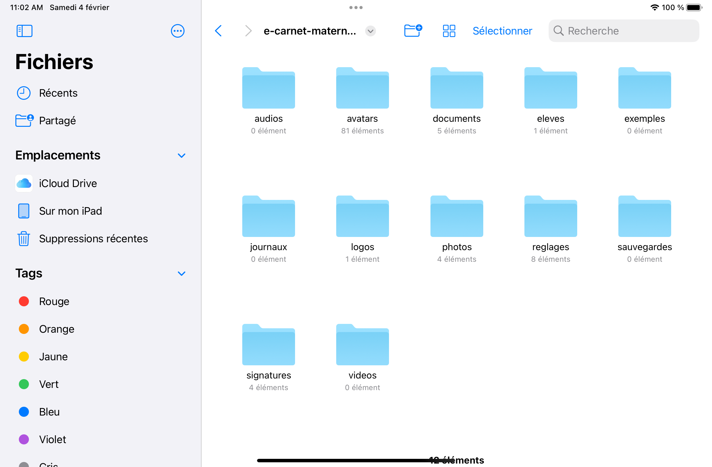

# Trouver les fichiers

La version 2 diffère significativement de la version 1 par le lieu de stockage des fichiers générés par l'application.

## Version Android

Ouvrir l'application Fichiers

Naviguer dans les répertoires pour aller jusque à cette partie : 

(votre appareil)/Android/data/org.tre.ecarnet/files/e-carnet-maternelle

cf illustrion ci-dessous : 

En vidéo ça donne : 

[!embed](https://www.youtube.com/watch?v=qVBUcp-ugdM)

## Version IOs

Ouvrir l'application Fichiers
Et choisir "*Sur mon Ipad*"

Cliquer sur le dossier e-carnet

Puis sur le dossier "*e-carnet-maternelle*"

Vous accédez alors à tous les répertoires utilisés pour stocker les fichiers utilisés ou produits par l'application :

## Contenus des dossiers

### audios

Contient les fichiers des enregistrements audio.

Pas utilisé dans la version courante.

### avatars

Contient les fichiers des avatars "animaux" fournis par défaut.

### documents

C'est le dossier principal dans lequel trouver les principaux fichiers générés.
ecarnets

#### ecarnets

Contient les fichiers au format html des carnets de suivi des apprentissages. 

Un dossier par format de fichier : 

##### html

Format adapté à une consultation aisée depuis n'importe quel navigateur internet, a largeur variable.

##### pdf

Uniquement produit automatiquement par les version de bureau de l'application (windows, ...).

Le format pdf s'obtient manuellement à partir des versions html en utilisant la fonction "imprimer pdf" des navigateurs.

Dans les 2 cas, le contenu du format pdf diffère de la version html pour réduire le volume de pages à imprimer (pour celles et ceux qui impriment encore ...) : 

- Le contenu est réduit
- La mise en page est optimisée
  

##### png

Uniquement produit automatiquement par les version de bureau de l'application (windows, ...).

C'est une image de "grande hauteur" qui est une version "statique" du carnet de suivi des apprentissages.

#### ejournaux

Contient les fichiers au format html des carnets de suivi des apprentissages... en version "e-journal".

Pour comprendre la différence entre e-carnets et e-journaux, voir ici : 

[Générer un e-journal](https://e-carnetv2.readthedocs.io/fr/latest/22-MesEleves/#generer_un_e-journal)

Contient les 3 mêmes répertoires html, pdf, png. Cf ci-avant.

#### emails

(description à mettre à jour)

#### epub

Contient les fichiers au format [epub](https://fr.wikipedia.org/wiki/EPUB_(format)).

Ces fichiers ont les particularités suivantes : 

- Ils permettent de consulter tout le dossier de l'élève dans un logiciel compatible epub tel que [Calibre](https://calibre-ebook.com/), Livres (Apple), ...
- Ils permettent, normalement ...,  de transférer le dossier d'un élève d'une tablette à une autre, ou plus généralement de toute version de l'application vers une autre : 
  
  - Android > Android
  - Android > IOs
  - Android > Windows 
  - Windows > Android 
  - etc ...

#### grilleDeSuivi

Contient fichier de type Excel contenant le tableau consultable dans la "grille de suivi"

### eleves

Contient un fichier de type Excel contenant un exemple de tableau d'élèves à importer dans l'application pour initialiser une classe en début d'année.

### exemples

Pas utilisé dans la version courante.

### journaux

Contient le fichier "journal.html" à transmettre au support en cas de problème.

Si il n'est pas présent, il faut l'activer via "Réglages/Journal"

### logos

Contient un exemple de fichier logo pour tester l'insertion d'un logo en tête du carnet de suivi des apprentissages.

### photos

Contient une copie "réduite" des photos prises par la caméra des tablettes ou mobile lors de l'usage de la fonction "photo" de l'application e-carnet.

Ces photos ont des dimensions réduites aisni qu'une qualité réduite grace à un mécanisme de compression. Cela pour faire en sorte que le fichier html généré soit optimisé pour une diffusion email (taille du fichier optimisé).

Les photos originales restent dans le dossier natif du système et peuvent être supprimées si besoin de place et en absence de besoins spécifiques.

### reglages

Contient des fichiers contenants :

- plusieurs versions du référentiel des apprentissages.
- le fichiers de remplacements
- des fichiers utilisés par l'application

### sauvegardes

Contient les fichiers produits par la fonction "sauvergarder base de données".

### signatures

Contient des fichiers images qui permettent de tester et d'illustre l'insertion de signatures scannées dans le carnet de suivi des apprentissages

### videos

Pas utilisé dans la version courante.