# Comment partager les fichiers e-carnet avec photos, vidéos avec les parents

Le principe est le suivant : 

- C'est le document au format "epub" produit par le logiciel e-carnet qui contient les photos, les vidéos, les enregistrements sonores.
- Pour chaque élève ou parents qui en font la demande, générer ce document "epub" de l'élève depuis le bouton "epub" depuis la liste des élèves,
- Faire une copie du/des fichiers sur un drive
- Obtenir un lien associé au fichier que vous souhaitez partager
- Transmettre ce lien par email aux parents
- Les parents téléchargent le fichier grâce au lien
- Avec le programme "e-carnet parent", les parents importent le fichier dans cette application et peuvent ainsi consulter le dossier de leur enfant, comme si ils étaient sur la tablette de l'enseignant(e) (mais uniquement avec les informations, photos, video, de leur enfant)

NB : Cette procédure peut sembler beaucoup plus complexe que la simple transmission d'un login/mot de passe sur un service en ligne comme le propose des solutions alternatives de type Espace Numérique de Travail (ENT). La principale raison est que le e-carnet fonctionne SANS serveur centralisé sur Internet. Les documents des élèves ne sont donc stockés null par ailleurs que sur la tablette de l'enseignant(e).

Ce choix historique est une caractéristique du logiciel : il fonctionne dans les classes qui n'ont pas de couverture wifi ou un acces internet difficile. Le logiciel e-carnet maternelle fonctionne ainsi sans serveur centralisé pour son usage en classe.

Cet absence de serveur central est aussi un gage de confidentialité et de protection des données des enfants. L'éditeur du logiciel ou un tiers hébergeur ne peuvent consulter les données.

Sous la responsabilité des enseignant(e)s, il est néanmoins possible d'utiliser les espaces de stockage Cloud académiques utilisés par chaque enseignant(e) pour faciliter le partage avec les parents. (exemple : Google Cloud, Microsoft OneDrive, OwnCloud, NextCloud)

Voyons comment ci-après.

## Rendre disponible les fichiers depuis un espace de stockage sur le cloud

2 façon de procéder : 

- manuellement, expliquée ci-dessous
- automatiquement : solution payante avec logiciels tiers disponible sur Play Store, solution personnalisée avec infrastructure spécifique à l'établissement. Sinon, avec un peu de patience, sera intégrée dans l'application e-carnet.

## Copier manuellement les fichiers et envoyer le lien aux parents d'un élève

Prérequis : avoir installé sur sa tablette ou smartphone le logiciel d'accès à votre espace de stockage. Exemples : 

- Google Drive
- Microsoft OneDrive
- NextCloud/OwnCloud

{: style="width:35%"}

Principe : 

- Aller sur votre espace de stockage Cloud depuis le logiciel installé sur votre tablette ou téléphone
- Commencer par créer un répertoire que vous pouvez appeler par exemple "ECARNET" pour y stocker vos fichiers
- Aller dans ce dossier
- Faire "+" et choisir d'importer le ou les fichiers html ou epub que vous souhaitez partager
- Une fois le/les fichiers dans votre espace de stockage, sélectionner un fichier et utiliser la commande permettant de générer un lien partageable
- Copier ce lien
- Coller ce lien dans un email destiné aux parents de l'enfant associé au fichier que vous venez de sélectionner.

En images : 

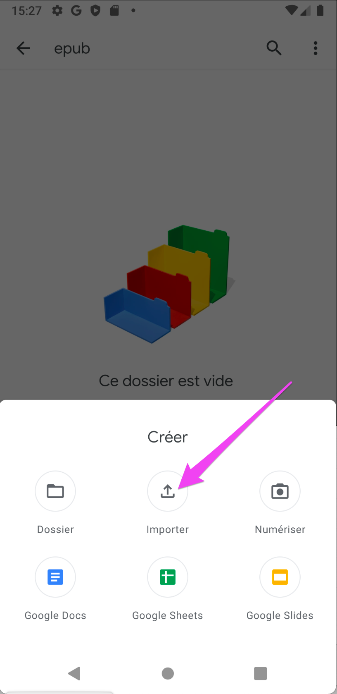{: style="width:35%"}

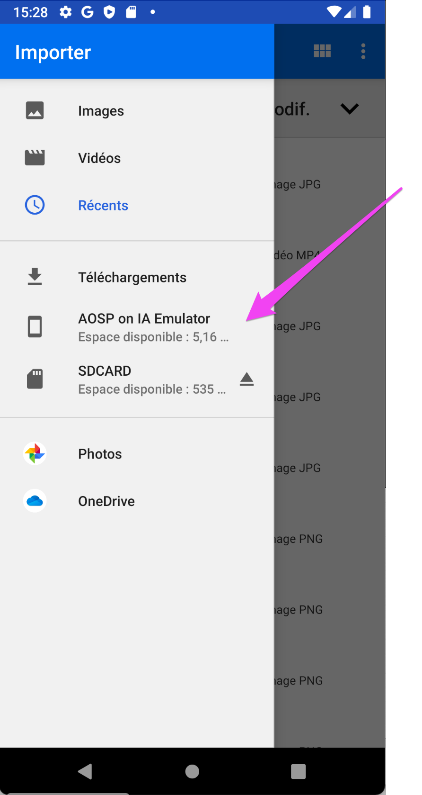{: style="width:35%"}

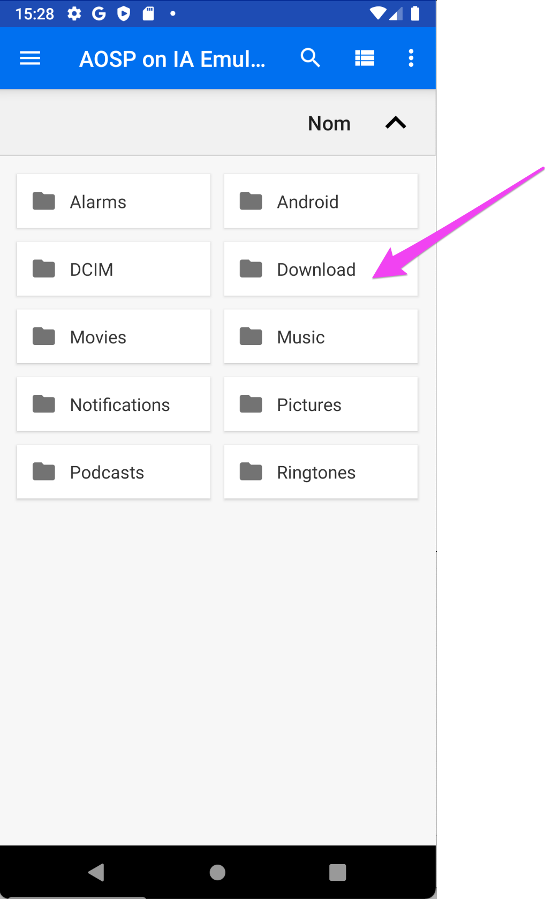{: style="width:35%"}

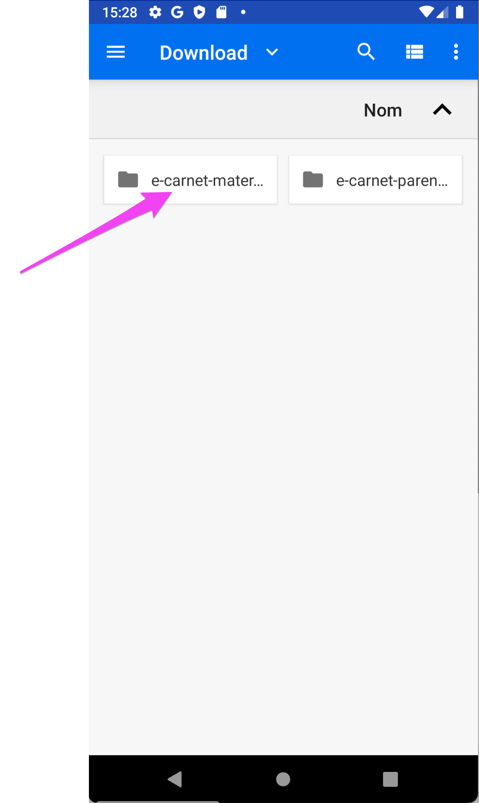{: style="width:35%"}

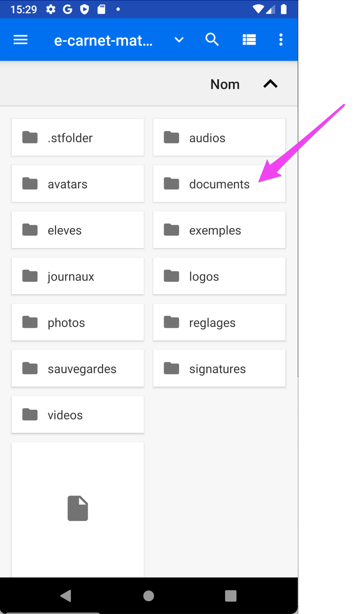{: style="width:35%"}

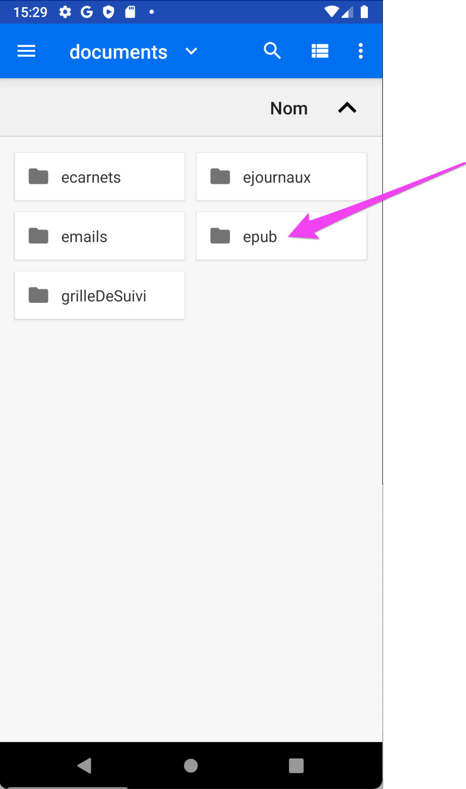{: style="width:35%"}

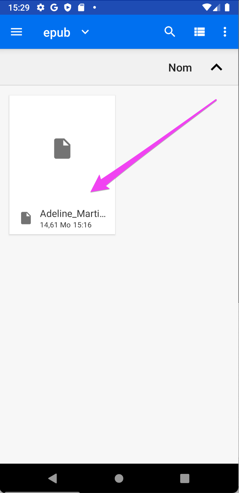{: style="width:35%"}

{: style="width:35%"}

Passage à l'étape suivante : créer le lien de partage

## Créer des liens de partage

Pour permettre aux parents de télécharger un document, il faut leur envoyer un lien (url) vers ce document. En cliquant dessus ils pourront alors récupérer le fichier.

De façon standard, chaque application de type Goolge Drive ou OneDrive offre la possibilité de créer ces liens de partage.

Il faut utiliser les fonctionnalités prévues à cet effet en choisissant bien l'option "Tous les utilisateurs disposant du lien". Cela a l'avantage de simplifier l'accès par les parents et de ne pas leur demander un compte (login/mot de passe) sur le même service de stockage. A l'opposé, toute personne disposant de ce lien aura acces au même document. Souple mais sécurité moindre.

Si vous souhaitez restreindre strictement l'accès du lien à des personnes désignées nominativement, il faudra choisir "Seules les personnes ajoutées peuvent l'ouvrir avec ce lien". Le parcours est alors plus compliqué pour l'enseignant et les parents, mais la sécurité d'accè s est renforcée.

Voici quelques illustrations qui correspondent au premier cas, le plus simple : 

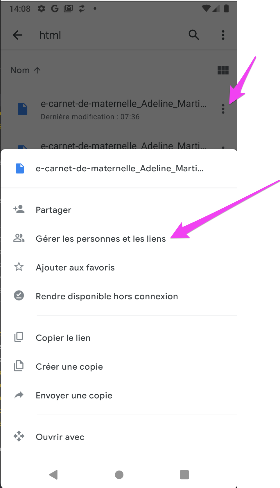{: style="width:35%"}

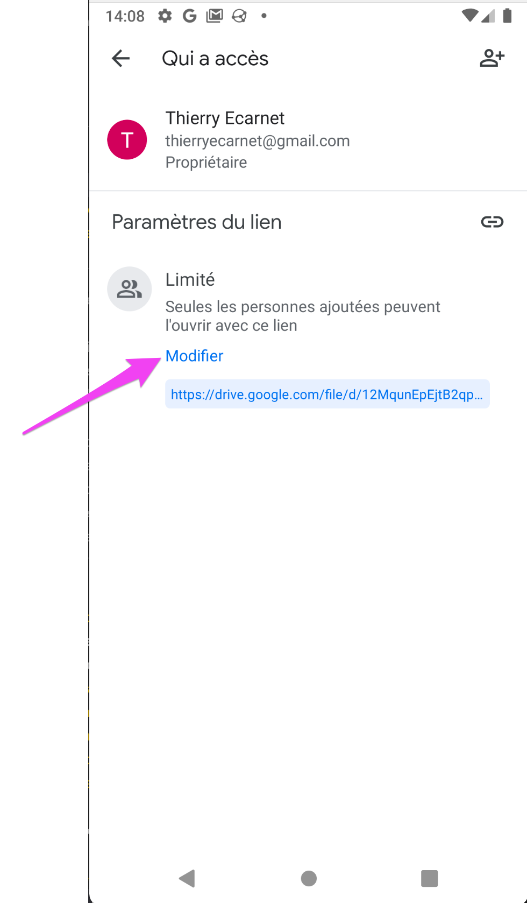{: style="width:35%"}

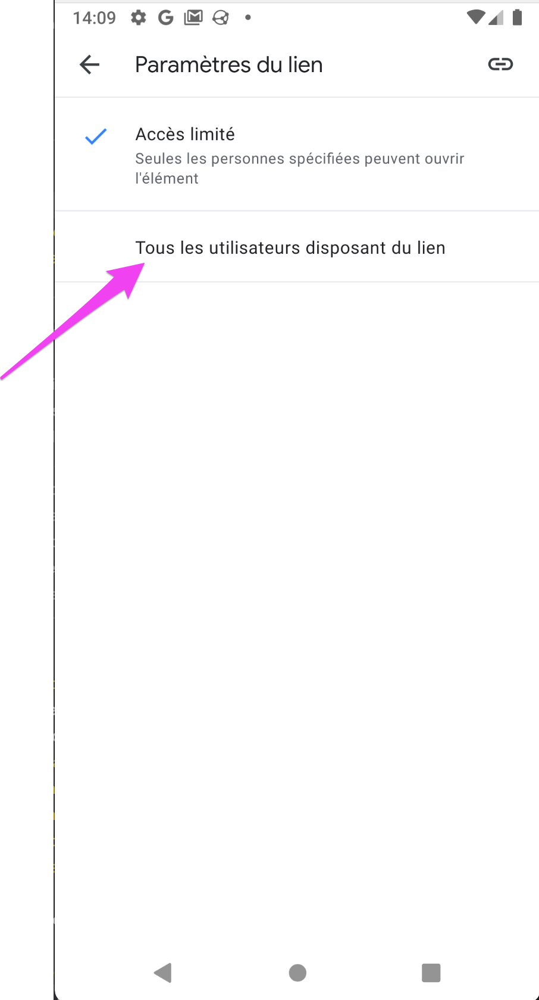{: style="width:35%"}

{: style="width:35%"}

## Envoyer le lien par messagerie

{: style="width:35%"}

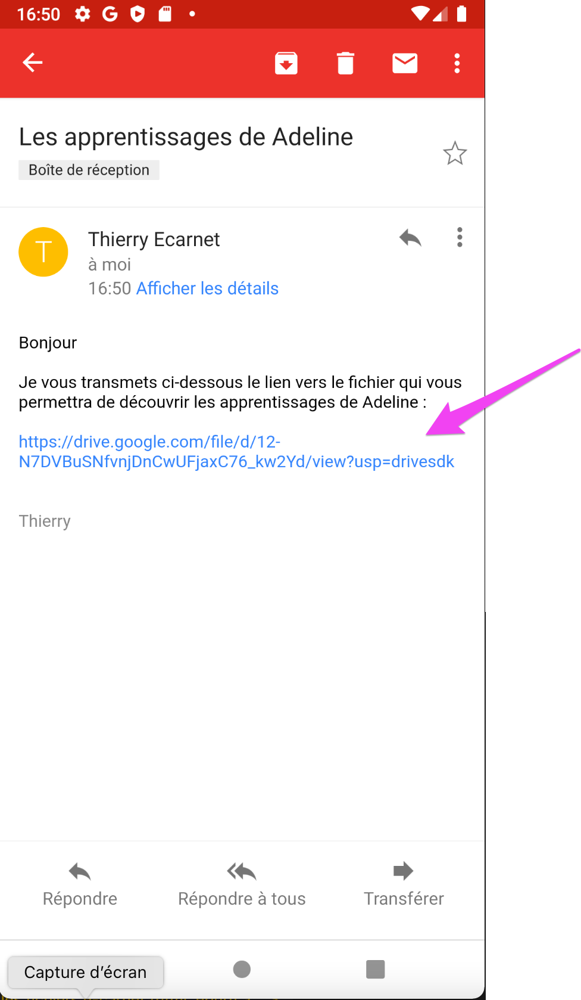{: style="width:35%"}

## Côté parents

### Prérequis : 

Proposer aux parents d'utiliser le logiciel e-carnet parents prévu à cet effet, 5 versions seront disponibles : 

  - Version Android (en test) : Lien vers la version de test  e-carnet PARENTS  sur Android 
    - [https://play.google.com/store/apps/details?id=org.tre.ecmparents](https://play.google.com/store/apps/details?id=org.tre.ecmparents)
  
  - Version windows : 
    - Lien de téléchargement : [bit.ly/ecmparentswindows](bit.ly/ecmparentswindows)
    - Puis renommer le .ex_ en .exe
    - Et double cliquer sur ce fichier ….exe
    - Au lancement, choisir un répertoire
    - Puis, une fois le menu affiché, choisir « importer un dossier »
    - Et choisir un fichier « epub » produit à partir de la tablette (boutons « epub » de la liste des élèves (en mode liste)) qu’il faut transférer sur le PC
    - A défaut, cf fichier démo : [bit.ly/demoepub](bit.ly/demoepub)
 
   - Version MacOs : 
      - Lien de téléchargement : [bit.ly/ecmparentsmacos](bit.ly/ecmparentsmacos)
      - Puis renommer le .dm_ en .dmg
      - Et double cliquer sur ce fichier ….dmg
      - Au lancement, choisir un répertoire
      - Puis, une fois le menu afficher, choisir « importer un dossier »
      - Et choisir un fichier « epub » produit à partir de la tablette (boutons « epub » de la liste des élèves (en mode liste)) qu’il faut transférer sur le Mac
       - A défaut, cf fichier démo : [bit.ly/demoepub](bit.ly/demoepub)

  - Version iPad !
    - [!embed](https://www.youtube.com/watch?v=gYVuwo7HZ7E)

  - Version Linux : prévue mais pas encore dispo. 
  
 
Les 4 versions sont identiques.

Elles permettent de voir les vidéos, écouter les enregistrements audio.

Et de voir les photos. 

NB : Ces photos sont en « basse résolution », elles ne pourront pas être de meilleure qualité. Seules les photos originales de haute qualité sont sur la tablette de l’enseignant(e). Elles ne sont actuellement pas « embarquées » dans le dossier transmissible aux parents, pour des raisons de volume.
 
NB : si les fonctions de lecture audio et vidéo ne fonctionnaient pas, installer VLC sur PC et Mac (pour les drivers audio et videos)  et relancer l’application.

NB : certaines icônes peuvent apparaitre comme indisponibles (correction en cours, mais pas génant, ne modifie pas le comportement)
  

### Principe : 

- Les parents reçoivent l'email contenant le lien
- La suite dépend de leur équipement
  - Si ils ont un smartphone Android : 
    - Ils doivent préalablement installer le logiciel e-carnet parents disponible sur le Play Store.
    - A la réception de l'email, ils doivent l'ouvrir depuis leur smartphone Android
    - Il faut ensuite cliquer sur le lien dans le message, ce qui provoque le téléchargement du fichier dans le dossier "Téléchargement" ou "Download" de leur téléphone
    - Ouvrir l'application "e-carnet parents"
    - Choisir "importer dossier"
    - Localiser le répertoire "Download" et sélection le fichier "epub" qui vient d'être téléchargé. Il porte le prénom et nom de l'enfant.
    - Des lors que le fichier a fini d'être analysé par le logiciel, l'avatar de l'élève apparait dans l'application
    - Les parents peuvent alors consulter tous les apprentissages enregistrés, y compris les vidéos, à l'identique de ce qui apparait sur la tablette de l'enseignant(e).

### Illustrations (version E-carnet parent Android)

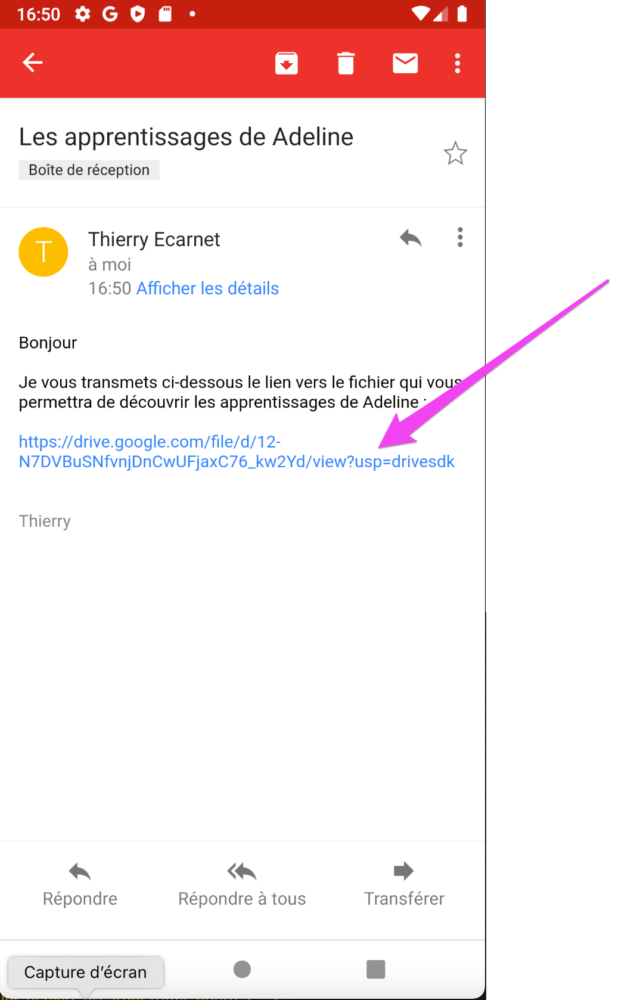{: style="width:35%"}

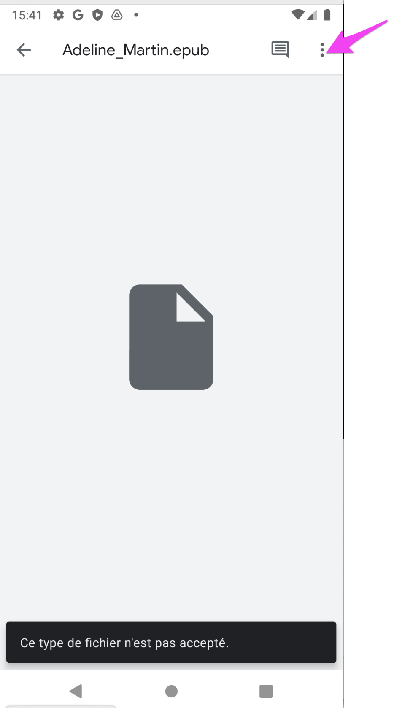{: style="width:35%"}

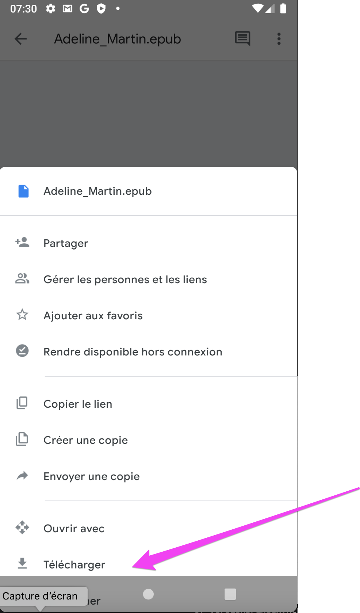{: style="width:35%"}

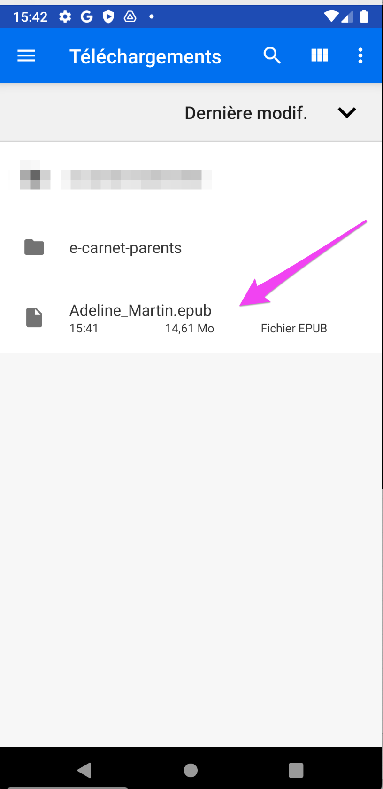{: style="width:35%"}

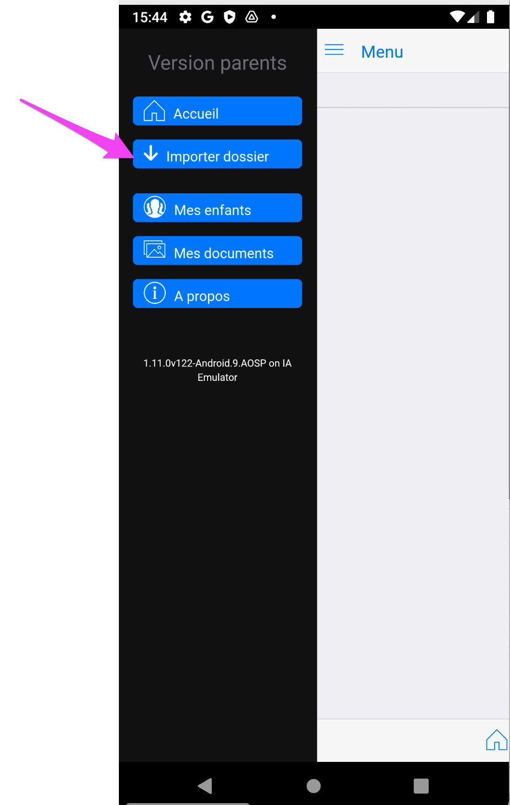{: style="width:35%"}

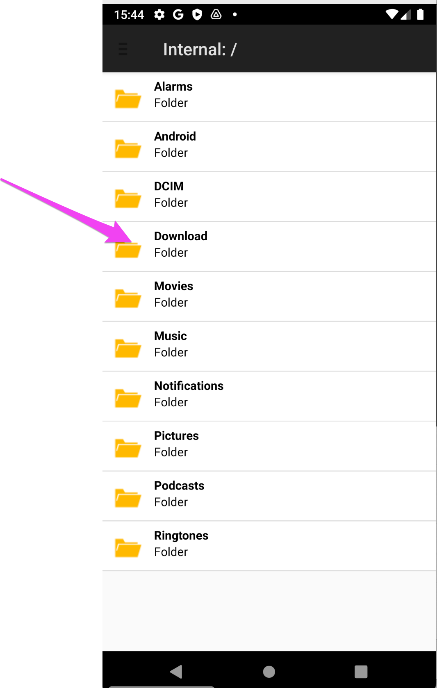{: style="width:35%"}

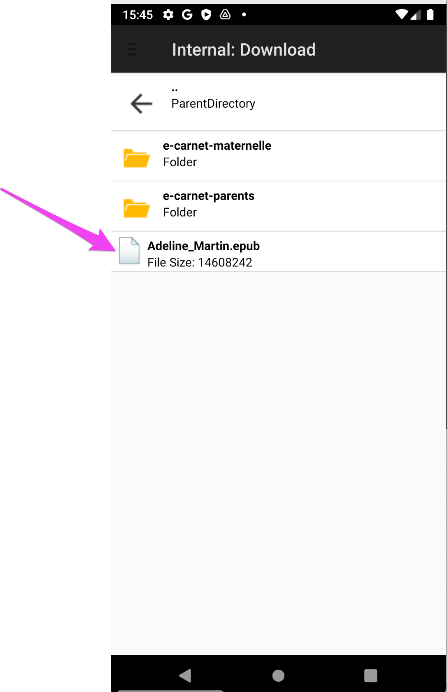{: style="width:35%"}

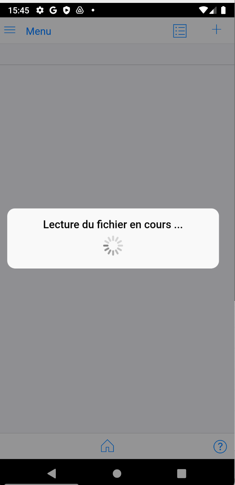{: style="width:35%"}

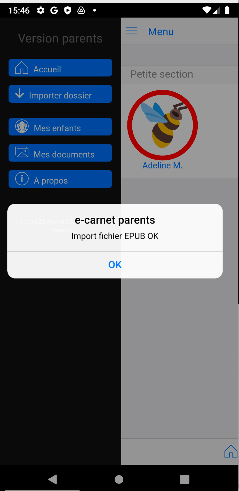{: style="width:35%"}

{: style="width:35%"}

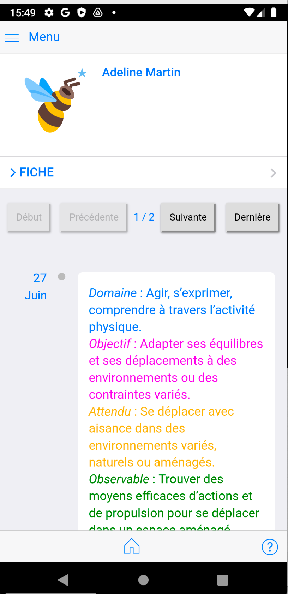{: style="width:35%"}

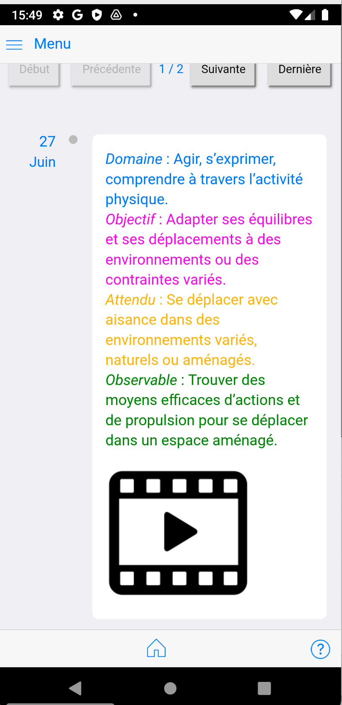{: style="width:35%"}

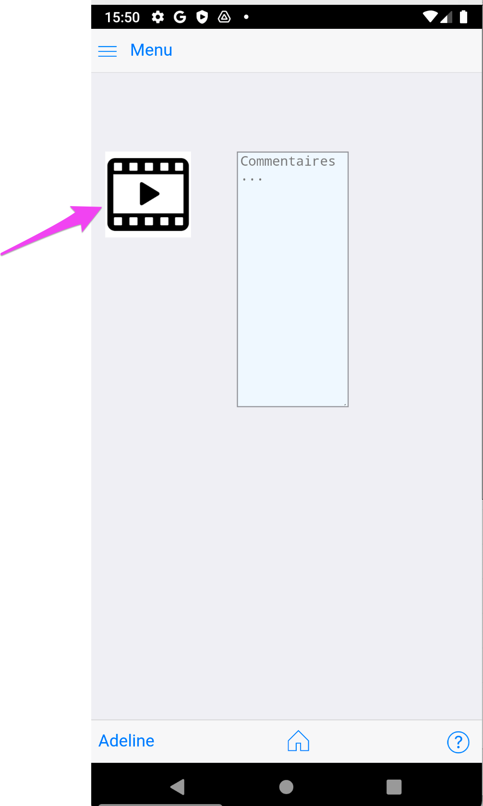{: style="width:35%"}

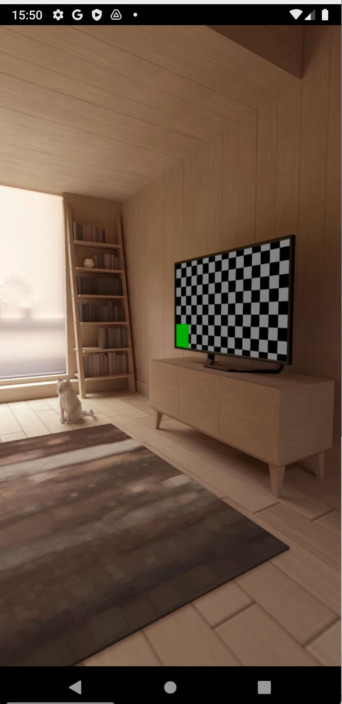{: style="width:35%"}

## Comment installer la version PC ?

Voir : [!embed](https://www.youtube.com/watch?v=mBkOB1D2Sjc)