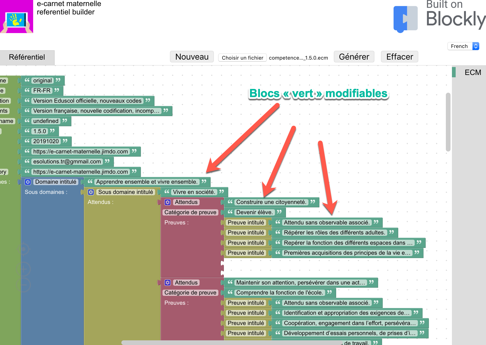

# Principe

<!-- //TODO (plantUML)  -->

L'interface graphique de type blocs permet de décrire un référentiel sous forme d'un arbre dont la strucuture est la suivante : 

    Domaine d'apprentissage (ex : Mobiliser le langage dans toutes ses dimensions)
        Sous domaine (ex : L’oral)
            Attendu (ex : Communiquer avec les adultes et avec les autres enfants par le langage, en se faisant comprendre.)
            Objectif/categorie de preuve (ex : Oser entrer en communication)
                Observable (ex : Participer en répétant seulement (parties de comptines, consignes,...))

Seuls les textes apparaissant dans les blocs vert sont modifiables.

Les blocs s'assemblent uniquement dans l'ordre prévu pour respecter la structure du référentiel.

Une fois les blocs verts modifiés, le clic sur le bouton `Générer` déclenche la production d'un fichier dont le nom est proposé automatiquement (ex : competences_anglais_test_2_EN-EN_0.0.2.20191111.ecm).

Quel que soit le moyen utilisé, ce fichier doit être copié sur la tablette qui utilise l'application ***e-carnet de maternelle.***

Une fois sur la tablette, le fichier peut être utilisé : 

    aller dans `Réglages`  
    puis `Gestion observables` 
    puis `Choisir fichier catalogue` .

## Conseil important

Avant de se lancer dans l'usage du logiciel il est primordial d'avoir préparé la description de son référentiel auparavant dans un document à part qui servira de guide à la saisie.

Cf le guide : [Aide à la personnalisation](files/E-carnet-maternelle.Consignes_de_personnalisation_referentiel.2.pdf)