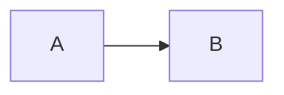
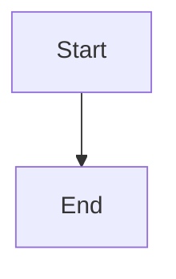
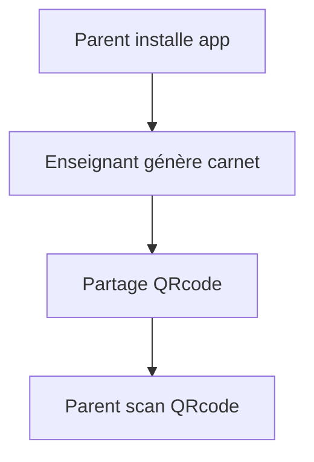

# Test Mermaid Simple

## Very Simple Test

```mermaid
graph LR
    A --> B
```

## Another Test

```mermaid
flowchart TD
    Start --> End
```

## The Original Diagram

```mermaid
graph TD;
    A["Parent installe app"] --> B["Enseignant génère carnet"]
    B --> C["Partage QRcode"]
    C --> D["Parent scan QRcode"]
```